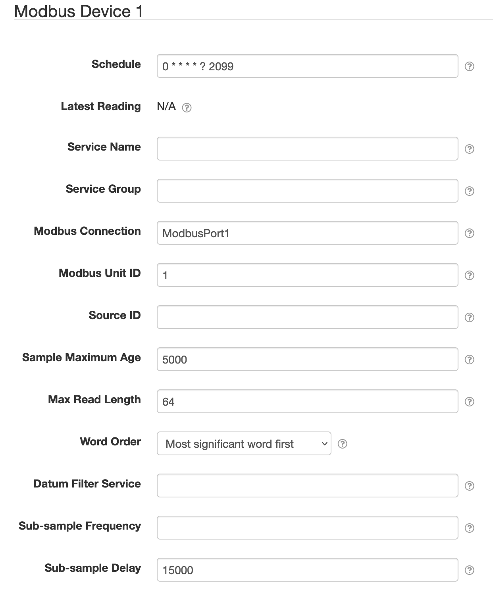

# SolarNode Modbus Device Datum Source

This project provides SolarNode plugin that can collect arbitrary data from
Modbus enabled devices. This is an advanced plugin that requires specific
low-level knowledge of the device you want to collect data from.



# Install

The plugin can be installed via the **Plugins** page on your SolarNode. It
appears under the **Datum** category as **Generic Modbus Datum Source**.

# Use

Once installed, a new **Modbus Device** component will appear on the
**Settings** page on your SolarNode. Click on the **Manage** button to configure
devices. You'll need to add one configuration for each Modbus device you want to
collect data from.

## Overall device settings

Each device configuration contains the following overall settings:

| Setting            | Description                                                                      |
|--------------------|----------------------------------------------------------------------------------|
| Schedule           | A cron schedule that determines when data is collected.                          |
| Service Name       | A unique name to identify this data source with.                                 |
| Service Group      | A group name to associate this data source with.                                 |
| Modbus Port        | The service name of the Modbus port to use.                                      |
| Modbus Unit ID     | The ID of the Modbus device to collect data from, from 1 - 255.                  |
| Source ID          | The SolarNetwork unique source ID to assign to datum collected from this device. |
| Sample Maximum Age | A minimum time to cache captured Modbus data, in milliseconds.                   |
| Max Read Length    | The maximum number of Modbus registers to request at once.                       |

## Overall device settings notes

<dl>
	<dt>Modbus Port</dt>
	<dd>This is the <i>service name</i> of the Modbus component configured elsewhere
	in SolarNode. You must configure that component with the proper connection settings
	for your Modbus network, configure a unique service name on that component, and then
	enter that same service name here.</dd>
	<dt>Source ID</dt>
	<dd>This value unique identifies the data collected from this device, by this node,
	 on SolarNetwork. Each configured device should use a different value.</dd>
	<dt>Sample Maximum Age</dt>
	<dd>SolarNode will cache the data collected from the Modbus device for at least
	this amount of time before refreshing data from the device again. Some devices
	do not refresh their values more than a fixed interval, so this setting can be
	used to avoid reading data unnecessarily. This setting also helps in highly
	dynamic configurations where other plugins request the current values from
	the device frequently.</dd>
	<dt>Max Read Length</dt>
	<dd>This plugin will try to read as many adjacent Modbus registers as possible
	when requesting data from the device. Some devices have trouble returning large
	numbers of registers at once, however. Configuring this setting to a smaller
	value will cause the plugin to make multiple smaller requests for data when
	necessary to work better with those devices.</dd>
</dl>

## Datum property settings

You must configure settings for each datum property you want to collect from each device.
You can configure as many property settings as you like, using the <kbd>+</kbd> and <kbd>-</kbd>
buttons to add/remove property configurations.

Each property configuration contains the following settings:

| Setting         | Description                                                                                             |
|-----------------|---------------------------------------------------------------------------------------------------------|
| Property        | The name of the datum property to save the Modbus value as.                                             |
| Property Type   | The type of datum property to use.                                                                      |
| Modbus Address  | The starting register address to read Modbus data from (zero-based).                                    |
| Modbus Function | The Modbus read function to execute.                                                                    |
| Data Type       | The type of data to expect from the read Modbus register(s).                                            |
| Data Length     | For variable length data types such as strings, the number of Modbus registers to read.                 |
| Unit Multiplier | For numeric data types, a multiplier to apply to the Modbus value to normalize it into a standard unit. |
| Decimal Scale   | For numeric data types, a maximum number of decimal places to round decimal numbers to.                 |

## Datum property settings notes

<dl>
	<dt>Property</dt>
	<dd>Property names represent what the associated data value is, and SolarNetwork
	has many standardized names that you should consider using. For example the
	<a href="https://github.com/SolarNetwork/solarnetwork-node/blob/master/net.solarnetwork.node/src/net/solarnetwork/node/domain/EnergyDatum.java">EnergyDatum</a>
	class defines properties such as <code>watts</code> and <code>wattHours</code>
	for electrical energy.</dd>
	<dt>Property Type</dt>
	<dd>Each property must be categorized as <code>Accumulating</code>, <code>Instantaneous</code>,
	or <code>Status</code>. <b>Accumulating</b> is used for properties that record
	a value that accumulates over time, such as <code>wattHours</code> captured from
	a power meter. <b>Instantaneous</b> is used for properties that capture values
	that record independent values over time, such as <code>watts</code>. <b>Status</b>
	is used for non-numeric values such as string status messages.</dd>
	<dt>Data Type</dt>
	<dd>The data type to interpret the values captured from the Modbus registers as.
	<b>Note</b> that only the <b>Status</b> property type can accept non-numeric
	data types such as strings.</dd>
	<dt>Unit Multiplier</dt>
	<dd>The property values stored in SolarNetwork should be normalized into standard
	base units if possible. For example if a power meter reports power in <i>kilowattts</i>
	then a unit multiplier of <code>1000</code> can be used to convert the values into
	<i>watts</i>.</dd>
	<dt>Decimal Scale</dt>
	<dd>This setting will round decimal numbers to at most this number of decimal places. Setting
	to <code>0</code> rounds decimals to whole numbers. Setting to <code>-1</code> disables
	rounding completely.</dd>
</dl>

## Virtual meter settings

Since version **1.3** you can ask SolarNode to generate accumulating property values derived
from instantaneous properties extrapolated across time. For example, if you have an
irradiance sensor that allows you to capture instantaneous <code>W / m<sup>2</sup></code>
power values, you could configure a virtual meter to generate <code>Wh /
m<sup>2</sup></code> energy values. You can configure as many virtual meters as you like,
using the <kbd>+</kbd> and <kbd>-</kbd> buttons to add/remove meter configurations.


Each virtual meter works with a single instantaneous datum property. The derived
accumulating datum property will be named after that property with the time unit suffix
appended. For example, an instantaneous `irradiance` property using the `Hours` time unit
would result in an accumulating `irradianceHours` property. The value is calculated as
an **average** between the current instantaneous value and the previously captured
instantaneous value, multiplied by the amount of time that has elapsed between the two
samples.

Virtual meters require keeping track of the meter reading value over time along with the
previously captured value. This plugin uses the [SolarNetwork datum metadata
API][meta-api] for this, storing three metadata properties under a property key named for
the virtual meter property name. For example, continuing the `irradianceHours` example, an
example set of datum metadata would look like:

```json
{
  "pm": {
    "irradianceHours": {
      "vm-date": 123123123123,
      "vm-value": "1361",
      "vm-reading": "12390980.1231"
    }
  }
}
```

Each virtual meter configuration contains the following settings:

| Setting         | Description                                                                           |
|-----------------|---------------------------------------------------------------------------------------|
| Property        | The name of the instantaneous datum property to derive the virtual meter values from. |
| Time Unit       | The time unit to record meter readings as.                                            |
| Max Age         | The maximum time allowed between samples where the meter reading can advance.         |
| Meter Reading   | The current meter reading value.                                                      |

## Virtual meter settings notes

<dl>
	<dt>Time Unit</dt>
	<dd>This value affects the name of the virtual meter reading property: it will be appended to the
	end of the property name. It also affects the virtual meter reading values, as they will be calculated in
	this time unit.</dd>
	<dt>Max Age</dt>
	<dd>In case the node isn't collecting samples for a period of time, this setting prevents the plugin
	from calculating an unexpectedly large reading value jump. For example if a node was turned off for
	a day, the first sample it captures when turned back on would otherwise advance the reading as if the
	associated instantaneous property had been active over that entire time. With this restriction, the
	node will record the new sample date and value, but not advance the meter reading until another sample
	is captured within this time period.</dd>
	<dt>Meter Reading</dt>
	<dd>Generally this should <b>not</b> be changed, because it can impact how the values are aggregated and
	interpreted by SolarNetwork and applications using the data.</dd>
</dl>


 [meta-api]: https://github.com/SolarNetwork/solarnetwork/wiki/SolarQuery-API#add-node-datum-metadata
