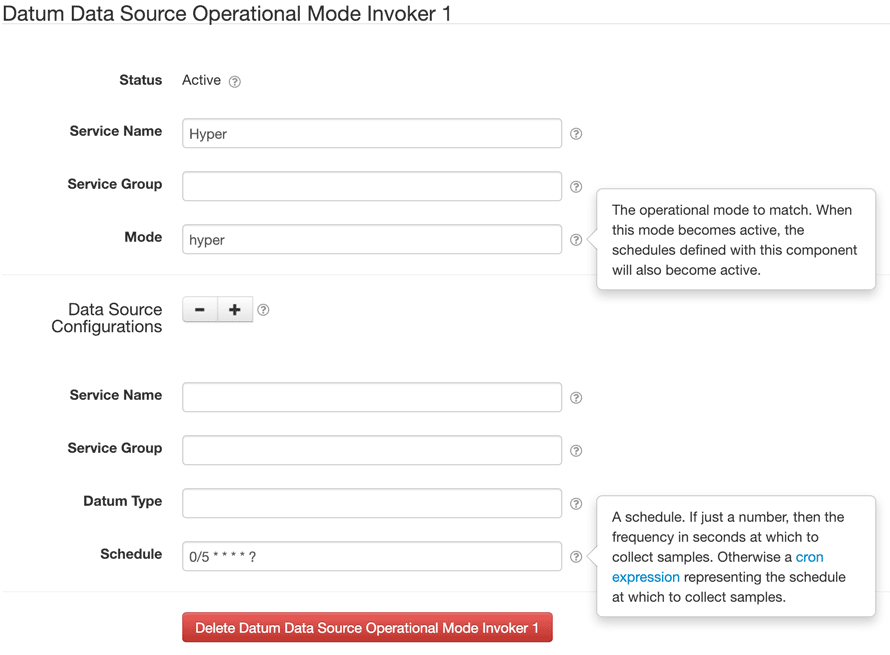

# Datum Data Source Operational Mode Invoker

This project provides a SolarNode plugin that allows you to configure groups of datum data sources
that respond to operational mode changes. As modes are activated, matching data sources can be
scheduled to sample data at a schedule specific to that mode. When modes are deactivated, the
sampling configured for that schedule will stop.

**Note** that this plugin merely _requests_ the datum data sources to provide a new datum. This
plugin doesn't actually do anything with the returned datum. This is still useful, however, because datum
data sources generally emit a `DATUM_CAPTURED` event when they provide a new sample. That event
can be used by other plugins. For example, the [SolarFlux Upload][solarflux-upload] plugin listens
for `DATUM_CAPTURED` events and uploads the associated datum to [SolarFlux][solarflux]. Thus you
could use an operational mode to toggle higher-frequency datum sampling to SolarFlux on and off.

# Install

The plugin can be installed via the **Plugins** page on your SolarNode. It
appears under the **Datum** category as **Operational Mode Data Source Scheduler**.

# Use

Once installed, a new **Datum Data Source Operational Mode Invoker** component will appear on the
**Settings** page on your SolarNode. Click on the **Manage** button to configure services. You can
configure as many services as you like.

## Overall settings

Each device configuration contains the following overall settings:

| Setting | Description |
|---------|-------------|
| Service Name | A unique name to identify this service with. |
| Service Group | A group name to associate this service with. |
| Mode | The operational mode that must be active for this invoker configuration to be applied. |

## Data source configuration settings

Each data source configuration defines a schedule and which data sources to sample. The configuration
properties are joined logically as "and" conditions, meaning all conditions must be met for a data 
source to be included with the schedule.

| Setting | Description |
|---------|-------------|
| Service Name | The service name of a data source to match. |
| Service Group | The service group of a data source to match. |
| Datum Type | The datum type the data source must collect. |
| Schedule | Either a number of seconds, or a cron expression, at which to sample datum from the data sources matching this configuration. |

## Overall device settings notes

<dl>
	<dt>Schedule</dt>
	<dd>If just a number, then the frequency in seconds at which to collect samples. Otherwise a 
	<a href="https://github.com/SolarNetwork/solarnetwork/wiki/SolarNode-Cron-Job-Syntax">cron expression</a>
	representing the schedule at which to collect samples.</dd>
</dl>

[solarflux]: https://github.com/SolarNetwork/solarnetwork/wiki/SolarFlux-API
[solarflux-upload]: https://github.com/SolarNetwork/solarnetwork-node/tree/develop/net.solarnetwork.node.upload.flux
