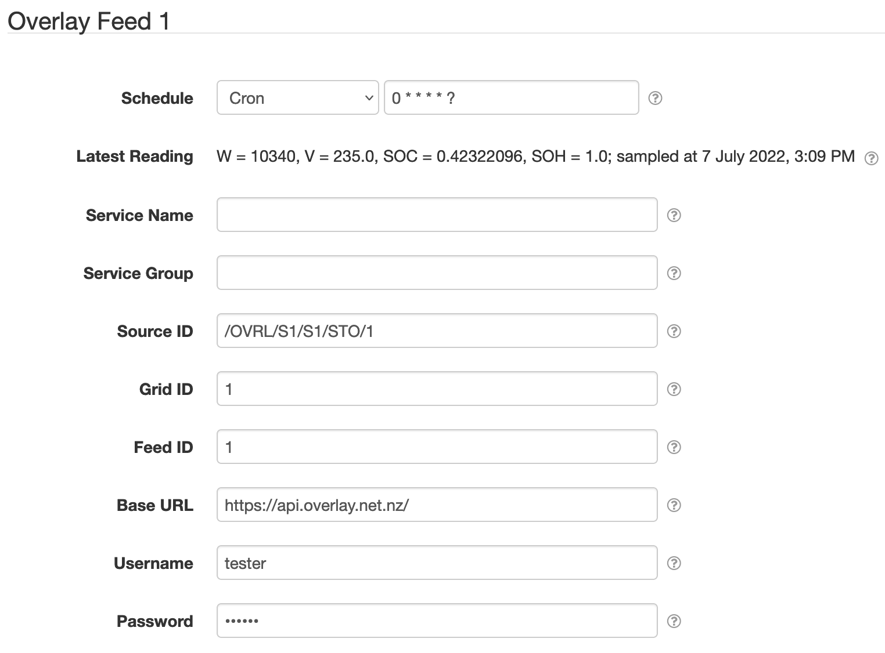

# SolarNode Overlay Feed Datum Source

This project provides SolarNode plugin that can collect data from the a "Feed" entity in the Overlay
API.

# Install

The plugin can be installed via the **Plugins** page on your SolarNode. It appears under the
**Datum** category as **Overlay Feed Datum Source**.

# Use

Once installed, a new **Overlay Feed** component will appear on the **Settings** page on your
SolarNode. Click on the **Manage** button to configure devices. You'll need to add one configuration
for each feed you want to collect data from.

## Overall settings

Each device configuration contains the following overall settings:

| Setting            | Description |
|:-------------------|:------------|
| Schedule           | A cron schedule that determines when data is collected. |
| Service Name       | A unique name to identify this data source with. |
| Service Group      | A group name to associate this data source with. |
| Source ID          | The SolarNetwork source ID to assign to captured datum. |
| Grid ID            | The ID of the grid entity to collect from. |
| Feed ID            | The ID of the feed entity within the grid to collect from. |
| Base URL           | The Overlay API base URL. |
| Username           | The Overlay API username to use. |
| Password           | The Overlay API password to use.

## Overall settings notes

 * **Source ID** — This value uniquely identifies the data collected from the feed, by this node,
   on SolarNetwork. Each configured feed should use a different value. Placeholder values are
   supported, including `{gridId}` and `{feedId}` placeholders that will be set to the values
   configured on the component.

