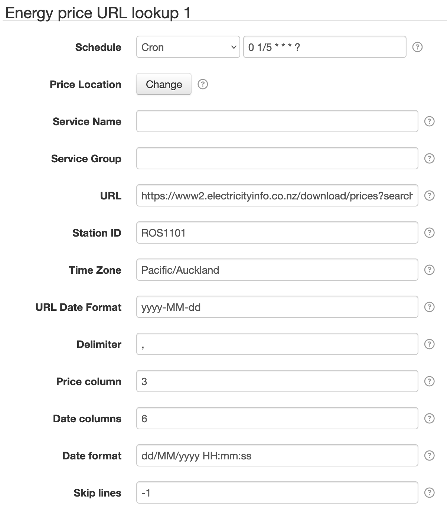

# SolarNode Delimited Price URL Datum Source

This project provides SolarNode plugin that can collect price data from URLs returning a delimited
data set, such as CSV.



# Install

The plugin can be installed via the **Plugins** page on your SolarNode. It appears under the
**Datum** category as **Delimited Price Datum DataSource**.

# Datum structure

This datum generates a [datum stream][datum] with the following properties:

| Property | Class | Units | Description |
|:---------|:------|:------|:------------|
| `price`  | `i` | - | the price; units depend on source data, for example `$/kWh` |

Here is an example datum, expressed in simplified JSON form:

```json
{
	"created":    "2023-03-24 00:33:49Z",
	"locationId": 123,
	"sourceId":   "electricityinfo.co.nz",
	"localDate":  "2023-03-24",
	"localTime":  "13:33:49",
	"price":      201.13
}
```

# Use

Once installed, a new **Energy price URL lookup** component will appear on the **Settings** page on
your SolarNode. Click on the **Manage** button to configure devices. You'll need to add one
configuration for each price lookup you want to collect data from.

## Settings

Each configuration contains the following settings:

| Setting            | Description                                                                      |
|--------------------|----------------------------------------------------------------------------------|
| Schedule           | A cron schedule that determines when data is collected.  |
| Price Location     | The SolarNetwork `price` location to associate the collected data with. |
| Service Name       | A unique name to identify this data source with. |
| Service Group      | A group name to associate this data source with. |
| URL                | The URL of the delimited resource to query. The following parameters are allowed: `{date}` the current date; `{stationId}` the station ID. |
| Station ID         | The price "station" identifier; will be the `{stationId}` URL parameter value. |
| Time Zone          | The time zone to use when parsing dates. |
| URL Date Format    | The [date format][datepat] to format the date URL variable. |
| Delimiter          | A [regular expression][regex] delimiter to split the lines of text with. |
| Price column       | The result column index for the price (starting from `0`). This value is assumed to be decimal number. |
| Date columns       | A list of column indices to use as the data's timestamp value (starting from `0`). This is provided as a comma-delimited list of indices in case the date and time of the price is split across multiple columns. If multiple columns are configured, they will be joined with a space character before parsing the result into a date. |
| Date format        | The [date format][datepat] to use for parsing the price date value. |
| Skip lines         | The number of lines of text to skip. This is useful for skipping a "header" row with column names. If negative, then return rows from the end of the data. For example `-1` would return the last row. |

# Price locations

The **Price Location** setting is used to associate the data with a SolarNetwork `price` location
datum stream. These locations must be created by SolarNetwork administrators. You can use the
[Location Request API][loc-req] to request a new location if a suitable one does not exist already.


[expr]: https://github.com/SolarNetwork/solarnetwork/wiki/Expression-Languages
[datepat]: https://docs.oracle.com/en/java/javase/11/docs/api/java.base/java/time/format/DateTimeFormatter.html#patterns
[ExpressionRoot]: https://github.com/SolarNetwork/solarnetwork-node/tree/develop/net.solarnetwork.node.datum.modbus/src/net/solarnetwork/node/datum/modbus/ExpressionRoot.java
[GeneralNodeDatum]: https://github.com/SolarNetwork/solarnetwork-node/blob/develop/net.solarnetwork.node/src/net/solarnetwork/node/domain/GeneralNodeDatum.java
[loc-req]: https://github.com/SolarNetwork/solarnetwork/wiki/SolarUser-Location-Request-API
[ModbusData]: https://github.com/SolarNetwork/solarnetwork-node/blob/develop/net.solarnetwork.node.io.modbus/src/net/solarnetwork/node/io/modbus/ModbusData.java
[meta-api]: https://github.com/SolarNetwork/solarnetwork/wiki/SolarQuery-API#add-node-datum-metadata
[metadata-key-path]: https://github.com/SolarNetwork/solarnetwork/wiki/SolarNet-API-global-objects#metadata-filter-key-paths
[regex]: https://docs.oracle.com/en/java/javase/11/docs/api/java.base/java/util/regex/Pattern.html#sum
[sn-cron-syntax]: https://github.com/SolarNetwork/solarnetwork/wiki/SolarNode-Cron-Job-Syntax
[sn-expressions]: https://github.com/SolarNetwork/solarnetwork/wiki/SolarNode-Expressions
