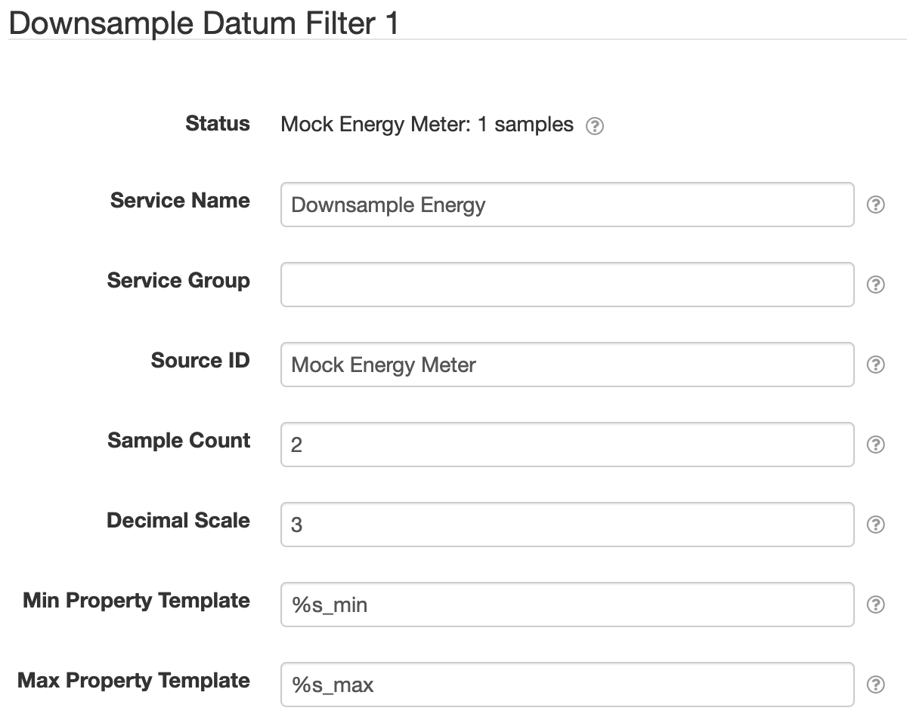

# SolarNode Downsample Datum Filter

This component provides a way to down-sample higher-frequency datum samples into lower-frequency
(averaged) datum samples. The filter will collect a configurable number of samples and then generate
a down-sampled sample where an **average** of each collected _instantaneous_ property is included.
In addition **minimum** and **maximum** values of each averaged property are added.

# Use

Once installed, a new **Downsample Datum Filter** component will appear on the 
**Settings > Datum Filter** page on your SolarNode. Click on the **Manage** button to configure 
filters.

# Settings

Each filter configuration contains the following overall settings:

| Setting            | Description                                                       |
|:-------------------|:------------------------------------------------------------------|
| Service Name          | A unique ID for the filter, to be referenced by other components. |
| Service Group         | An optional service group name to assign. |
| Source ID             | The source ID(s) to filter. |
| Require Mode          | If configured, an [operational mode](https://github.com/SolarNetwork/solarnetwork/wiki/SolarNode-Operational-Modes) that must be active for this filter to be applied. |
| Sample Count          | The number of samples to average over. |
| Decimal Scale         | A maximum number of digits after the decimal point to round to. Set to`0` to round to whole numbers. |
| Property Excludes     | A list of property names to exclude. |
| Min Property Template | A string format to use for computed minimum property values. Use `%s` as the placeholder for the original property name, e.g. `%s_min`. |
| Max Property Template | A string format to use for computed maximum property values. Use `%s` as the placeholder for the original property name, e.g. `%s_max`. |

## Settings notes

<dl>
	<dt>Source ID</dt>
	<dd>This is a case-insensitive regular expression pattern to match against datum source ID values.
	<b>Only</b> datum with matching source ID values will be filtered. This is required.</dd>
</dl>
