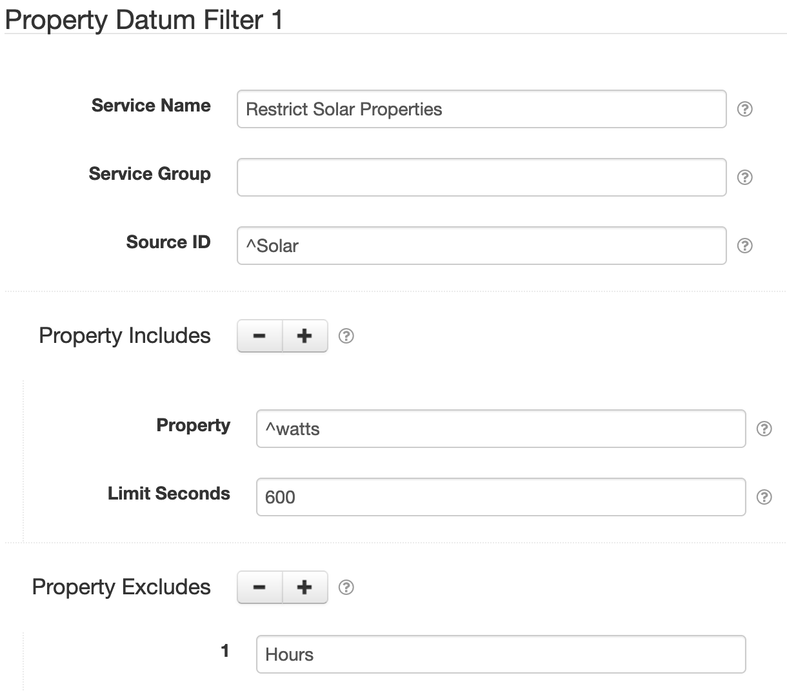

# SolarNode Property Datum Filter

This component provides a way to filter **properties** of datum. This can help if some component
generates properties that you don't actually need to use.

For example you might have a plugin that collects data from an AC power meter that capture power,
energy, quality, and other properties each time a sample is taken. If you are only interested in
capturing the power and energy properties you could use this component to remove all the others.

This component can also throttle individual properties over time, so that individual properties are
posted less frequently than the rate the whole datum it is a part of is sampled at. For example a
plugin for an AC power meter might collect datum once per minute, and you want to collect the energy
properties of the datum every minute but the quality properties only once every 10 minutes.

The general idea for filtering properties is to configure rules that define which datum **sources**
you want to filter, along with a list of **properties** to _include_ and/or a list to _exclude_. All
matching is done using regular expressions, which can help make your rules concise.

# Use

Once installed, a new **Property Datum Filter** component will appear on the 
**Settings > Datum Filter** page on your SolarNode. Click on the **Manage** button to configure 
filters.

# Settings

Each filter configuration contains the following overall settings:

| Setting            | Description                                                       |
|:-------------------|:------------------------------------------------------------------|
| Service Name       | A unique ID for the filter, to be referenced by other components. |
| Service Group      | An optional service group name to assign.                         |
| Source ID          | The source ID(s) to filter.                                       |
| Required Mode      | If configured, an [operational mode](https://github.com/SolarNetwork/solarnetwork/wiki/SolarNode-Operational-Modes) that must be active for this filter to be applied. |
| Property Includes  | A list of property names to include, removing all others.         |
| Property Excludes  | A list of property names to exclude.                              |

Use the <kbd>+</kbd> and <kbd>-</kbd> buttons to add/remove property include/exclude patterns.

Each property inclusion setting contains the following settings:

| Setting            | Description                                                       |
|:-------------------|:------------------------------------------------------------------|
| Name               | The property name pattern to include.                             |
| Limit Seconds      | A throttle limit, in seconds, to apply to included properties.    |

## Settings notes

<dl>
	<dt>Source ID</dt>
	<dd>This is a case-insensitive regular expression pattern to match against datum source ID values.
	<b>Only</b> datum with matching source ID values will be filtered. This is required.</dd>
	<dt>Property Includes</dt>
	<dd>This is a list of case-insensitive regular expressions to match against datum
	<b>property names</b>. If any inclusion patterns are configured then <b>only</b> properties
	matching one of these patterns will be included in datum. Any property name that
	does not match one of these patterns will be removed.</dd>
	<dt>Limit Seconds</dt>
	<dd>The minimum number of seconds to limit properties that match the configured
	property inclusion pattern. If properties are produced faster than this rate, they
	will be filtered out. Leave empty (or <code>0</code>) for no throttling.</dd>
	<dt>Property Excludes</dt>
	<dd>This is a list of case-insensitive regular expressions to match against datum
	<b>property names</b>. If any exclusion expressions are configured then <b>any</b>
	property that matches one of these expressions will be removed. Exclusion epxressions
	are processed <b>after</b> inclusion expressions when both are configured.</dd>
</dl>
