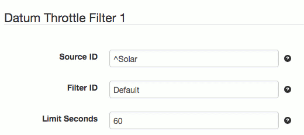

# SolarNode Datum Property/Throttle Filters

This project provides a SolarNode plugin that can filter out datum properties from datum
collected by other plugins before they are posted to SolarNetwork, either entirely or by
throttling how frequently they are allowed to be posted. This can be useful for these
scenarios:

 1. a plugin collects datum with a lot of properties that you don't need
 2. you want to collect some properties less frequently than others within the same datum
 3. you want to collect entire datum less frequently than they are produced

# Install

The plugin can be installed via the **Plugins** page on your SolarNode. It appears under
the **Datum** category as **Datum Sample Property Filter**.

# Use

Once installed, two new components will appear on the **Settings** page on your SolarNode:
**Datum Property Filter** and **Datum Throttle Filter**. Click on the **Manage** button to
configure filters.

# Datum Property Filter

The first component provided by this plugin is designed to filter out specific properties
from datum based on property names. For example you might have a plugin that collects data
from an AC power meter that capture power, energy, quality, etc. properties each time a
sample is taken. If you are only interested in capturing the power and energy properties
you could use this component to filter out all the others.

This component can also throttle individual properties over time, so that individual
properties are posted less frequently than the rate the whole datum it is a part of
is sampled at. For example a plugin for an AC power meter might collect datum once per
minute, and you want to collect the energy properties of the datum every minute but
the quality properties only once every 10 minutes.

## Datum Property Filter settings

The general idea for filtering properties is to configure rules that define which datum
**sources** you want to filter, along with a list of **properties** to _include_ and/or a
list to _exclude_. All matching is done using regular expressions, which can help make
your rules concise.

Each filter configuration contains the following overall settings:

| Setting            | Description                                                       |
|--------------------|-------------------------------------------------------------------|
| Source ID          | The source ID(s) to filter.                                       |
| Property Includes  | A list of property names to include, removing all others.         |
| Limit Seconds      | A throttle limit, in seconds, to apply to included properties.    |
| Property Excludes  | A list of property names to exclude.                              |

Use the <kbd>+</kbd> and <kbd>-</kbd> buttons to add/remove property include/exclude
expressions.

## Datum Property Filter settings notes

<dl>
	<dt>Source ID</dt>
	<dd>This is a case-insensitive regular expression pattern to match against datum source ID values.
	<b>Only</b> datum with matching source ID values will be filtered. This is required.</dd>
	<dt>Property Includes</dt>
	<dd>This is a list of case-insensitive regular expressions to match against datum
	<b>property names</b>. If any inclusion patterns are configured then <b>only</b> properties
	matching one of these patterns will be included in datum. Any property name that
	does not match one of these patterns will be removed.</dd>
	<dt>Limit Seconds</dt>
	<dd>The minimum number of seconds to limit properties that match the configured
	property inclusion pattern. If properties are produced faster than this rate, they
	will be filtered out. Leave empty (or <code>0</code>) for no throttling.</dd>
	<dt>Property Excludes</dt>
	<dd>This is a list of case-insensitive regular expressions to match against datum
	<b>property names</b>. If any exclusion expressions are configured then <b>any</b>
	property that matches one of these expressions will be removed. Exclusion epxressions
	are processed <b>after</b> inclusion expressions when both are configured.</dd>
</dl>

# Datum Throttle Filter

This component can throttle entire datum over time, so that they are posted to SolarNetwork
less frequently than a plugin that collects the data produces them. This can be useful
if you need a plugin to collect data at a high frequency for use internally by SolarNode
but don't need to save such high resolution of data in SolarNetwork. For example, a
plugin that monitors a device and responds quickly to changes in the data might be
configured to sample data every second, but you only want to capture that data once per
minute in SolarNetwork.

## Datum Throttle Filter settings

The general idea for filtering datum is to configure rules that define which datum
**sources** you want to filter, along with **time limit** to throttle matching datum by.
Any datum matching the sources that are captured faster than the time limit will filtered
and **not** uploaded to SolarNetwork.

Each filter configuration contains the following overall settings:

| Setting            | Description                                                       |
|--------------------|-------------------------------------------------------------------|
| Source ID          | The source ID(s) to filter.                                       |
| Filter ID          | A unique ID for the filter, to aid with troubleshooting.          |
| Limit Seconds      | A throttle limit, in seconds, to apply to matching datum.         |

## Datum Throttle Filter settings notes

<dl>
	<dt>Limit Seconds</dt>
	<dd>The throttle limit is applied to datum by source ID. Before each datum is uploaded
	to SolarNetwork, the filter will check how long has elapsed since a datum with the
	same source ID was uploaded. If the elapsed time is less than the configured limit,
	the datum will not be uploaded.</dd>
</dl>
