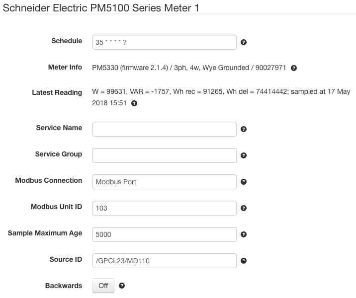

# SolarNode PM51000 Series Power Meter Datum Source

This project provides SolarNode plugin that can collect data from the Schneider
PM5100 series power meters.

# Install

The plugin can be installed via the **Plugins** page on your SolarNode. It
appears under the **Datum** category as **Schneider PM5100 Meter Data Source**.

# Use

Once installed, a new **Schneider Electric PM5100 Series Meter** component will
appear on the **Settings** page on your SolarNode. Click on the **Manage**
button to configure devices. You'll need to add one configuration for each
Modbus device you want to collect data from.

## Overall device settings

Each device configuration contains the following overall settings:

| Setting            | Description                                                                      |
|--------------------|----------------------------------------------------------------------------------|
| Schedule           | A cron schedule that determines when data is collected.                          |
| Service Name       | A unique name to identify this data source with.                                 |
| Service Group      | A group name to associate this data source with.                                 |
| Modbus Connection  | The service name of the Modbus port to use.                                      |
| Modbus Unit ID     | The ID of the Modbus device to collect data from, from 1 - 255.                  |
| Source ID          | The SolarNetwork unique source ID to assign to datum collected from this device. |
| Sample Maximum Age | A minimum time to cache captured Modbus data, in milliseconds.                   |
| Source ID          | The SolarNetwork source ID to assign to captured datum.                          |
| Backwards          | Toggle to treat energy delivered as `wattHoursReverse` instead of `wattHours`    |
| Phase Measurements | Toggle to collect additional phase-specific measurement properties.              |

## Overall device settings notes

<dl>
	<dt>Modbus Port</dt>
	<dd>This is the <i>service name</i> of the Modbus component configured elsewhere
	in SolarNode. You must configure that component with the proper connection settings
	for your Modbus network, configure a unique service name on that component, and then
	enter that same service name here.</dd>
	<dt>Source ID</dt>
	<dd>This value unique identifies the data collected from this device, by this node,
	 on SolarNetwork. Each configured device should use a different value.</dd>
	<dt>Sample Maximum Age</dt>
	<dd>SolarNode will cache the data collected from the Modbus device for at least
	this amount of time before refreshing data from the device again. Some devices
	do not refresh their values more than a fixed interval, so this setting can be
	used to avoid reading data unnecessarily. This setting also helps in highly
	dynamic configurations where other plugins request the current values from
	the device frequently.</dd>
	<dt>Backwards</dt>
	<dd>Normally this plugin maps the <i>energy delivered</i> value to the <code>wattHours</code>
	datum property and <i>energy received</i> to <code>wattHoursReverse</code>. Enable this to instead
	map <i>energy delivered</i> to <code>wattHoursReverse</code> and <i>energy received</i>
	to <code>wattHours</code>.</dd>
	<dt>Phase Measurements</dt>
	<dd>When enabled, then the data source will include phase-specific measurements in the datum
	it collects, such as: <ul>
	<li><code>current_a</code>, <code>current_b</code>, <code>current_c</code></li>
	<li><code>voltage_a</code>, <code>voltage_b</code>, <code>voltage_c</code></li>
	<li><code>voltage_ab</code>, <code>voltage_bc</code>, <code>voltage_ca</code></li>
	</ol></ul>
</dl>
