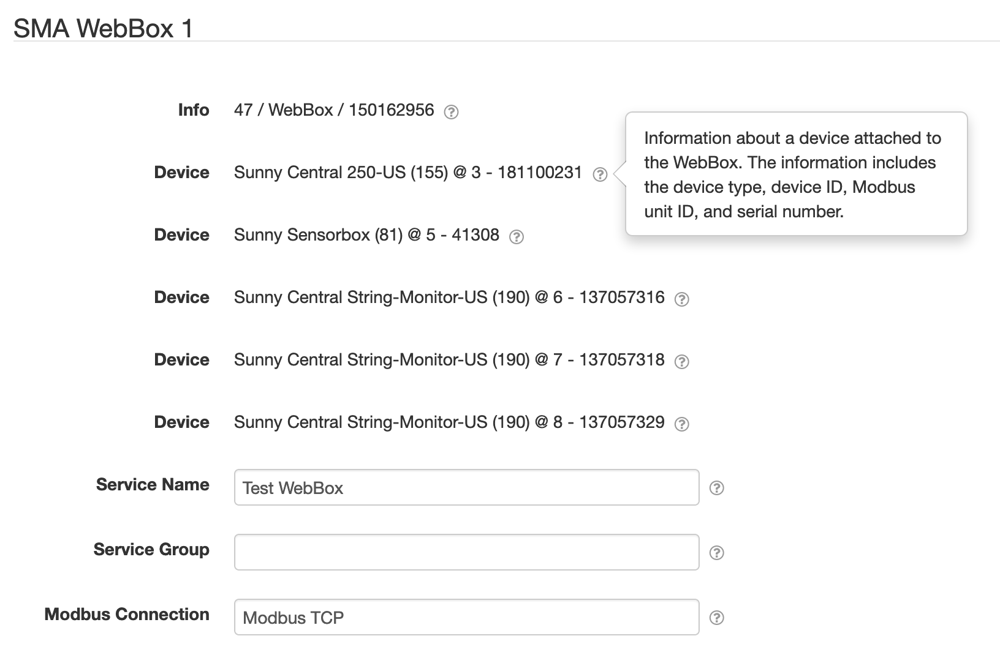
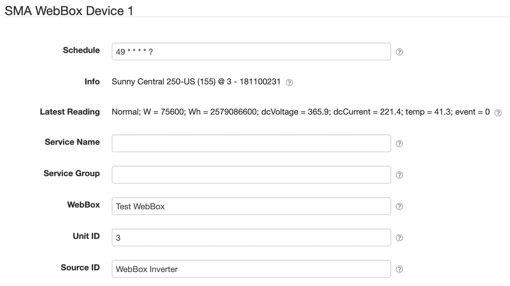

# SolarNode SMA WebBox Data Source

This project provides SolarNode plugin that can collect data from devices connected to an SMA
WebBox. It works using the Modbus protocol, which must be enabled on the WebBox you want to
integrate SolarNode with.

# Install

The plugin can be installed via the **Plugins** page on your SolarNode. It appears under the
**Datum** category as **SMA WebBox Data Source**.

# Use

Once installed, new **SMA WebBox**  and **SMA WebBox Device** components will appear on the
**Settings** page on your SolarNode. Click on the **Manage** button to configure devices. You'll
need to add one [WebBox](#webbox) configuration for each WebBox you want to be able to collect data
from, and then one [WebBox Device](#webbox-device) configuration for each physical device (connected
to the WebBox) you want to collect data from.

# WebBox

The first component required to integrate with an SMA WebBox is an **SMA WebBox** component. This is
where you configure SolarNode's Modbus connection to the WebBox. This component is then referenced
by [WebBox Device](#webbox-device) configurations.

## WebBox settings

Each device configuration contains the following overall settings:

| Setting            | Description |
|:-------------------|:------------|
| Device             | A read-only label of a device connected to the WebBox. |
| Service Name       | A unique name to identify this WebBox with. This value will be referenced by [WebBox Device](#webbox-device) configurations. |
| Service Group      | An optional group name to associate this component with. |
| Modbus Connection  | The **Service Name** of the Modbus connection to use. |

## WebBox settings notes

<dl>
	<dt>Device</dt>
	<dd>For each device connected to the WebBox, a <i>Device</i> label will appear that shows a
	description of the device in the form <i>Device Type (Device ID) @ Unit ID - Serial Number</i>.</dd>
	<dt>Modbus Connection</dt>
	<dd>This is the <i>Service Name</i> of the Modbus component configured elsewhere
	in SolarNode. You must configure that component with the proper connection settings
	for your Modbus network, configure a unique <i>Service Name</i> on that component, and then
	enter that same service name here.</dd>
</dl>

# WebBox Device

The second component required to integrate with an SMA WebBox is an **SMA WebBox Device** component.
This is the actual data source component that collects data from devices connected to the WebBox.
This is where you configure the unit ID of the device exposed by the WebBox that you want to collect
data from.

## WebBox Device settings

Each device configuration contains the following overall settings:

| Setting              | Description |
|:---------------------|:------------|
| Service Name         | A unique name to identify this WebBox Device with.  |
| Service Group        | An optional group name to associate this component with. |
| WebBox               | The **Service Name** of the [WebBox](#webbox) component to use. |
| Unit ID              | The Modbus Unit ID of the device to collect data from. |
| Source ID            | The SolarNetwork unique source ID to assign to datum collected from this device. |
| Datum Filter Service | The **Service Name** of a filter service to apply. |

## WebBox Device settings notes

<dl>
	<dt>Unit ID</dt>
	<dd>The WebBox component will show you the Unit ID of each device connected to the WebBox,
	after the <code>@</code> symbol in the <b>Device</b> setting values. For example the Unit ID
	is <b>5</b> in the <i>Device</i> setting value <code>Sunny Sensorbox (81) @ 5 - 41308</code>.</dd>
	<dt>Source ID</dt>
	<dd>This value unique identifies the data collected from this device, by this node,
	 on SolarNetwork. Each configured device should use a different value.</dd>
	 <dt>Datum Filter Service</dt>
	 <dd>The <i>Service Name</i> of a filter service to apply to datum collected by this device.
	 For example a <a href="../net.solarnetwork.node.datum.samplefilter/#virtual-meter-filter">Virtual
	 Meter Filter</a> could be used to derive an <code>irradianceHours</code> property from a Sunny
	 Sensorbox's <code>irradiance</code> property.</dd>
</dl>
