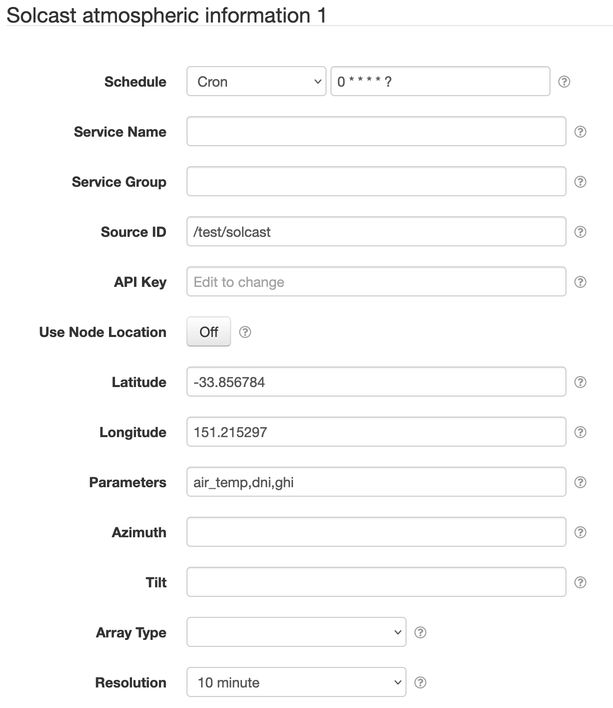

# SolarNode Solcast Datum Source

This project provides SolarNode plugin that collects atmospheric data from [Solcast][solcast]
into a datum stream. Each component collects data from a single GPS coordinate. Each time a datum
is sampled in SolarNode, the _most recently observed_ data will be used to generate a datum.

# Install

The plugin can be installed via the **Plugins** page on your SolarNode. It appears under the
**Datum** category as **Solcast Datum Source**.

# Use

Once installed, a new **Solcast atmospheric information** component will appear on the **Settings** page on your
SolarNode. Click on the **Manage** button to configure individual components.

## Settings

Each device configuration contains the following overall settings:

| Setting              | Description |
|----------------------|-------------|
| Schedule             | A cron schedule that determines when data is collected. |
| Service Name         | A unique name to identify this data source with. |
| Service Group        | A group name to associate this data source with. |
| Source ID            | The SolarNetwork unique source ID to assign to datum generated by this component. |
| API Key              | The Solcast API key to authenticate to the Solcast API with. |
| Use Node Location    | If enabled then use the node's own GPS coordinate, as configured in SolarNetwork. If disabled then use the _Latitude_ and _Longitude_ setting values configured on the component. |
| Latitude             | The GPS latitude to use, if _Use Node Location_ is not enabled or the node has no GPS coordinate configured in SolarNetwork. |
| Longitude            | The GPS longitude to use, if _Use Node Location_ is not enabled or the node has no GPS coordinate configured in SolarNetwork. |
| Parameters           | A comma-delimited  list of Solcast _output parameters_ to include when querying. |
| Azimuth              | The angle (degrees) from true north that the PV system is facing, used for GTI calculations. The value must be between `-180` and `180`. |
| Tilt                 | The angle (degrees) tilt from `0` (facing directly upwards) to `90` (facing the horizon). Used for GTI calculations. |
| Array Type           | The array mount type. Used for GTI calculations. |
| Resolution           | The desired _period_ of the Solcast data. Not all locations support all resolutions. See the [Solcast][solcast] site for more information. |

# Datum property mappings

Many Solcast output parameters are copied as-is to the resulting datum stream. The following 
parameters are exceptions:

| Parameter | Note |
|:----------|:-----|
| `air_temp`           | This property is saved as the `temp` instantaneous datum property. |
| `dewpoint_temp`      | This property is saved as the `dew` instantaneous datum property. |
| `relative_humidity`  | This property is saved as the `humidity` instantaneous datum property. |
| `period_end`         | This timestamp is offset using the `period` parameter to resolve each datum's timestamp. |
| `period`             | This value is converted into an equivalent number of seconds and saved as the `duration` instantaneous datum property. |
| `surface_pressure`   | This property is saved as the `atm` instantaneous datum property and converted into Pa. |
| `wind_direction_10m` | This property is saved as the `wdir` instantaneous datum property. |
| `wind_speed_10m`     | This property is saved as the `wpeed` instantaneous datum property. |

[solcast]: https://solcast.com/
