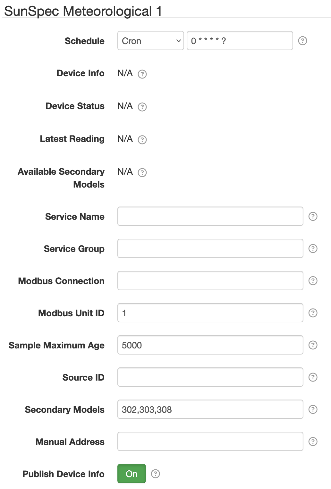
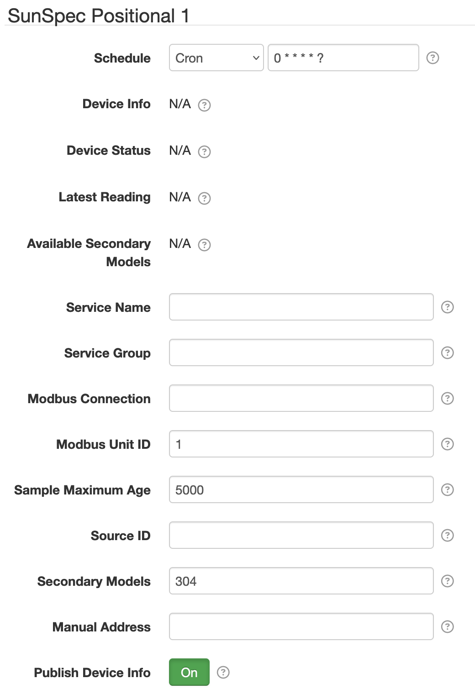

# SolarNode SunSpec Compatible Environmental Datum Source

This project provides SolarNode plugin that can collect data from any [SunSpec][suns] compatible
meteorological, irradiance, GPS, or inclination device. The plugin provides two data source
components: one for meteorological and another for positional devices.

# Use

Once installed, new **SunSpec Meteorological** and **SunSpec Positional** components will appear on
the **Settings** page on your SolarNode. Click on the **Manage** button to configure devices. You'll
need to add one configuration for each device you want to collect data from.

# Meteorological device settings

Each Meteorological device configuration contains the following overall settings:

| Setting             | Description |
|:--------------------|:------------|
| Schedule            | A cron schedule that determines when data is collected. |
| Service Name        | A unique name to identify this data source with. |
| Service Group       | A group name to associate this data source with. |
| Modbus Connection   | The **Service Name** of the **Modbus Connection** component to use. |
| Modbus Unit ID      | The ID of the Modbus device to collect data from, from 1 - 255. |
| Sample Maximum Age  | A minimum time to cache captured Modbus data, in milliseconds. |
| Source ID           | The SolarNetwork source ID to assign to captured datum. |
| Secondary Models    | List of additional SunSpec model IDs to capture data from. |
| Manual Address      | The Modbus **0-based** register where the SunSpec information starts. Leave unspecified or `-1` to automatically discover the address. Typically only necessary with devices that do not adhere to the SunSpec standard fully. Can be specified in hex like `0x1000`. |
| Publish Device Info | If enabled, then publish device info such as the device model and serial number as source metadata under the `deviceInfo` property metadata key. |

## Meteorological device settings notes

 * **Modbus Port** — This is the **Service Name** of the **Modbus Connection** component configured
   elsewhere in SolarNode. You must configure that component with the proper connection settings for
   your Modbus network, configure a unique service name on that component, and then enter that same
   service name here.
 * **Sample Maximum Age** — SolarNode will cache the data collected from the Modbus device for at
   least this amount of time before refreshing data from the device again. Some devices do not refresh
   their values more than a fixed interval, so this setting can be used to avoid reading data
   unnecessarily. This setting also helps in highly dynamic configurations where other plugins request
   the current values from the device frequently.
 * **Source ID** — This value unique identifies the data collected from this device, by this node,
   on SolarNetwork. Each configured device should use a different value.

# Positional device settings

Each Positional device configuration contains the following overall settings:

| Setting             | Description |
|:--------------------|:------------|
| Schedule            | A cron schedule that determines when data is collected. |
| Service Name        | A unique name to identify this data source with. |
| Service Group       | A group name to associate this data source with. |
| Modbus Connection   | The **Service Name** of the **Modbus Connection** component to use. |
| Modbus Unit ID      | The ID of the Modbus device to collect data from, from 1 - 255. |
| Sample Maximum Age  | A minimum time to cache captured Modbus data, in milliseconds. |
| Source ID           | The SolarNetwork source ID to assign to captured datum. |
| Secondary Models    | List of additional SunSpec model IDs to capture data from. |
| Manual Address      | The Modbus **0-based** register where the SunSpec information starts. Leave unspecified or `-1` to automatically discover the address. Typically only necessary with devices that do not adhere to the SunSpec standard fully. Can be specified in hex like `0x1000`. |
| Publish Device Info | If enabled, then publish device info such as the device model and serial number as source metadata under the `deviceInfo` property metadata key. |

## Positional device settings notes

 * **Modbus Port** — This is the **Service Name** of the **Modbus Connection** component configured
   elsewhere in SolarNode. You must configure that component with the proper connection settings for
   your Modbus network, configure a unique service name on that component, and then enter that same
   service name here.
 * **Sample Maximum Age** — SolarNode will cache the data collected from the Modbus device for at
   least this amount of time before refreshing data from the device again. Some devices do not refresh
   their values more than a fixed interval, so this setting can be used to avoid reading data
   unnecessarily. This setting also helps in highly dynamic configurations where other plugins request
   the current values from the device frequently.
 * **Source ID** — This value unique identifies the data collected from this device, by this node,
   on SolarNetwork. Each configured device should use a different value.

 [suns]: https://sunspec.org/
