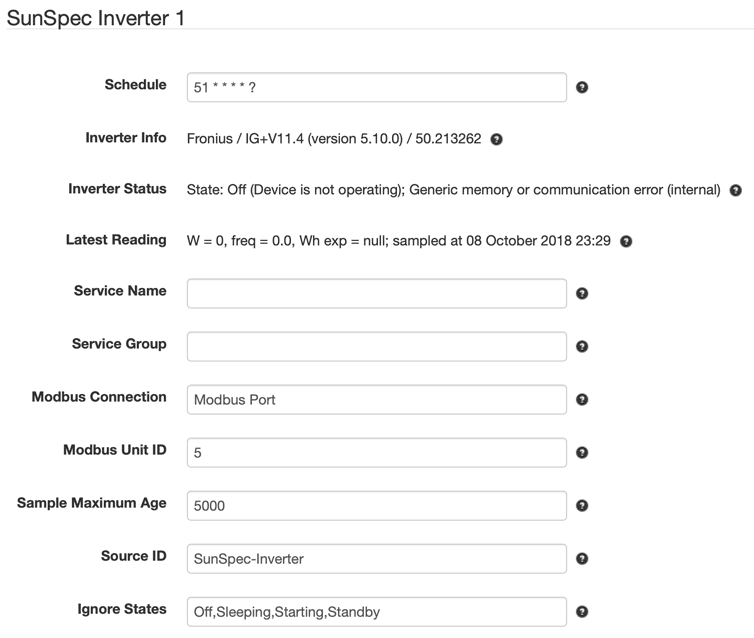

# SolarNode SunSpec Compatible Inverter Datum Source

This project provides SolarNode plugin that can collect data from any [SunSpec][suns]
compatible inverter.

# Install

The plugin can be installed via the **Plugins** page on your SolarNode. It
appears under the **Datum** category as **SunSpec Inverter Data Source**.

# Use

Once installed, a new **SunSpec Inverter** component will
appear on the **Settings** page on your SolarNode. Click on the **Manage**
button to configure devices. You'll need to add one configuration for each
Modbus device you want to collect data from.

## Overall device settings

Each device configuration contains the following overall settings:

| Setting            | Description                                             |
|--------------------|---------------------------------------------------------|
| Schedule           | A cron schedule that determines when data is collected. |
| Service Name       | A unique name to identify this data source with. |
| Service Group      | A group name to associate this data source with. |
| Modbus Connection  | The service name of the Modbus port to use. |
| Modbus Unit ID     | The ID of the Modbus device to collect data from, from 1 - 255. |
| Sample Maximum Age | A minimum time to cache captured Modbus data, in milliseconds. |
| Source ID          | The SolarNetwork source ID to assign to captured datum. |
| Secondary Models   | List of additional SunSpec model IDs to capture data from. |
| Ignore States      | A list of inverter operating states to skip collecting data while in. |

## Overall device settings notes

<dl>
	<dt>Modbus Port</dt>
	<dd>This is the <i>service name</i> of the Modbus component configured elsewhere
	in SolarNode. You must configure that component with the proper connection settings
	for your Modbus network, configure a unique service name on that component, and then
	enter that same service name here.</dd>
	<dt>Source ID</dt>
	<dd>This value unique identifies the data collected from this device, by this node,
	 on SolarNetwork. Each configured device should use a different value.</dd>
	<dt>Sample Maximum Age</dt>
	<dd>SolarNode will cache the data collected from the Modbus device for at least
	this amount of time before refreshing data from the device again. Some devices
	do not refresh their values more than a fixed interval, so this setting can be
	used to avoid reading data unnecessarily. This setting also helps in highly
	dynamic configurations where other plugins request the current values from
	the device frequently.</dd>
	<dt>Secondary Models</dt>
	<dd>This provides a way to collect data from additional SunSpec models supported by this
	plugin. The list of supported models are listed below.</dd>
	<dt>Ignore States</dt>
	<dd>Some inverters shut down at night, and may not report valid values for various readings
	like the total lifetime energy exported. Use this setting to avoid collecting data when
	the inverter is in one of the configured states. Valid states are: <code>Off</code>, 
	<code>Sleeping</code>, <code>Starting</code>, <code>Mppt</code>, 
	<code>Throttled</code>, <code>ShuttingDown</code>, <code>Fault</code>, 
	<code>Standby</code>.</dd>
</dl>

# Secondary model support

The following additional SunSpec models can be captured into the datum generated by this plugin.

## Model 160 - Multiple MPPT Inverter Extension

This model exposes individual DC-level inverter module information (i.e. strings). If enabled,
then additional datum properties, with names all suffixed by `_ID` where `ID` is the module ID,
will be collected for each available module (if supported by the inverter):

| Property | Classification | Description |
|:------------|:---------------|:------------|
| `dcVoltage` | `i`            | PV DC input voltage, in volts. |
| `dcPower`   | `i`            | PV DC input power, in watts. |
| `wattHours` | `a`            | PV DC input energy, in watt-hours. |
| `temp`      | `i`            | PV module temperature, in degrees celsius. |
| `opState`   | `s`            | PV module SunSpec operating state code. |
| `events`    | `s`            | PV module SunSpec event bitmask. |

 [suns]: https://sunspec.org/
 
