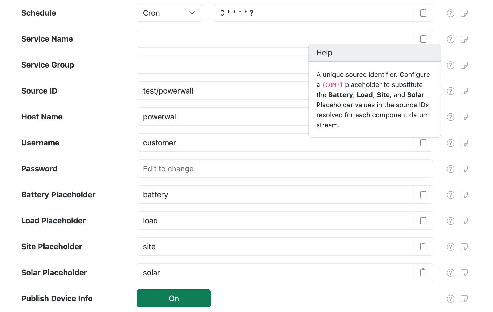

# SolarNode Tesla Powerwall Datum Source

This project provides a SolarNode plugin that collects energy data from
[Tesla Powerwall][powerwall] battery systems into datum streams.

# Use

Once installed, a new **Tesla Powerwall** component will appear on the **Settings** page on your
SolarNode. Click on the **Manage** button to configure individual components.

## Settings

Each device configuration contains the following overall settings:

| Setting              | Description |
|----------------------|-------------|
| Service Name         | A unique name to identify this data source with. |
| Service Group        | A group name to associate this data source with. |
| Source ID            | The SolarNetwork unique source ID template to assign to datum generated by this component. A `{COMP}` [placeholder][placeholders] will be provided to resolve each component datum stream source ID. See [Datum streams](#datum-streams) for more information. |
| Host Name            | The hostname of the Powerwall to connect to. Can include a `:port` suffix. |
| Username             | The username to use. Can use `customer` if no custom user has been set up. |
| Password             | The password to use. Can use the last 5 digits of the Powerwall's serial number if no custom user has been set up. |
| Battery Placeholder  | The battery component source ID `{COMP}` placeholder value to use. |
| Load Placeholder     | The load component source ID `{COMP}` placeholder value to use. |
| Site Placeholder     | The site component source ID `{COMP}` placeholder value to use. |
| Solar Placeholder    | The solar component source ID `{COMP}` placeholder value to use. |

# Datum streams

Several datum streams are collected by this plugin. They all use the configured **Source ID** along
with a `{COMP}` [placeholder][placeholders] for the component. If no `{COMP}` placeholder is
provided in the Source ID setting, then the **Placeholder** setting for each component will be
appended to the Source ID, preceded by a `/` character.

Here are some example settings to show how the component source IDs are resolved, assuming the
default placeholder values of `batter`, `load`, `site`, and `solar` are configured:

| Source ID | Resolved Source IDs | Notes |
|:----------|:--------------------|:------|
| `/pw/1` | `/pw/1/battery`, `/pw/1/load`, `/pw/1/site`, `/pw/1/solar` | No `{COMP}` placeholder provided, so placeholders appended to end. |
| `/pw/{COMP}/1` | `/pw/battery/1`, `/pw/load/1`, `/pw/site/1`, `/pw/solar/1` | The `{COMP}` placeholder is used. |

## Common properties

All components share some general properties, including:

| Property | Classification | Units | Notes |
|:---------|:---------------|:------|:------|
| `watts`             | Instantaneous | W   | |
| `reactivePower`     | Instantaneous | VAR | |
| `apparentPower`     | Instantaneous | VA  | |
| `frequency`         | Instantaneous | Hz  | |
| `wattHours`         | Accumulating  | Wh  | |
| `wattHoursReverse`  | Accumulating  | Wh  | |
| `voltage`           | Instantaneous | V   | |
| `current`           | Instantaneous | A   | |
| `current_a`         | Instantaneous | A   | |
| `current_b`         | Instantaneous | A   | |
| `current_c`         | Instantaneous | A   | |

## Battery

In addition to the general properties listed above, the following additional properties are included:

| Property | Classification | Units | Notes |
|:---------|:---------------|:------|:------|
| `soc`               | Instantaneous | %  | Percentage from 0-100 |
| `capacityWattHours` | Instantaneous | Wh | Nominal capacity. |
| `availWattHours`    | Instantaneous | Wh | Nominal available energy. |
| `gridConnected`     | Status        |    | `1` if connected to the grid, `0` otherwise. |

## Load

This component represents **home load** (consumption) data.

## Site

This component represents **grid load** data.

## Solar

This component represents **solar PV** data.

[powerwall]: https://www.tesla.com/powerwall
[placeholders]: https://solarnetwork.github.io/solarnode-handbook/users/placeholders/
