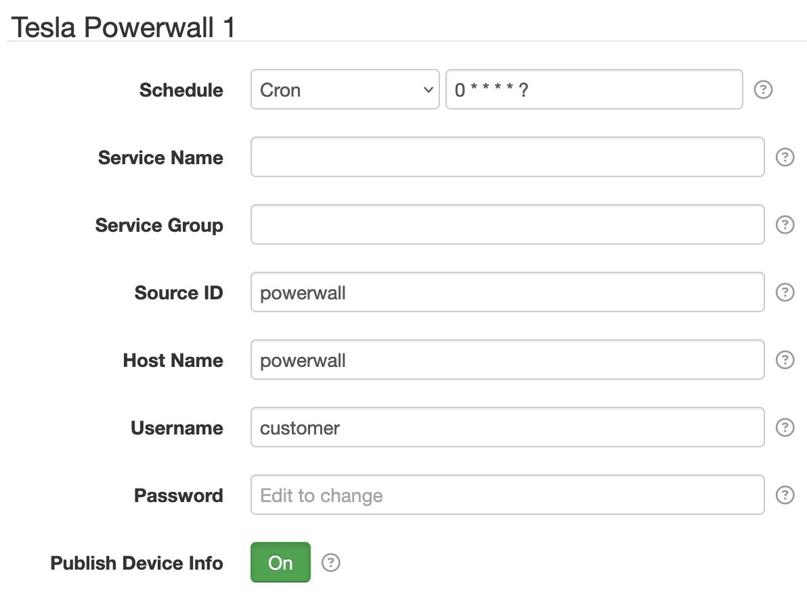

# SolarNode Tesla Powerwall Datum Source

This project provides a SolarNode plugin that collects energy data from
[Tesla Powerwall][powerwall] battery systems into datum streams.

# Use

Once installed, a new **Tesla Powerwall** component will appear on the **Settings** page on your
SolarNode. Click on the **Manage** button to configure individual components.

## Settings

Each device configuration contains the following overall settings:

| Setting              | Description |
|----------------------|-------------|
| Service Name         | A unique name to identify this data source with. |
| Service Group        | A group name to associate this data source with. |
| Source ID            | The SolarNetwork unique source ID to assign to datum generated by this component. |
| Host Name            | The hostname of the Powerwall to connect to. Can include a `:port` suffix. |
| Username             | The username to use. Can use `customer` if no custom user has been set up. |
| Password             | The password to use. Can use the last 5 digits of the Powerwall's serial number if no custom user has been set up. |

# Datum streams

Several datum streams are collected by this plugin. They all use the configured **Source ID**
along with a unique suffix. They also share some general properties, including:

| Property | Classification | Units | Notes |
|:---------|:---------------|:------|:------|
| `watts`             | Instantaneous | W | |
| `reactivePower`     | Instantaneous | VAR | |
| `apparentPower`     | Instantaneous | VA | |
| `frequency`         | Instantaneous | Hz | |
| `wattHours`         | Accumulating  | Wh | |
| `wattHoursReverse`  | Accumulating  | Wh | |
| `voltage`           | Instantaneous | V | |
| `current`           | Instantaneous | A | |
| `current_a`         | Instantaneous | A | |
| `current_b`         | Instantaneous | A | |
| `current_c`         | Instantaneous | A | |

## Battery

The **battery** data will be published on the Source ID value appended with `/battery`. In addition
to the general properties listed above, the following additional properties are included:

| Property | Classification | Units | Notes |
|:---------|:---------------|:------|:------|
| `soc`             | Instantaneous | % | Percentage from 0-100 |
| `capacityWattHours` | Instantaneous | Wh | Nominal capacity. |
| `availWattHours`    | Instantaneous | Wh | Nominal available energy. |
| `gridConnected`     | Status        |    | `1` if connected to the grid, `0` otherwise. |

## Load

The **home load** data will be published on the Source ID value appended with `/load`.

## Site

The **grid load** data will be published on the Source ID value appended with `/site`.

## Solar

The **solar PV** data will be published on the Source ID value appended with `/solar`.

[powerwall]: https://www.tesla.com/powerwall
