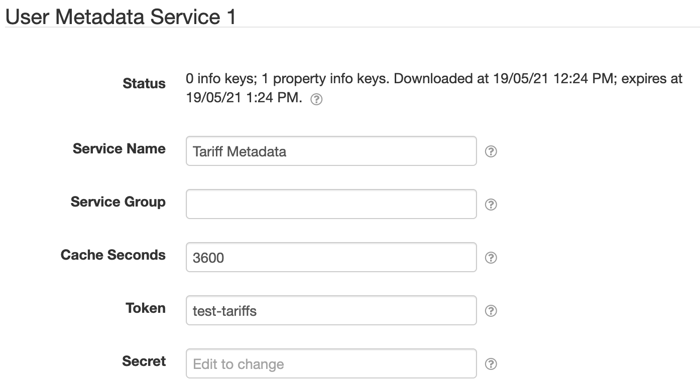

# SolarNode Time-based Tariff Datum Source

This project provides SolarNode plugin that turns a time-based tariff schedule into a datum stream.
The schedule is provided by a CSV metadata property.


# Use

Once installed, a new **Time-based Tariff Datum Source** component will appear on the **Settings >
Components** page in SolarNode. Click on the **Manage** button to configure the component.
You'll need to add one configuration for each tariff schedule you want to generate a datum stream
from.

# Overall settings

Each component contains the following overall settings:

| Setting            | Description |
|:-------------------|:------------|
| Schedule           | A [cron schedule][sn-cron-syntax] that determines when data is collected, or millisecond frequency. |
| Service Name       | A unique name to identify this data source with. |
| Service Group      | A group name to associate this data source with. |
| Source ID          | The SolarNetwork unique source ID to assign to datum generated by this component. |
| Metadata Service   | The **Service Name** of the Metadata Service to obtain the tariff schedule from. See [below](#metadata-service) for more information. |
| Metadata Path      | The metadata path that will resolve the tariff schedule from the configured Metadata Service. |
| Language           | A IETF BCP 47 language tag to parse the tariff data with. If not configured then the default system language will be assumed. |
| First Match        | If enabled, then apply only the **first** tariff that matches a given datum date. If disabled, then apply **all** tariffs that match. |
| Schedule Cache     | The amount of seconds to cache the tariff schedule obtained from the configured Metadata Service. |
| Tariff Evaluator   | The **Service Name** of a _Time-based Tariff Evaluator_ service to evaluate each tariff to determine if it should apply to a given datum. |
| Properties         | A list of datum property configurations. Any number of property configurations can be added, for each tariff schedule rate to be collected in the datum stream. |

# Property settings

You must add one property configuration for each tariff rate column you want to capture as a datum
property. Each property configuration contains the following settings:


| Setting            | Description |
|:-------------------|:------------|
| Rate Name          | The tariff schedule column name to collect as a datum property. |
| Property Type      | The type of the datum property to generate. |
| Unit Offset        | An offset to add to the value. This is the first transform applied. Set to `0` for no offset. |
| Unit Multiplier    | A multiplication factor to normalize the value into some other unit. This is the second transform applied, **after** the **Unit Offset**. Set to `1` to leave the input unchanged. |
| Multiplier         | A multiplication factor to normalize the value into some other unit. This is the third transform applied, **after** the **Unit Multiplier**. Set to `1` to leave the input unchanged. |
| Offset             | An offset to add to the value. This is the forth transform applied, **after** the **Multiplier**. Set to `0` for no offset. |
| Property           | The name of the datum property to generate. |

## Value transform

The various **Multiplier** and **Offset** settings allow you to apply two linear equations to the
datum property values to transform a raw data value _x_ into a corresponding metric value _y_.

First the **Unit Offset** _B_ and **Unit Multiplier** _M_ are applied using the equation

```
y = (x + B) × M
```

Then the **Multiplier** _m_ and **Offset** _b_ are applied using the equation

```
y = (m × x) + b
```

Taken together, the overal equation applied is thus:

```
y = (m × ((x + B) × M)) + b
```

# Metadata Service

SolarNode provides **Node Metadata Service** and **User Metadata Service** components that this datum source
can use for the **Metadata Service** setting. This allows you to configure the tariff schedule as either
node or user metadata in SolarNetwork and then SolarNode will download the schedule and use it as needed.

The **Node Metadata Service** does not require any configuration to use (its **Service Name** is simply
`Node Metadata Service`), but the **User Metadata Service** requires setting up.



You must configure a SolarNetwork security token to use the User Metadata Service. We recommend that
you create a **Data** security token in SolarNetwork with a limited security policy that includes an
**API Path** of just `/users/meta` and a **User Metadata Path** of something granular like
`/pm/tariffs/**`. This will give SolarNode access to just the tariff metadata under the
`/pm/tariffs` metadata path.


The [SolarNetwork API Explorer][api-explorer] can be used to add the necessary tariff schedule
metadata to your account. For example:


# Tariff schedule format

The tariff schedule obtained from the configured Metadata Service uses a simple CSV-based format
that can be easily exported from a spreadsheet. Each row represents a rule that includes:

 * a set of time constraints that must be satisfied for the rule to be applied
 * a list of tariff rates to be added to datum when the constraints are satisfied

> :warning: **Note** a header row is **required** because the tariff rate names are defined there.
> The first 4 column names are ignored.

The schedule consists of 4 time constraint columns followed by one or more tariff rate columns. Each
constraint is represented as a range, in the form `start - end`. Multiple ranges can be specified by
adding a `,` between each range (see [Range sets](#range-sets) below). Whitespace is allowed around the
`-` character. If the `start` and `end` are the same, the range may be shortened to just `start`. A
range can be left empty to represent **all values**. The time constraint columns are:

| Column | Constraint | Description |
|:-------|:-----------|:------------|
| 1      | Month range | An inclusive month range. Months can be specified as numbers (1-12) or abbreviations (Jan-Dec) or full names (January - December). When using text names case does not matter and they will be parsed using the **Lanauage** setting. |
| 2      | Day range | An inclusive day-of-month range. Days are specified as numbers (1-31). |
| 3      | Weekday range | An inclusive day-of-week range. Weekdays can be specified as numbers (1-7) with Monday being `1` and Sunday being `7`, or abbreviations (Mon-Sun) or full names (Monday - Sunday). When using text names case does not matter and they will be parsed using the **Lanauage** setting. |
| 4      | Time range | An **inclusive - exclusive** time-of-day range. The time can be specified as whole hour numbers (0-24) or `HH:MM` style (`00:00` - `24:00`). |

## Range sets

All range values can be specified as a comma-delimited set of ranges, so disparate ranges can be used.
For example a Month range could be specified as `Jan-Mar,Oct-Dec` to represent the overall set of months
including January, February, March, October, November, and December.

## Example schedule

Here's an example schedule with 4 rules and a single **TOU** rate (the `*` stands for **all values**):

| Rule  | Month   | Day | Weekday | Time |   TOU |
|:------|:--------|:----|:--------|:-----|------:|
| **1** | Jan-Dec | *   | Mon-Fri | 0-8  | 10.48 |
| **2** | Jan-Dec | *   | Mon-Fri | 8-24 | 11.00 |
| **3** | Jan-Dec | *   | Sat-Sun | 0-8  |  9.19 |
| **4** | Jan-Dec | *   | Sat-Sun | 8-24 | 11.21 |


In CSV format the schedule would look like this:

```csv
Month,Day,Weekday,Time,TOU
Jan-Dec,,Mon-Fri,0-8,10.48
Jan-Dec,,Mon-Fri,8-24,11.00
Jan-Dec,,Sat-Sun,0-8,9.19
Jan-Dec,,Sat-Sun,8-24,11.21
```

When encoding into SolarNetwork metadata JSON, that same schedule would look like this when saved
at the `/pm/tariffs/schedule` path:

```json
{
  "pm": {
    "tariffs": {
      "schedule": "Month,Day,Weekday,Time,TOU\nJan-Dec,,Mon-Fri,0-8,10.48\nJan-Dec,,Mon-Fri,8-24,11.00\nJan-Dec,,Sat-Sun,0-8,9.19\nJan-Dec,,Sat-Sun,8-24,11.21"
    }
  }
}
```

[api-explorer]: https://go.solarnetwork.net/dev/api/
[sn-cron-syntax]: https://github.com/SolarNetwork/solarnetwork/wiki/SolarNode-Cron-Job-Syntax
