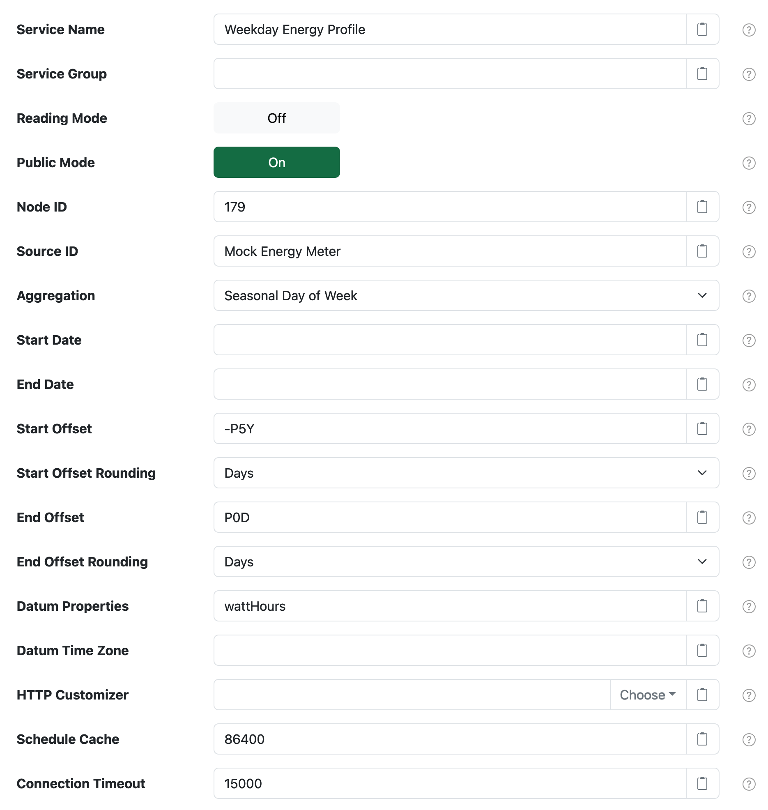

# SolarNode Time-based Tariff Schedule - SolarNetwork

This project provides SolarNode plugin that turns a time-based tariff schedule into a datum stream.
This can be used to generate a simple time-based profile of a datum stream, for example by querying
SolarNetwork for multiple years of data with an aggregate level like `SeasonalDayOfWeek`.

# Use

Once installed, a new **Time-based Tariff Schedule - SolarNetwork** component will appear on the **Settings >
Components** page in SolarNode. Click on the **Manage** button to configure the component.

# Overall settings

Each component contains the following overall settings:

| Setting               | Description |
|:----------------------|:------------|
| Schedule              | A [cron schedule][sn-cron-syntax] that determines when data is collected, or millisecond frequency. |
| Service Name          | A unique name to identify this data source with. |
| Service Group         | A group name to associate this data source with. |
| Reading Mode          | When **enabled** then query the reading API, otherwise the list API. Also when enabled, the **Aggregation** setting only supports `Hour`, `Day`, `Month`, and `Year` values. |
| Public  Mode          | When **enabled** then query using the public datum stream API. The node that owns the stream must be configured in Public mode. When **disabled** then SolarNetwork token credentials must be provided by the configured **HTTP Customizer**. |
| Node ID               | The node ID of the datum stream to query. Leave blank to use the active node's ID. |
| Source ID             | The source ID of the datum stream to query. |
| Aggregation           | The aggregation level of the datum stream to query. |
| Start Date            | An explicit start date of the datum stream to query in the datum stream's local time zone, for example `2020-01-01 00:00`. Overrides any **Start Offset** setting if configured. |
| End Date              | An explicit end date of the datum stream to query in the datum stream's local time zone, for example `2020-01-01 00:00`. Overrides any **End Offset** setting if configured. |
| Start Offset          | An offset added to the time the datum stream is queried to use as the query's **start date** value. Supports a calendar-based form `PnYnMnD` or `PnW`, optionally prefixed with `-` for subtraction, where `n` is a number of years `Y`, months `M`, days `D`, or weeks `W`. For example `-P1Y2M3D` represents minus 1 year and 2 months and 3 days, or `-P7D` minus 7 days, or `-P4W` minus 4 weeks. Also supports a time-based form `PnDTnHnMn.nS` where `n` is a number of days `D`, hours `H`, minutes `M`, or fractional seconds `S`. For example `-PT15M` represents minus 15 minutes, or `-PT20.345S` minus 20.345 seconds. |
| Start Offset Rounding | A rounding mode to apply to the **Start Offset**. |
| End Offset            | An offset added to the time the datum stream is queried to use as the query's **end date** value. See the **Start Offset** description for details on the supported syntax. |
| End Offset Rounding   | A rounding mode to apply to the **End Offset**. |
| Datum Properties      | A comma-delimited list of datum stream property names to use for tariff rates. |
| Datum Time Zone       | The local time zone of the datum stream. If not provided the node device's time zone will be used. :warning: **Note** that the various _X of Y_ aggregates like **Day of Week** will automatically use `UTC`. |
| HTTP Customizer       | The **Service Name** of the **HTTP Request Customizer** component to apply to SolarNetwork requests. This is required when **Public Mode** is **disabled**, to supply the SolarNetwork token credentials. |
| Schedule Cache        | The amount of **seconds** to cache the tariff schedule generated from the datum stream. |
| Connection Timeout    | The maximum amount of **milliseconds** to wait when connecting to SolarNetwork before giving up. |

[sn-cron-syntax]: https://github.com/SolarNetwork/solarnetwork/wiki/SolarNode-Cron-Job-Syntax
