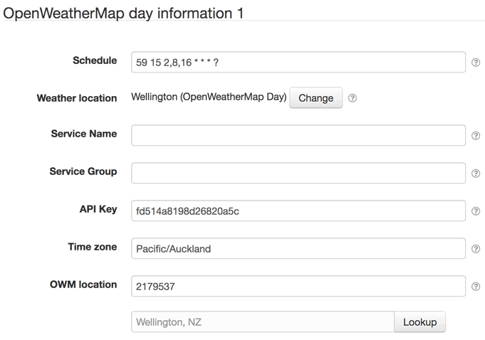
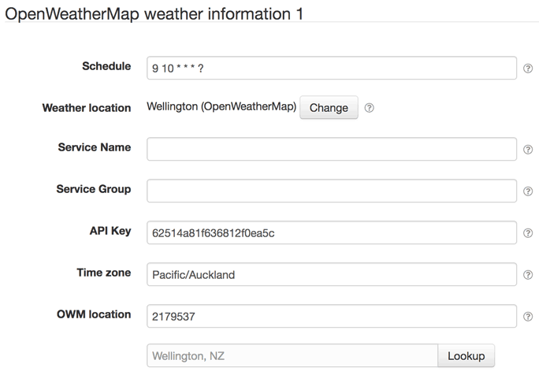

# SolarNode OpenWeatherMap Datum Source

This project provides SolarNode plugin that can collect data from the OpenWeatherMap
API, for day information (sunrise, sunset, etc.) as well as weather conditions and
forecasts.

# Install

The plugin can be installed via the **Plugins** page on your SolarNode. It appears under
the **Weather** category as **OpenWeatherMap Weather**.

# Use

Once installed, two new components will appear on the **Settings** page on your SolarNode:
**OpenWeatherMap day information** and **OpenWeatherMap weather information**  Click on
the **Manage** button to configure either data source. You'll need to add one
configuration for each type and location  you want to collect data from.

## Overall settings

Each configuration contains the following overall settings:

| Setting            | Description                                                                      |
|--------------------|----------------------------------------------------------------------------------|
| Schedule           | A cron schedule that determines when data is collected.                          |
| Weather Location   | The SolarNetwork weather location to associate the collected data with.          |
| Service Name       | A unique name to identify this data source with.                                 |
| Service Group      | A group name to associate this data source with.                                 |
| API Key            | The OpenWeatherMap API key to authenticate with.                                 |
| Time zone          | A time zone to use for location-specific dates and times.                        |
| OWM location       | The OpenWeatherMap ID of the location to collect data from.                      |
| Collection Mode    | The type of data to collect: observation or forecast.                            |

## Overall settings notes

<dl>
	<dt>Time zone</dt>
	<dd>This should match the time zone of the Weather Location and OWM location. When you configure
	the <b>Weather Location</b> value, this will be automatically populated with that location's 
	time zone.</dd>
	<dt>OWM location</dt>
	<dd>Use the <b>Lookup</b> button to find the location ID value, which will present a
	search form to easily find the location ID: </dd>
	<dt>Collection Mode</dt>
	<dd>The observation and forecast data can be split into different source IDs by 
	configuring two separate components and setting one to <code>Observation</code> and the other
	to <code>Forecast</code>.</dd>
</dl>
