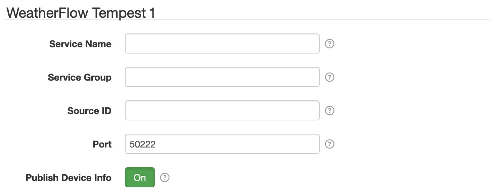

# SolarNode WeatherFlow Tempest Datum Source

This project provides a SolarNode plugin that collects atmospheric data from
[WeatherFlow Tempest][tempest] stations into datum streams, by listening for
the status messages broadcast by the station via UDP on the local network.



# Use

Once installed, a new **WeatherFlow Tempest** component will appear on the **Settings** page on your
SolarNode. Click on the **Manage** button to configure individual components.

## SolarNodeOS IP port considerations

By default SolarNodeOS has a built-in firewall enabled that will not allow access to arbitrary IP
ports. WeatherFlow Tempest broadcasts its data over UDP on port `50222`, so that port must be opened
in the SolarNodeOS firewall, which by default is `nftables` and configured via the
`/etc/nftables.conf` file. To open port 50222, you'd add the following lines, after the existing
ones that open ports 80 and 8080:

```
# Allow WeatherFlow Tempest messages
add rule ip filter INPUT udp dport 50222 counter accept
```

You will need to reload the firewall rules after making this change:

```sh
sudo systemctl reload nftables
```

## Settings

Each device configuration contains the following overall settings:

| Setting              | Description |
|----------------------|-------------|
| Service Name         | A unique name to identify this data source with. |
| Service Group        | A group name to associate this data source with. |
| Source ID            | The SolarNetwork unique source ID to assign to datum generated by this component. |
| Port                 | The UDP port to listen on. Defaults to `50222`. |

# Datum streams

Several datum streams are collected by this plugin.

## Observations

The station **observation data** will be published on the **Source ID** value configured. The
published properties include:

| Property | Classification | Units | Notes |
|:---------|:---------------|:------|:------|
| `atm`               | Instantaneous | pascals | note this is converted from millibar |
| `avgStrikeDistance` | Instantaneous | m | note this is converted from km |
| `batteryVoltage`    | Instantaneous | V | |
| `duration`          | Instantaneous | seconds | note this is converted from minutes |
| `humidity`          | Instantaneous | % | integer between 0-100 |
| `irradiance`        | Instantaneous | W/m<sup>2</sup> |  |
| `lux`               | Instantaneous | lux |  |
| `precipType`        | Status        | enum | 0 = none, 1 = rain, 2 = hail, 3 = rain + hail (experimental) |
| `rain`              | Instantaneous | mm | |
| `rain_day`          | Accumulating  | mm | |
| `strikes`           | Instantaneous | count |  |
| `temp`              | Instantaneous | ℃ |  |
| `uvIndex`           | Instantaneous | index |  |
| `windDuration`      | Status        | seconds |  |
| `wdir`              | Instantaneous | degrees |  |
| `wspeed`            | Instantaneous | m/s | average over interval |
| `wspeed_gust`       | Instantaneous | m/s | maximum 3s sample |
| `wpeed_lull`        | Instantaneous | m/s | minimum 3s sample |

## Precipitation events

Any **precipitation event** messages will be published on the **Source ID** appended with
`/precip`. The published properties include:

| Property | Classification | Units | Notes |
|:---------|:---------------|:------|:------|
| `start`             | Status |  | the value will always be `1` |

## Lightning strike events

Any **lightning strike event** messages will be published on the **Source ID** appended with
`/strike`. The published properties include:

| Property | Classification | Units | Notes |
|:---------|:---------------|:------|:------|
| `distance`          | Instantaneous | m | note this is converted from km |
| `energy`            | Instantaneous |  |  |

## Rapid wind events

Any **rapid wind event** messages will be published on the **Source ID** appended with `/wind`. The
published properties include:

| Property | Classification | Units | Notes |
|:---------|:---------------|:------|:------|
| `wdir`              | Instantaneous | degrees |  |
| `wspeed`            | Instantaneous | m/s | average over interval |


[tempest]: https://tempest.earth/
