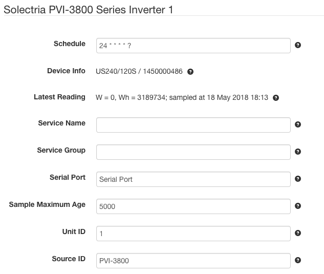

# SolarNode PVI-3800 Series Inverter Datum Source

This project provides SolarNode plugin that can collect data from the Yaskawa
Solectria PVI-3800 series inverters.



# Install

The plugin can be installed via the **Plugins** page on your SolarNode. It appears under the
**Datum** category as **Solectria PVI-3800 Inverter Data Source**.

# Datum structure

This datum generates a [datum stream][datum] with the following properties:

| Property | Class | Units | Description |
|:---------|:------|:------|:------------|
| `current`          | `i` | A | AC current, phase sum |
| `dcCurrent_1`      | `i` | A | DC module 1 current |
| `dcCurrent_2`      | `i` | A | DC module 2 current |
| `dcCurrent_3`      | `i` | A | DC module 3 current |
| `dcPower_1`        | `i` | W | DC module 1 power |
| `dcPower_2`        | `i` | W | DC module 2 power |
| `dcPower_3`        | `i` | W | DC module 3 power |
| `dcVoltage_1`      | `i` | V | DC module 1 voltage |
| `dcVoltage_2`      | `i` | V | DC module 2 voltage |
| `dcVoltage_3`      | `i` | V | DC module 3 voltage |
| `events`           | `s` | bit set | Base-10 bit set of [SunSpec-compatible event codes](#sunspec-event-codes) |
| `frequency`        | `i` | Hz | AC frequency |
| `powerFactor`      | `i` | - | Power factor |
| `reactivePower`    | `i` | VAR | Reactive power |
| `status_ac1`       | `s` | bit set | Base-10 bit set of AC phase 1 [status codes](#ac-status-codes) |
| `status_ac2`       | `s` | bit set | Base-10 bit set of AC phase 2 [status codes](#ac-status-codes) |
| `status_ac3`       | `s` | bit set | Base-10 bit set of AC phase 3 [status codes](#ac-status-codes) |
| `status_pv1`       | `s` | bit set | Base-10 bit set of PV module 1 [status codes](#pv-status-codes) |
| `status_pv2`       | `s` | bit set | Base-10 bit set of PV module 2 [status codes](#pv-status-codes) |
| `status_pv3`       | `s` | bit set | Base-10 bit set of PV module 3 [status codes](#pv-status-codes) |
| `status_pvIso1`    | `s` | bit set | Base-10 bit set of PV module 1 [ISO status codes](#pv-iso-status-codes) |
| `status_pvIso2`    | `s` | bit set | Base-10 bit set of PV module 2 [ISO status codes](#pv-iso-status-codes) |
| `status_pvIso3`    | `s` | bit set | Base-10 bit set of PV module 3 [ISO status codes](#pv-iso-status-codes) |
| `temp`             | `i` | C | Ambient temperature |
| `temp_heatSink`    | `i` | C | Heatsink temperature |
| `vendorEvents`     | `s` | bit set | Base-16 bit set of all active [Fault codes](#fault-codes) |
| `voltage`          | `i` | V | AC voltage, phase average |
| `wattHours`        | `a` | Wh | Lifetime energy |
| `watts`            | `i` | W | Active power total |

Here is an example datum, expressed in simplified JSON form:

```json
{
	"created": "2023-02-22 13:58:00.014Z",
	"nodeId": 123,
	"sourceId": "/INV/1",
	"localDate": "2023-02-22",
	"localTime": "08:58",
	"watts": 2639,
	"temp": 20,
	"current": 11.4,
	"dcPower": 2692,
	"voltage": 235,
	"dcCurrent": 7.5,
	"dcPower_1": 1807,
	"dcPower_2": 885,
	"dcVoltage": 357,
	"frequency": 60.02,
	"dcCurrent_1": 5,
	"dcCurrent_2": 2.5,
	"dcVoltage_1": 359,
	"dcVoltage_2": 355,
	"powerFactor": 0.995,
	"reactivePower": -241,
	"temp_heatSink": 20,
	"wattHours": 699831
}
```

# Use

Once installed, a new **Solectria PVI-3800 Series Inverter** component will appear on the
**Settings** page on your SolarNode. Click on the **Manage** button to configure devices. You'll
need to add one configuration for each Modbus device you want to collect data from.

## Overall device settings

Each device configuration contains the following overall settings:

| Setting            | Description                                                                      |
|--------------------|----------------------------------------------------------------------------------|
| Schedule           | A cron schedule that determines when data is collected.                          |
| Service Name       | A unique name to identify this data source with.                                 |
| Service Group      | A group name to associate this data source with.                                 |
| Serial Port        | The service name of the Serial Port to use.                                      |
| Sample Maximum Age | A minimum time to cache captured data, in milliseconds.                          |
| Unit ID            | The address of the inverter to collect datum from.                               |
| Source ID          | The SolarNetwork source ID to assign to captured datum.                          |

## Overall device settings notes

<dl>
	<dt>Serial Port</dt>
	<dd>This is the <i>service name</i> of the Serial Port component configured elsewhere
	in SolarNode. You must configure that component with the proper connection settings
	for your serial network, configure a unique service name on that component, and then
	enter that same service name here.</dd>
	<dt>Source ID</dt>
	<dd>This value unique identifies the data collected from this device, by this node,
	 on SolarNetwork. Each configured device should use a different value.</dd>
	<dt>Sample Maximum Age</dt>
	<dd>SolarNode will cache the data collected from the device for at least
	this amount of time before refreshing data from the device again. Some devices
	do not refresh their values more than a fixed interval, so this setting can be
	used to avoid reading data unnecessarily. This setting also helps in highly
	dynamic configurations where other plugins request the current values from
	the device frequently.</dd>
</dl>

# AC status codes

The `status_ac*` properties are each a bit set of the following possible values:

| Index | Name                                 | Description                                      |
|:------|:-------------------------------------|:-------------------------------------------------|
| 0     | `CriticalOverVoltage`                | Critical over voltage                            |
| 1     | `OverVoltage`                        | Over voltage                                     |
| 2     | `UnderVoltage`                       | Under voltage                                    |
| 3     | `CriticalUnderVoltage`               | Critical under voltage                           |
| 4     | `HighFrequency`                      | High frequency                                   |
| 5     | `LowFrequency`                       | Low frequency                                    |
| 6     | `DcInjection`                        | DC injection                                     |
| 7     | `AcSync`                             | AC synchronisation                               |
| 8     | `IslandingDetected`                  | Islanding detected                               |
| 9     | `PowerReductionActive`               | Power reduction active                           |
| 10    | `ConnectionCondition`                | Connection condition                             |
| 11    | `FaultRideThroughActive`             | Fault ride through active                        |
| 12    | `SoftStart`                          | Soft start                                       |
| 13    | `HardwareCriticalOverVoltage`        | Hardware critical over voltage                   |
| 14    | `ActivePowerLimitedForReactivePower` | Active power limited to allow for reactive power |
| 15    | `LongGridOut`                        | Long grid out                                    |
| 16    | `GridSynchronisationError`           | Grid synchronisation error                       |

# PV status codes

The `status_pv*` properties are each a bit set of the following possible values:

| Index | Name                  | Description                |
|:------|:----------------------|:---------------------------|
| 0     | `VoltageLow`          | PV voltage too low         |
| 1     | `PowerLow`            | PV power too low           |
| 2     | `VoltageLowWarning`   | PV voltage too low warning |
| 3     | `PowerLimitation`     | Power limitation to Pn     |
| 4     | `TemperatureDerating` | Temperature derating       |

# PV ISO status codes

The `status_pvIso*` properties are each a bit set of the following possible values:

| Index | Name                         | Description           |
|:------|:-----------------------------|:----------------------|
| 0     | `IsoStartupFailure`          | ISO startup failure   |
| 1     | `IsoRunningFailure`          | ISO running failure   |
| 2     | `PVPositiveGroundingFailure` | PV+ grounding failure |
| 3     | `PVNegativeGroundingFailure` | PV- grounding failure |
| 4     | `IsoStartupWarning`          | ISO startup warning   |
| 5     | `IsoRunningWarning`          | ISO running warning   |
| 6     | `PVPositiveGroundingWarning` | PV+ grounding warning |
| 7     | `PVNegativeGroundingWarning` | PV- grounding warning |

# Fault codes

The `vendorEvents` property is a bit set of the following possible values:

| Index | Name                                 | Description                                      |
|:------|:-------------------------------------|:-------------------------------------------------|
| 0     | `VoltageLow`                         | PV voltage too low                               |
| 1     | `PowerLow`                           | PV power too low                                 |
| 2     | `VoltageLowWarning`                  | PV voltage too low warning                       |
| 3     | `PowerLimitation`                    | Power limitation to Pn                           |
| 4     | `TemperatureDerating`                | Temperature derating                             |
| 32    | `IsoStartupFailure`                  | ISO startup failure                              |
| 33    | `IsoRunningFailure`                  | ISO running failure                              |
| 34    | `PVPositiveGroundingFailure`         | PV+ grounding failure                            |
| 35    | `PVNegativeGroundingFailure`         | PV- grounding failure                            |
| 36    | `IsoStartupWarning`                  | ISO startup warning                              |
| 37    | `IsoRunningWarning`                  | ISO running warning                              |
| 38    | `PVPositiveGroundingWarning`         | PV+ grounding warning                            |
| 39    | `PVNegativeGroundingWarning`         | PV- grounding warning                            |
| 64    | `CriticalOverVoltage`                | Critical over voltage                            |
| 65    | `OverVoltage`                        | Over voltage                                     |
| 66    | `UnderVoltage`                       | Under voltage                                    |
| 67    | `CriticalUnderVoltage`               | Critical under voltage                           |
| 68    | `HighFrequency`                      | High frequency                                   |
| 69    | `LowFrequency`                       | Low frequency                                    |
| 70    | `DcInjection`                        | DC injection                                     |
| 71    | `AcSync`                             | AC synchronisation                               |
| 72    | `IslandingDetected`                  | Islanding detected                               |
| 73    | `PowerReductionActive`               | Power reduction active                           |
| 74    | `ConnectionCondition`                | Connection condition                             |
| 75    | `FaultRideThroughActive`             | Fault ride through active                        |
| 76    | `SoftStart`                          | Soft start                                       |
| 77    | `HardwareCriticalOverVoltage`        | Hardware critical over voltage                   |
| 78    | `ActivePowerLimitedForReactivePower` | Active power limited to allow for reactive power |
| 79    | `LongGridOut`                        | Long grid out                                    |
| 80    | `GridSynchronisationError`           | Grid synchronisation error                       |

# SunSpec event codes

This plugin will map specific fault codes into the SunSpec `events` property:

| Fault | Name | Event | Inverter Model Event |
|:------|:-----|:------|:---------------------|
| 4     | `TemperatureDerating`        | 7  | `OverTemperature` |
| 34    | `PVPositiveGroundingFailure` | 0  | `GroundFault` |
| 35    | `PVNegativeGroundingWarning` | 0  | `GroundFault` |
| 64    | `CriticalOverVoltage`        | 10 | `AcOverVoltage` |
| 65    | `OverVoltage`                | 10 | `AcOverVoltage` |
| 66    | `UnderVoltage`               | 11 | `AcUnderVoltage` |
| 67    | `CriticalUnderVoltage`       | 11 | `AcUnderVoltage` |
| 68    | `HighFrequency`              | 8  | `OverFrequency` |
| 69    | `LowFrequency`               | 9  | `UnderFrequency` |
| 72    | `IslandingDetected`          | 4  | `GridDisconnect` |
| 80    | `GridSynchronisationError`   | 4  | `GridDisconnect` |


[datum]: https://github.com/SolarNetwork/solarnetwork/wiki/SolarNet-API-global-objects#datum
