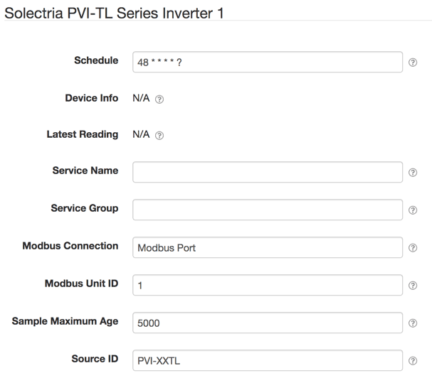

# SolarNode PVI-14-36TL Series Inverter Datum Source

This project provides SolarNode plugin that can collect data from the Yaskawa
Solectria PVI-14-36TL series inverters.

# Install

The plugin can be installed via the **Plugins** page on your SolarNode. It
appears under the **Datum** category as **Solectria PVI-14-36TL Inverter Data Source**.

# Use

Once installed, a new **Solectria PVI-14-36TL Series Inverter** component will
appear on the **Settings** page on your SolarNode. Click on the **Manage**
button to configure devices. You'll need to add one configuration for each
Modbus device you want to collect data from.

## Overall device settings

Each device configuration contains the following overall settings:

| Setting            | Description                                                                      |
|--------------------|----------------------------------------------------------------------------------|
| Schedule           | A cron schedule that determines when data is collected.                          |
| Service Name       | A unique name to identify this data source with.                                 |
| Service Group      | A group name to associate this data source with.                                 |
| Modbus Port        | The service name of the Modbus Port to use.                                      |
| Sample Maximum Age | A minimum time to cache captured data, in milliseconds.                          |
| Unit ID            | The address of the inverter to collect datum from.                               |
| Source ID          | The SolarNetwork source ID to assign to captured datum.                          |

## Overall device settings notes

<dl>
	<dt>Modbus Port</dt>
	<dd>This is the <i>service name</i> of the Modbus Port component configured elsewhere
	in SolarNode. You must configure that component with the proper connection settings
	for your serial network, configure a unique service name on that component, and then
	enter that same service name here.</dd>
	<dt>Source ID</dt>
	<dd>This value unique identifies the data collected from this device, by this node,
	 on SolarNetwork. Each configured device should use a different value.</dd>
	<dt>Sample Maximum Age</dt>
	<dd>SolarNode will cache the data collected from the device for at least
	this amount of time before refreshing data from the device again. Some devices
	do not refresh their values more than a fixed interval, so this setting can be
	used to avoid reading data unnecessarily. This setting also helps in highly
	dynamic configurations where other plugins request the current values from
	the device frequently.</dd>
</dl>
