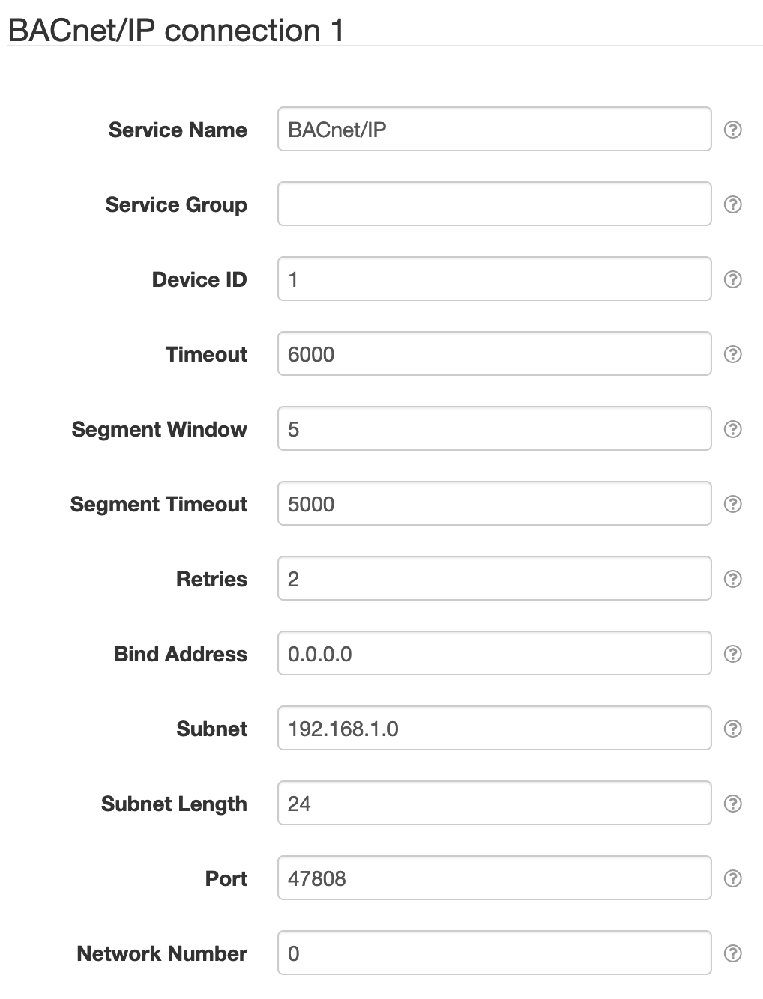

# SolarNode BACnet I/O - BACnet4J

This plugin provides configurable BACnet network connections for other SolarNode components.

# BACnet/IP connection

BACnet/IP connections work via UDP messages on an IP network.

| Setting               | Description |
|:----------------------|:------------|
| Service Name          | An optional unique name to identify this component with. :warning: This is the value you will need to configure on _other_ SolarNode components to make use of this connection. |
| Service Group         | An optional group name to associate this component with. |
| Device ID             | The BACnet device identifier to use for this component. :warning: SolarNode will present itself to the BACnet network with this ID, so it should not conflict with any existing device IDs from other BACnet devices on the network. |
| Timeout               | A timeout to use when communicating with BACnet devices, in milliseconds. |
| Segment Window        | The BACnet network segment window. |
| Segment Timeout       | The BACnet network segment timeout, in milliseconds. |
| Retries               | The network operation retry count. |
| Bind Address          | The local IP address of the network interface to bind to, or `0.0.0.0` for all available interfaces. |
| Subnet                | The IP subnet address, for broadcast messages. |
| Subnet Length         | The IP subnet network prefix length, for example `24` or `16`. |
| Port                  | The IP port to use. The default BACnet port is `47808`. |
| Network Number        | The BACnet network number to use. |
