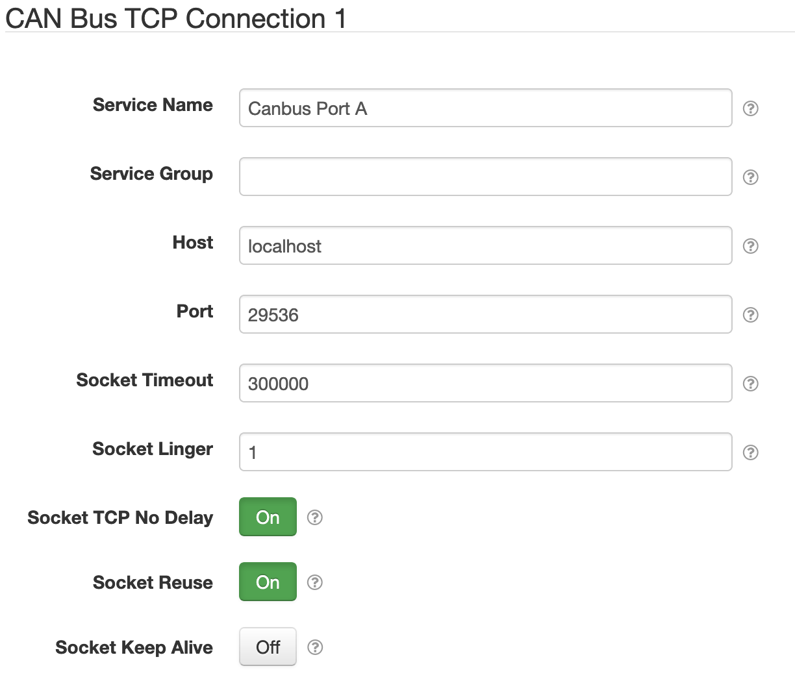

# SolarNode CAN Bus Connection

This plugin provides configurable [`socketcand`][socketcand] daemon connections for other SolarNode
components. The [SolarNode CAN Bus Datum Data Source][can-datum-source] plugin uses this, for
example.



# Install

The plugin can be installed via the **Plugins** page on your SolarNode. It appears under the **I/O**
category as **CAN Bus Communication Support**.

# Use

Once installed, a new **CAN Bus TCP Connection** component will appear on the **Settings** page on
your SolarNode. Click on the **Manage** button to configure components. You'll need to add one
configuration for each `socketcand` server you want to collect data from.

## Component settings

Each device configuration contains the following overall settings:

| Setting             | Description |
|:--------------------|:------------|
| Service Name        | A unique name to identify this data source with. |
| Service Group       | A group name to associate this data source with. |
| Host                | The host name the `socketcand` server to connect to. |
| Port                | The port number of the `socketcand` server to connect to. |
| Socket Timeout      | A timeout for receiving data when reading from the socket, in **milliseconds**. |
| Socket Linger       | Set to anything greater than `0` to configure the socket linger flag to this value, in **seconds**. |
| Socket TCP No Delay | Toggle the TCP _no-delay_ option on the socket. |
| Socket Reuse        | Toggle the _reuse_ flag on the socket. This is generally recommended. |
| Socket Keep Alive   | Toggle the _keep-alive_ flag on the socket. |


# SolarNetwork KCD Support

This project also registers a [`KcdParser`][kcd-parser] service with the OSGi runtime, which can be
used to parse CAN bus configuration information from [KCD][kcd] XML files. This service does not
expose any user-visible settings itself or do anything other than provide the service to parse the
XML, but other plugins can use this. For example the [SolarNode CAN Bus Datum Data
Source][can-datum-source] uses this parser to configure data sources to capture data from a CAN bus.

## KCD extensions

The `KcdParser` provided by this bundle actually uses an extended form of KCD, designed to
support working with SolarNetwork more easily. The extensions are provided in a separate XML
namespace to make it clear they are not from the KCD namespace. The namespace URI is
`urn:solarnetwork:datum:1.0`.

To make use of the extended format, an KCD document would start off like this:

```xml
<NetworkDefinition xmlns="http://kayak.2codeornot2code.org/1.0" 
  xmlns:sn="urn:solarnetwork:datum:1.0">
```

That maps the `urn:solarnetwork:datum:1.0` namespace to the `sn` prefix, which is what the rest of
this document uses in its examples.

Here's an example snippet of the extended KCD XML format:

```xml
<NetworkDefinition xmlns="http://kayak.2codeornot2code.org/1.0" xmlns:sn="urn:solarnetwork:datum:1.0">
  <Document name="ACME Bus" version="1.0" author="J. Doe" 
      company="ACME" date="2019-09-20">ACME Bus CAN</Document>
  <Node id="1" name="Motor" sn:source-id="/TR/BUS/TEST1/MOT/1" 
      sn:publish-interval="60000" sn:network-service-name="Canbus Port A"/>
  <Bus name="can0">
    <!-- Motor -->
    <Message id="0x0C03A1A7" name="Motor Data" interval="5000">
      <Producer>
        <NodeRef id="1"/>
      </Producer>
      <Signal name="PCU Input Voltage" offset="0" length="16" endianess="little"
          sn:datum-property="mcuDcVoltage" sn:datum-property-classification="i">
        <Notes>PCU Input Voltage</Notes>
        <Value type="unsigned" slope="0.1" intercept="-1000" min="0" max="999" unit="V"/>
      </Signal>
      <Signal name="PCU Input Current" offset="16" length="16" endianess="little"
          sn:datum-property="mcuDcCurrent" sn:datum-property-classification="i">
        <Notes>PCU Input Current</Notes>
        <Value type="signed" slope="0.1" intercept="-1000" min="-999" max="999" unit="A"/>
      </Signal>
      <Signal name="PCU Motor Torque" offset="32" length="16" endianess="little"
          sn:datum-property="torque" sn:datum-property-classification="i">
        <Notes>Motor Torque</Notes>
        <Value type="signed" slope="1" intercept="-3000" min="-3000" max="3000" 
            unit="N.m" sn:normalized-unit="N.m"/>
      </Signal>
      <Signal name="PCU Motor Speed" offset="48" length="16" endianess="little"
          sn:datum-property="speed" sn:datum-property-classification="i">
        <Notes>PCU Motor Speed</Notes>
        <Value type="unsigned" slope="0.5" intercept="0" min="0" max="9999" 
            unit="Hz/60" sn:normalized-unit="Hz/60"/>
      </Signal>
    </Message>
  </Bus>
</NetworkDefinition>
```

### `<Node>` element extensions

The `<Node>` element supports the following additional attributes:

| Attribute | Default | Description |
|:----------|:--------|:------------|
| `sn:network-service-name` | `Canbus Port` | The name of a CAN Bus Connection component that provides the connection to the physical CAN bus network. |
| `sn:publish-interval` | 60000 | The frequency at which to publish datum for this node, in **milliseconds**. |

For example:

```xml
<Node id="1" name="Motor" sn:source-id="/TR/BUS/TEST1/MOT/1" 
  sn:publish-interval="60000" sn:network-service-name="Canbus Port A"/>
```

### `<Signal>` element extensions

The `<Signal>` element supports the following additional attributes:

| Attribute | Default | Description |
|:----------|:--------|:------------|
| `sn:datum-property` | | The datum property name to populate for this signal. |
| `sn:datum-property-classification` | `i` | The [datum property classification][datum-samples] of the property to populate for this signal. |
| `sn:decimal-scale` | -1 | A maximum scale (number of digits after the decimal point) to round decimal values to. This is applied after all transforms. Set to 0 to round to whole numbers. Set to `-1` to disable rounding. |

The `<Signal>` element supports the following additional nested elements:

| Element | Default | Description |
|:----------|:--------|:------------|
| `Name` | | Zero or more localized names to associate with this signal. The element content is a simple string and must include an `xml:lang` attribute that specifies the language tag of the content. |


For example:

```xml
<Signal name="Battery Charge Energy" offset="32" length="32" endianess="little"
  sn:datum-property="chargeEnergy" sn:datum-property-classification="a">
  <Value/>
  <Name xml:lang="en">Battery Charge Energy</Name>
</Signal>
```

### `<Value>` element extensions

The `<Value>` element supports the following additional attributes:

| Attribute | Default | Description |
|:----------|:--------|:------------|
| `sn:normalized-unit` | | If provided, the desired normalized unit to use. If not provided then standard normalization rules will apply. |

For example:

```xml
<Value type="unsigned" slope="0.01" intercept="0" unit="kW.h" sn:normalized-unit="W.h"/>
```


# Building KCD JAXB bindings

The `KcdParser` uses JAXB to parse XML resources. The KCD schema needs to be compiled into Java
classes, using the `xjc` tool that comes with JAXB. From within this project, the following
command can be used to re-generate the JAXB classes, if the KCD schema changes:

```
xjc src/net/solarnetwork/node/io/canbus/schema/SN-Definition-Datum.xsd \
  -b src/net/solarnetwork/node/io/canbus/schema/SN-Definition-Datum.xjb.xml \
  -d src
```

You might need to specify a `JAVA_HOME` property that points to a JDK with the `xjc` tool
available, for example if your default JDK is Java 11 which doesn't include this tool.
For example:

```
JAVA_HOME=/Library/Java/JavaVirtualMachines/jdk1.8.0_211.jdk/Contents/Home xjc \
  src/net/solarnetwork/node/io/canbus/schema/SN-Definition-Datum.xsd \
  -b src/net/solarnetwork/node/io/canbus/schema/SN-Definition-Datum.xjb.xml \
  -d src
```

[socketcand]: https://github.com/linux-can/socketcand
[can-datum-source]: ../net.solarnetwork.node.datum.canbus
[datum-samples]: https://github.com/SolarNetwork/solarnetwork/wiki/SolarNet-API-global-objects#datum-samples
[kcd]: https://github.com/julietkilo/kcd
[kcd-parser]: src/net/solarnetwork/node/io/canbus/KcdParser.java
