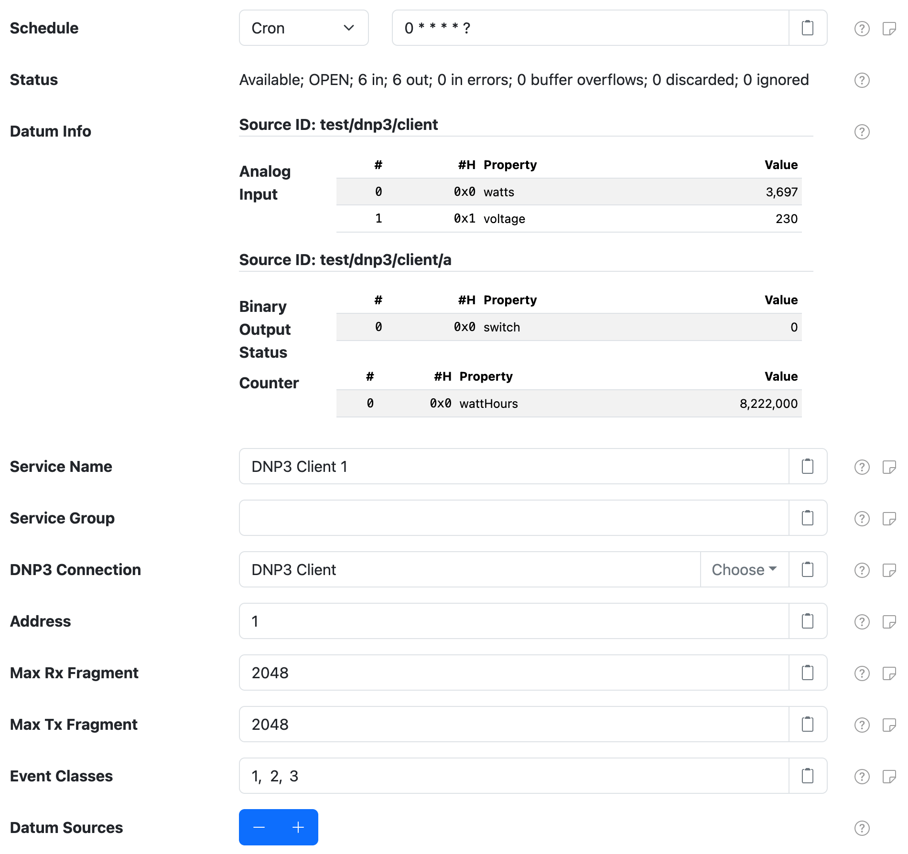
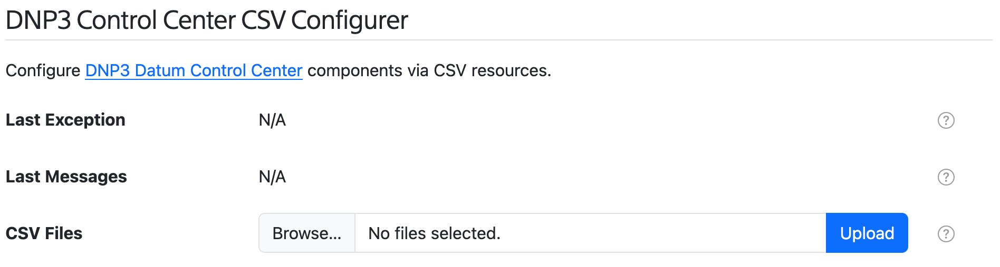
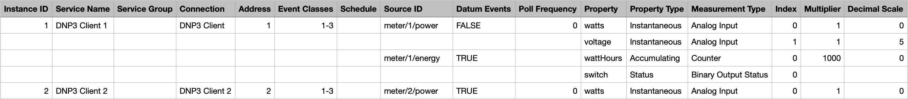
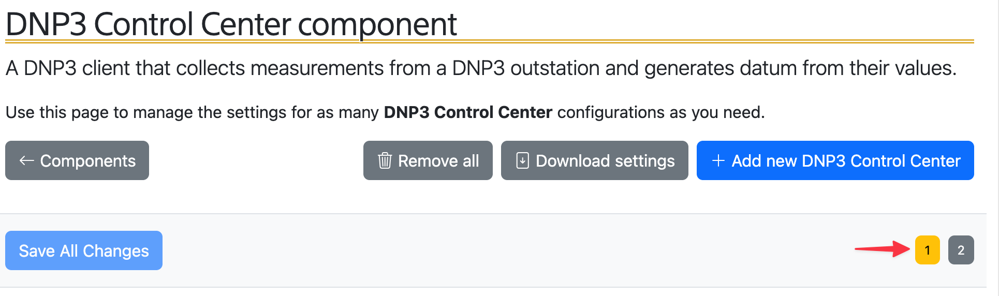

# DNP3 Control Center

The **DNP3 Control Center** component provides a DNP3 "control center" (or _master_) that connects
to a DNP3 outstation to collect measurement values. The Control Center then generates datum out of
the collected DNP3 measurements.

At a high level, this component connects to a DNP3 outstation and then polls for DNP3 measurement
values, caching them, based on a **Refresh Frequency** polling frequency. It then generates datum
out of the cached values, based on a configured **Schedule**. Thus the collection and publication of
the measurement values are decoupled.

A DNP3 outstation can also _push_ measurement values to this control center, as they change. The
updated measurement values are cached as if this control center polled for that measurement. You can
configure the **Event Datum** setting to have this component generate datum after receiving a
measurement update event, in which case the datum will include the latest available values for _all
cached values for all properties configured on that datum_.




# CSV Configurer

This plugin provides a **DNP3 Control Center CSV Configurer** component will appear on the
**Settings > Services** page. This component lets you upload a DNP3 Control Center CSV Configuration
file to configure all DNP3 Control Center components, without having to use the component settings
form.

> :fire: You can copy the [DNP3 Control Center Configuration Example][csv-example] sheet as a
> starting point. This sheet has drop-down menu validation to make it super easy to configure your
> DNP3 Control Centers. Download your completed Sheet as CSV, then use the **DNP3 Control Center
> CSV Configurer** form to upload and configure SolarNode.



## DNP3 Control Center CSV configuration format

The DNP3 Control Center CSV configuration uses the column structure detailed
[below](#csv-column-definition), with each row representing an individual datum property to read
from the DNP3 outstation. A header row is required. Comment lines are allowed, just start the line
with a `#` character (i.e. the first cell value). The entire comment line will be ignored.

Here's an example screen shot of a configuration in a spreadsheet application. It is for two Control
Centers with 3 datum sources defined between them:

 1. Control Center `1` with 2 datum sources:
	1. Source `meter/1/power` with 2 properties: `watts` and `voltage`
	2. Source `meter/1/energy` with 2 properties: `wattHours` and `switch`
 2. Control Center `2` with 1 datum source:
	1. Source `meter/2/power1` with 1 datum property: `watts`

Spreadsheet applications generally allow you to export the sheet in the CSV format, which can then
be loaded into SolarNode via the CSV Configurer.



### Instance identifiers

Individual DNP3 Control Center components are defined by the first column (**Instance ID**). You can
assign any identifier you like (such as `Meter`, `Inverter`, and so on) or configure as a single
dash character `-` to have SolarNode assign a simple number identifier. Once an Instance ID has been
assigned on a given row, subsequent rows will use that value if the corresponding cell value is left
empty.

Here's an example of how 2 instance IDs `1` and `2` appear in the SolarNode UI:



### CSV column definition

The following table defines all the CSV columns used by DNP3 Control Center CSV Configuration. There
are 3 groups within the columns:

 1. Control Center configuration: columns **A - G**
 2. Datum Source configuration: columns **H - J**
 3. Measurement configuration: columns **K - P**

The Control Center configuration columns  **A - G** apply to the **entire DNP3 Control Center
configuration**, and only the values from the row that defines a new Instance ID will be used to
configure the control center. Thus you can omit the values from these columns when defining
additional rows within the same configuration.

The Datum Source configuration columns **H - J** apply to a **Datum Source configuration**, and only
the values from the row that define a new Source ID will be used to configure the datum source. Thus
you can omit the values from these columns when defining additional rows within the same
configuration.

The Measurement configuration columns **K - P** define **datum properties** to populate from DNP3
measurement values.

| Col | Name | Type | Default | Description |
|:----|:-----|:-----|:--------|:------------|
| `A` | **Instance ID** | string |  | The unique identifier for a single DNP3 Control Center component. Can specify `-` to automatically assign a simple number value, which will start at `1`. |
| `B` | **Service Name** | string |  | A **required** service name to assign to the component. |
| `C` | **Service Group** | string |  | An optional service group to assign to the component. |
| `D` | **Connection** | string |  | The **Service Name** of the **DNP3 client connection** component to use. |
| `E` | **Address** | string |  | The DNP3 address to use. Must be unique within the local DNP3 network. |
| `F` | **Events** | string |  | A comma-delimited list of DNP3 classes to register for unsolicited (push) events. The supported classes are `1`, `2`, and `3`. For example `1, 2, 3` would register for all DNP3 events. Can be specified also as a range like `1-3`. |
| `G` | **Schedule** | string | `0 * * * * *` | The schedule at which to generate datum out of the collected DNP3 measurement data. Can be either a [cron][sn-cron-syntax] value or a millisecond frequency. |
| `H` | **Source ID** | string |  | Defines the start of a Datum Configuration, using this source ID. A single DNP3 Control Center instance supports any number of Datum Configurations. |
| `I` | **Datum Events** | boolean | `false` | When `true` then generate datum after measurement update events are received, otherwise only on the configured **Schedule**. |
| `J` | **Poll Frequency** | integer |  | An optional frequency, in seconds, to poll the DNP3 outstation for the latest measurement values. Leave blank or set to `0` to disable polling (and rely only on **Events**). |
| `K` | **Property** | string |  | A datum property name to use for a DNP3 measurement. |
| `L` | **Property Type** | enum | `Instantaneous` |  The type of datum property to use. Must be one of `Instantaneous`, `Accumulating`, `Status`, or `Tag`, and can be shortened to just `i`, `a`, `s`, or `t`. |
| `M` | **Measurement Type** | enum |  | The DNP3 point type to collect. Must be one of `Analog Input`, `Analog Output Status`, `Binary Input`, `Binary Output Status`, `Counter`, `Double Bit Binary Input`, `Frozen Counter`, or equivalent case-sensitive keys of `a`, `A`, `b`, `B`, `c`, `d`, `f`. |
| `N` | **Index** |  | The DNP point type index to collect .|
| `O` | **Multiplier** | decimal | `1` | For numeric data types, a multiplier to apply to the BACnet value to normalize it into a standard unit. |
| `P` | **Decimal Scale** | integer | `5` | For numeric data types, a maximum number of decimal places to round decimal numbers to, or `-1` to not do any rounding. |

## Example CSV

Here is the CSV as shown in the example configuration screen shot above:

```csv
Instance ID,Service Name,Service Group,Connection,Address,Event Classes,Schedule,Source ID,Datum Events,Poll Frequency,Property,Property Type,Measurement Type,Index,Multiplier,Decimal Scale
1,DNP3 Client 1,,DNP3 Client,1,1-3,,meter/1/power,FALSE,0,watts,Instantaneous,Analog Input,0,1,0
,,,,,,,,,,voltage,Instantaneous,Analog Input,1,1,5
,,,,,,,meter/1/energy,TRUE,,wattHours,Accumulating,Counter,0,1000,0
,,,,,,,,,,switch,Status,Binary Output Status,0,,
2,DNP3 Client 2,,DNP3 Client 2,2,1-3,,meter/2/power,TRUE,0,watts,Instantaneous,Analog Input,0,1,0
```


# DNP3 Control Center settings

Each control center configuration contains the following overall settings:

| Setting                  | Description                                      |
|:-------------------------|:-------------------------------------------------|
| Service Name             | A unique name to identify this component with. |
| Service Group            | A group name to associate this component with. |
| DNP3 Connection          | The **Service Name** of DNP3 client connection to use. |
| Address                  | The DNP3 address to use.|
| Max Rx Fragment          | The maximum fragment size the outstation will be able to receive. |
| Max Tx Fragment          | The maximum fragment size the outstation will use for fragments it sends. |
| Event Classes            | A comma-delimited list of DNP3 classes to register for unsolicited (push) events. The supported classes are `1`, `2`, and `3`. For example `1, 2, 3` would register for all DNP3 events. Each DNP3 outstation defines for itself what measurements are included in each of the event classes, so you must consult the documentation and/or configuration of the device to find out what is included in each. |
| Datum Sources            | A list of datum-specific settings that define the source IDs to generate datum for. |

## Datum Source settings

A datum source configuration defines a datum **source ID** and a list of **measurement
configurations** to collect from the DNP3 outstation and populate as datum properties. You can
configure as many datum source settings as you like, using the **Datum Sources** <kbd>+</kbd> and
<kbd>-</kbd> buttons to add/remove configurations.


Each datum source configuration contains the following settings:

| Setting                  | Description                                      |
|:-------------------------|:-------------------------------------------------|
| Source ID                | The datum source ID to assign. Placeholder values are supported. |
| Refresh Frequency        | An optional frequency, in seconds, to poll the DNP3 outstation to collect the latest available measurement values. Works with or without the overall **Event Classes** setting that allows the DNP3 outstation to publish measurement updates when the change. :warning: Note this setting differs from the overall **Schedule** setting, which defines when datum are generated from the collected measurement values. |
| Event Datum              | Toggle the generation of datum in response to measurement updates. |
| Measurements             | A list of measurement-specific settings that define which DNP3 points map to datum properties. |

## Measurement settings

A measurement configuration defines a mapping from a DNP3 point to a datum property.


Each measurement configuration contains the following settings:

| Setting         | Description                                                                            |
|:----------------|:---------------------------------------------------------------------------------------|
| DNP3 Type       | The DNP point type to collect. |
| Index           | The DNP point type index to collect. |
| Property Type   | The datum property type to publish measurement values as. |
| Property        | The datum property name to publish measurement values as. |
| Unit Multiplier | A multiplication factor to apply to measurement values to normalize the value into a standard unit. |
| Decimal Scale   | A maximum scale (number of digits after the decimal point) to round decimal values to. |


[csv-example]: https://docs.google.com/spreadsheets/d/1ZYAfR8NFbY11f5SLlGuXqOadG32FH4c4WsixRbcOekQ

