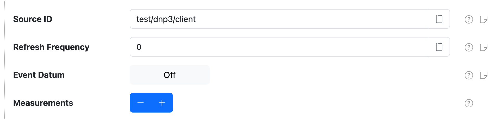
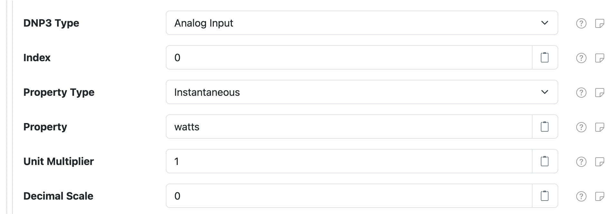

# DNP3 Control Center

The **DNP3 Control Center** component provides a DNP3 "control center" (or _master_) that connects
to DNP3 outstations to collects measurement values. This allows generating datum out of DNP3
measurements.

At a high level, this component connects to a DNP3 outstation and then polls for DNP3 measurement
values, caching them, based on a **Refresh Frequency** polling frequency. It then generates datum
out of the cached values, based on a configured **Schedule**. Thus the collection and publication of
the measurement values are decoupled.

A DNP3 outstation can also _push_ measurement values to this control center, as they change. The
updated measurement values are cached as if this control center polled for that measurement. You can
configure the **Event Datum** setting to have this component generate datum after receiving a
measurement update event, in which case the datum will include the latest available values for _all
cached values for all properties configured on that datum_.

## DNP3 Control Center general settings

Each control center configuration contains the following general settings:

| Setting                  | Description                                      |
|:-------------------------|:-------------------------------------------------|
| Service Name             | A unique name to identify this component with. |
| Service Group            | A group name to associate this component with. |
| DNP3 Connection          | The **Service Name** of DNP3 client connection to use. |
| Address                  | The DNP3 address to use.|
| Max Rx Fragment          | The maximum fragment size the outstation will be able to receive. |
| Max Tx Fragment          | The maximum fragment size the outstation will use for fragments it sends. |
| Event Classes            | A comma-delimited list of DNP3 classes to register for unsolicited (push) events. The supported classes are `1`, `2`, and `3`. For example `1, 2, 3` would register for all DNP3 events. Each DNP3 outstation defines for itself what measurements are included in each of the event classes, so you must consult the documentation and/or configuration of the device to find out what is included in each. |
| Datum Sources            | A list of datum-specific settings that define the source IDs to generate datum for. |

## Datum Source settings

A datum source configuration defines a datum **source ID** and a list of **measurement
configurations** to collect from the DNP3 outstation and populate as datum properties. You can
configure as many datum source settings as you like, using the **Datum Sources** <kbd>+</kbd> and
<kbd>-</kbd> buttons to add/remove configurations.

Each datum source configuration contains the following settings:

| Setting                  | Description                                      |
|:-------------------------|:-------------------------------------------------|
| Source ID                | The datum source ID to assign. Placeholder values are supported. |
| Refresh Frequency        | An optional frequency, in seconds, to poll the DNP3 outstation to collect the latest available measurement values. Works with or without the overall **Event Classes** setting that allows the DNP3 outstation to publish measurement updates when the change. :warning: Note this setting differs from the overall **Schedule** setting, which defines when datum are generated from the collected measurement values. |
| Event Datum              | Toggle the generation of datum in response to measurement updates. |
| Measurements             | A list of measurement-specific settings that define which DNP3 points map to datum properties. |

## Measurement settings

A measurement configuration defines a mapping from a DNP3 point to a datum property.

Each measurement configuration contains the following settings:

| Setting         | Description                                                                            |
|:----------------|:---------------------------------------------------------------------------------------|
| DNP3 Type       | The DNP point type to collect. |
| Index           | The DNP point type index to collect. |
| Property Type   | The datum property type to publish measurement values as. |
| Property        | The datum property name to publish measurement values as. |
| Unit Multiplier | A multiplication factor to apply to measurement values to normalize the value into a standard unit. |
| Decimal Scale   | A maximum scale (number of digits after the decimal point) to round decimal values to. |

