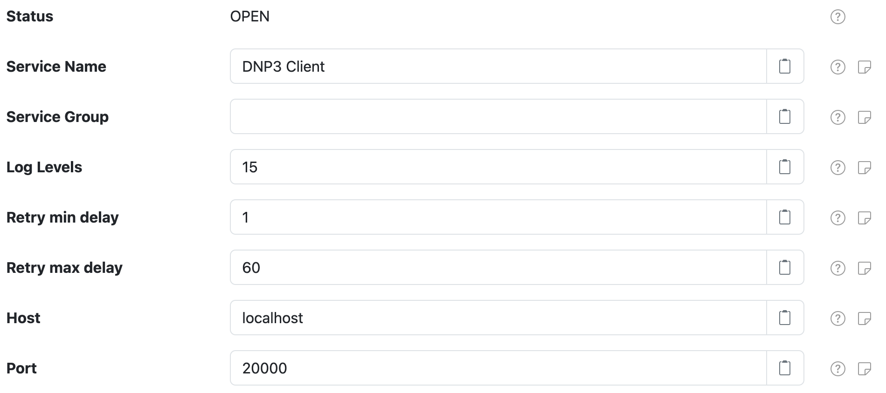
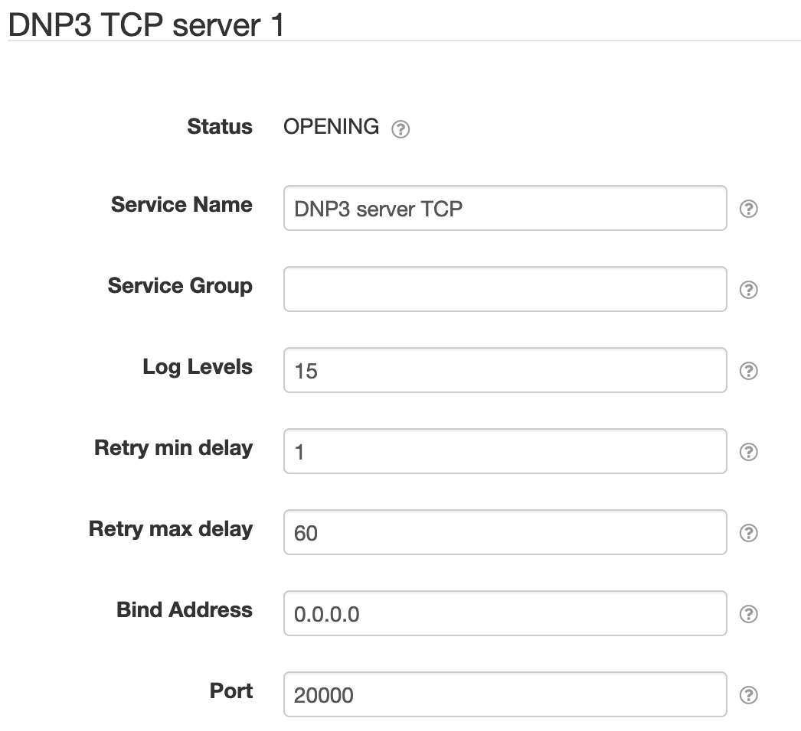

# SolarNode DNP3

This project provides SolarNode plugin that integrates SolarNode with a DNP3 based
network. This is an advanced plugin that requires specific low-level knowledge of the
DNP3 services you plan to integrate with.

# DNP3 TCP client

The **DNP3 TCP server** component provides a TCP based DNP3 client that can be used for DNP3
applications to use. This can be used by the [DNP3 Control Center](#dnp3-control-center) component.



## DNP3 TCP client settings

Each TCP client configuration contains the following settings:

| Setting         | Description                                      |
|-----------------|--------------------------------------------------|
| Service Name    | A unique name to identify this component with. |
| Service Group   | A group name to associate this component with. |
| Log Levels      | A bitmask combination of OpenDNP3 [log levels][log-levels]. |
| Retry min delay | The minimum length of time, in seconds, to delay between network operation retry attempts. |
| Retry max delay | The maximum length of time, in seconds, to delay between network operation retry attempts. |
| Host            | The hostname or IP address to connect to. |
| Port            | The IP port to connect on. |


# DNP3 TCP server

The **DNP3 TCP server** component provides a TCP based DNP3 server that can be used for DNP3
applications to use. This can be used by the [DNP3 Outstation](#dnp3-outstation) component.



## DNP3 TCP server settings

Each TCP server configuration contains the following settings:

| Setting         | Description                                      |
|-----------------|--------------------------------------------------|
| Service Name    | A unique name to identify this component with. |
| Service Group   | A group name to associate this component with. |
| Log Levels      | A bitmask combination of OpenDNP3 [log levels][log-levels]. |
| Retry min delay | The minimum length of time, in seconds, to delay between network operation retry attempts. |
| Retry max delay | The maximum length of time, in seconds, to delay between network operation retry attempts. |
| Bind address    | The IP address to bind to, such as `127.0.0.1` for localhost or `0.0.0.0` for all available addresses. |
| Port            | The port to listen on. |


# DNP3 Control Center

The **DNP3 Control Center** component provides a DNP3 "control center" (or _master_) that connects
to DNP3 outstations to collects measurement values. This allows generating datum out of DNP3 measurements.

See the [Control Center README](./README-ControlCenter.md) document for more details.


# DNP3 Outstation

The **DNP3 Outstation** component provides a DNP3 "outstation" for DNP3 Control Center applications
to connect to. This allows data collected by SolarNode plugins to be published via the DNP3
protocol, and for DNP3 control actions to be performed on SolarNode controls.

See the [Outstation README](./README-Outstation.md) document for more details.


# OpenDNP3 Shared library

SolarNode must be able to find the OpenDNP3 `libopendnp3java` shared library at runtime.
If this is not available in a standard location, add the appropriate path to the `java.library.path`
system property. For example, pass the following argument to the JVM:

```
-Djava.library.path=/usr/local/lib
```

If you see an error like

```
java.lang.UnsatisfiedLinkError: no opendnp3java in java.library.path
```

that means the shared library was not found.

[log-levels]: https://github.com/automatak/dnp3/blob/2efcf2e5f477869165f2cb40d731d41fb961b51b/java/bindings/src/main/java/com/automatak/dnp3/LogLevels.java#L23-L27
