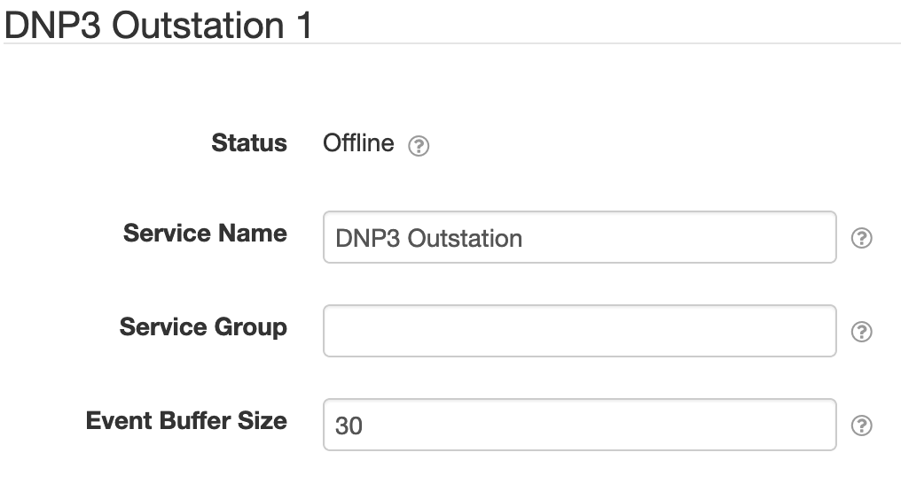
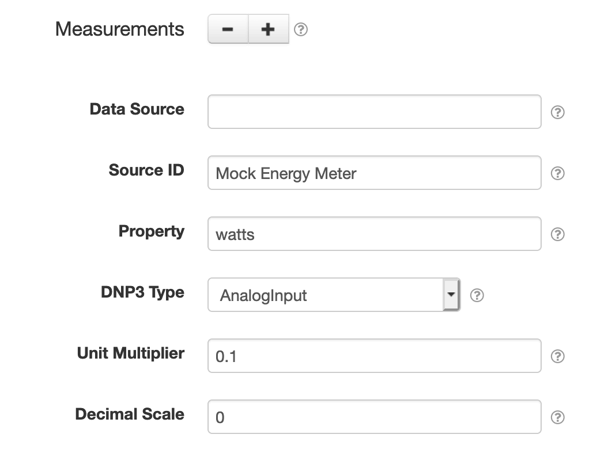
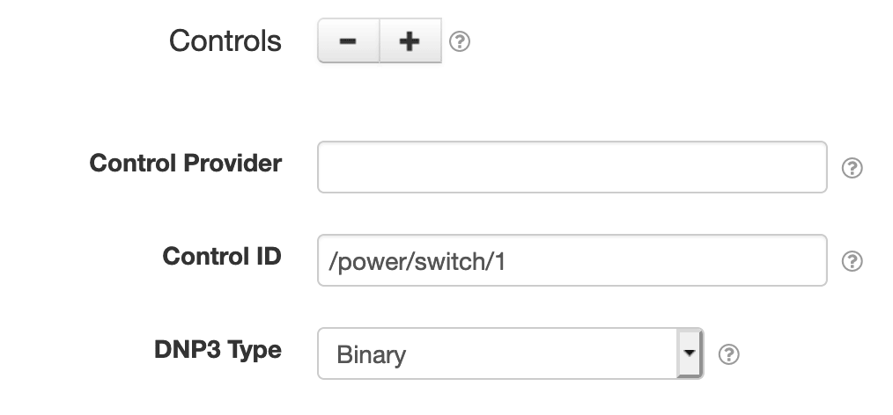

# SolarNode DNP3

This project provides SolarNode plugin that integrates SolarNode with a DNP3 based 
network. This is an advanced plugin that requires specific low-level knowledge of the 
DNP3 services you plan to integrate with.

# Install

The plugin can be installed via the **Plugins** page on your SolarNode. It
appears under the **IO** category as **SolarNode DNP3 Integration**. Once installed,
the components outlined next in this document will become available.

# DNP3 TCP server

The **DNP3 TCP server** component provides a TCP based DNP3 server that can be used for DNP3
applications to connect to. This can be used by the [DNP3 Outstation](#dnp3-outstation) component.


## DNP3 TCP server settings

Each TCP server configuration contains the following settings:

| Setting         | Description                                      |
|-----------------|--------------------------------------------------|
| Service Name    | A unique name to identify this component with. |
| Service Group   | A group name to associate this component with. |
| Log Levels      | A bitmask combination of OpenDNP3 [log levels][log-levels]. |
| Retry min delay | The minimum length of time, in seconds, to delay between network operation retry attempts. |
| Retry max delay | The maximum length of time, in seconds, to delay between network operation retry attempts. |
| Bind address    | The IP address to bind to, such as `127.0.0.1` for localhost or `0.0.0.0` for all available addresses. |
| Port            | The port to listen on. |


# DNP3 Outstation

The **DNP3 Outstation** component provides a DNP3 "outstation" for DNP3 "master" applications
to connect to. This allows data collected by SolarNode plugins to be published via the DNP3
protocol, and for DNP3 control actions to be performed on SolarNode controls.



## DNP3 Outstation general settings

Each outstation configuration contains the following general settings:

| Setting                  | Description                                      |
|--------------------------|--------------------------------------------------|
| Service Name             | A unique name to identify this component with. |
| Service Group            | A group name to associate this component with. |
| Event buffer size        | The number of DNP3 data events to maintain internally. |
| DNP3 Server              | The **Service Name** of DNP3 server component to use. |
| Address                  | The DNP3 address to use.|
| Master Address           | The DNP3 address of the master DNP3 server to use. |
| Max Controls Per Request | The maximum number of controls the outstation will attempt to process from a single request. |
| Max Rx Fragment          | The maximum fragment size the outstation will be able to receive. |
| Max Tx Fragment          | The maximum fragment size the outstation will use for fragments it sends. |

## DNP3 Outstation measurement settings

You must configure measurement settings for each datum property you want to publish via DNP3.
You can configure as many measurement settings as you like, using the <kbd>+</kbd> and <kbd>-</kbd>
buttons to add/remove measurement configurations.



Each measurement configuration contains the following settings:

| Setting         | Description                                                                            |
|-----------------|----------------------------------------------------------------------------------------|
| Data Source     | The **Service Name** of the datum data source that provides data for this measurement. |
| Source ID       | The datum source ID that contains the **Property** value to publish to DNP3. |
| Property        | The datum property to publish to DNP3. |
| DNP3 Type       | The type of DNP3 measurement to associate with the datum property. |
| Unit Multiplier | A multiplication factor to apply to property values to normalize the value into a standard unit. |
| Decimal Scale   | A maximum scale (number of digits after the decimal point) to round decimal values to. |

The Outstation will listen for `net/solarnetwork/node/DatumDataSource/DATUM_CAPTURED` events that 
match any measurement configuration's _Source ID_ value, and update the associated value in the DNP3 database.

## DNP3 Outstation control settings

You may configure control settings for each control you want to make manageable via DNP3.
You can configure as many control settings as you like, using the <kbd>+</kbd> and <kbd>-</kbd>
buttons to add/remove control configurations.

Each control configuration will add a corresponding _output status_ type property to the DNP3 database
(i.e. either an _Analog output status_ or a _Binary output status_).



Each control configuration contains the following settings:

| Setting          | Description                                                                            |
|------------------|----------------------------------------------------------------------------------------|
| Control Provider | The **Service Name** of the of the control provider to query for control values. |
| Control ID       | The control ID to manage via DNP3. |
| DNP3 Type        | The type of DNP3 control to associate with the datum property. |

The Outstation will listen for `net/solarnetwork/node/NodeControlProvider/CONTROL_INFO_CAPTURED` and
`net/solarnetwork/node/NodeControlProvider/CONTROL_INFO_CHANGED` events that match any control
configuration's _Control ID_ value, and update the associated value in the DNP3 database.


# OpenDNP3 Shared library

SolarNode must be able to find the OpenDNP3 `libopendnp3java` shared library at runtime.
If this is not available in a standard location, add the appropriate path to the `java.library.path`
system property. For example, pass the following argument to the JVM:

```
-Djava.library.path=/usr/local/lib
```

If you see an error like

```
java.lang.UnsatisfiedLinkError: no opendnp3java in java.library.path
```

that means the shared library was not found.

[log-levels]: https://github.com/automatak/dnp3/blob/2efcf2e5f477869165f2cb40d731d41fb961b51b/java/bindings/src/main/java/com/automatak/dnp3/LogLevels.java#L23-L27
