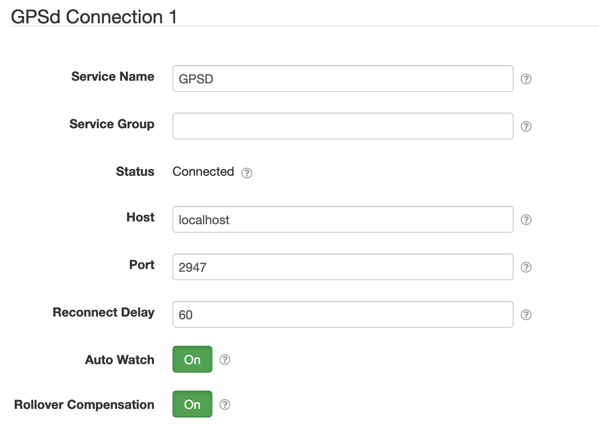

# SolarNode GPSd I/O

This plugin provides configurable `gpsd` daemon connections for other SolarNode components. The
[SolarNode GPSd GPS Datum Data Source][gpsd-data-source] plugin uses this,
for example.

# Install

The plugin can be installed via the **Plugins** page on your SolarNode. It appears under the **I/O**
category as **GPSd Communication Support**.

# Use

Once installed, a new **GPSd Connection** component will appear on the **Settings** page on your
SolarNode. Click on the **Manage** button to configure components. You'll need to add one
configuration for each GPSd server you want to collect data from.

## Overall device settings

Each device configuration contains the following overall settings:

| Setting            | Description |
|--------------------|-------------|
| Service Name       | A unique name to identify this data source with. |
| Service Group      | A group name to associate this data source with. |
| Host               | The host name the `gpsd` server to connect to. |
| Port               | The port number of the `gpsd` server to connect to. |
| Reconnect Delay    | A delay in seconds to wait before trying to reconnect to the `gpsd`  server after losing the connection or failing to establish the connection. |
| Auto Watch         | If enabled, then issue a `?WATCH` command to the `gpsd` server as soon as the connection is established. This enables receiving of the GPS report messages from `gpsd`. |
| Rollover Compensation | If enabled, compensate for GPS report timestamps far in the past, under the assumption the GPS hardware does not support GPS date rollovers. |

## Overall device settings notes

<dl>
	<dt>Auto Watch</dt>
	<dd>Check with the documentation on the plugins that use this component to see if they require
	the Auto Watch setting to be enabled.</dd>
	<dt>Rollover Compensation</dt>
	<dd>Some GPS hardware does not handle GPS time rollover events (when the GPS clock offset
	rolls back to <code>0</code>). Enabling this means the dates reported via GPS will be adjusted
	to SolarNode's local date if they are far in the past. This means SolarNode should have a
	reliable clock, for example synced via NTP.</dd>
</dl>

[gpsd-data-source]: ../net.solarnetwork.node.datum.gps.gpsd
