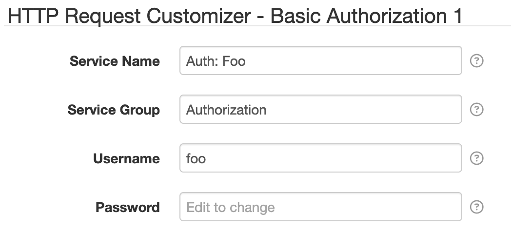

# HTTP Request Customizer - Basic Authorization

This HTTP Request Customizer component adds username/password credentials to HTTP requests, in the
form of HTTP Basic authorization.

# Settings

Each component configuration contains the following overall settings:

| Setting            | Description |
|:-------------------|:------------|
| Service Name       | A unique ID for the service, to be referenced by other components. |
| Service Group      | An optional service group name to assign. |
| Username           | The username to use. Supports [placeholders][placeholders]. |
| Password           | The password to use. Supports [placeholders][placeholders]. |

[placeholders]: https://github.com/SolarNetwork/solarnetwork/wiki/SolarNode-Placeholders
