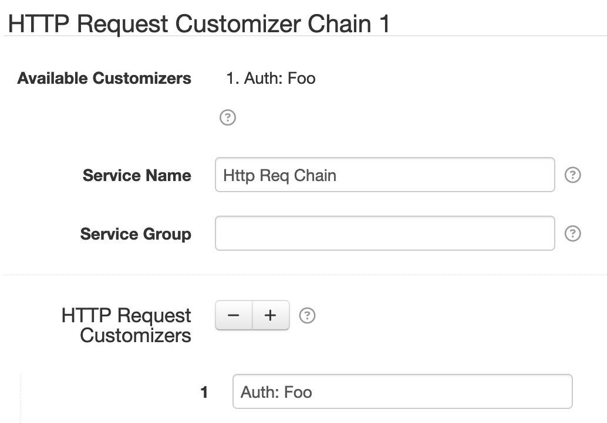

# HTTP Request Customizer Chain

This HTTP Request Customizer component allows combining any number of HTTP Request Customizer
services into a single service. You configure a Chain component with a list of other HTTP Request
Customizer service names, and when the Chain runs it will invoke each of the referenced customizers,
in the order defined on the Chain.

# Settings

Each component configuration contains the following overall settings:

| Setting            | Description |
|:-------------------|:------------|
| Available Customizers | A list of all available HTTP Request Customizer services that can be referenced in the **HTTP Request Customizers** list. |
| Service Name       | A unique ID for the service, to be referenced by other components. |
| Service Group      | An optional service group name to assign. |
| HTTP Request Customizers | A list of HTTP Request Customizer <b>Service Name</b> values.  This defines the list of HTTP Request Customizer services to invoke when this Chain is invoked. |
