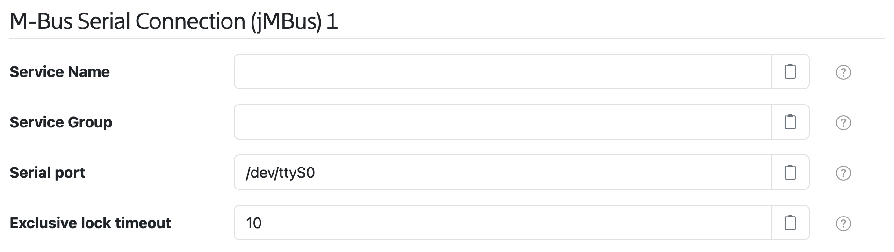
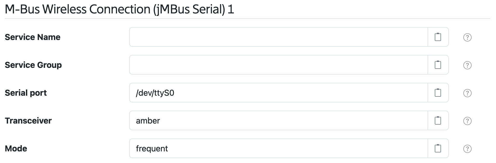

# SolarNode M-Bus I/O - jM-Bus

This plugin provides configurable M-Bus network connections for other SolarNode components. There
are two types of networks supported: serial and wireless (via serial connection to transceiver).

## Serial M-Bus Connection

Serial M-Bus connections work via device-specific serial ports made available on the host operating
system. The name of each port is operating-system specific. Some common examples are `/dev/ttyS0`
(Linux serial port), `/dev/ttyUSB0` (Linux USB serial port), and `COM1` (Windows serial port).

## Wireless Serial M-Bus Connection

Wireless serial M-Bus connections work via a serial device-specific serial ports made available on
the host operating system to a wireless M-Bus transceiver. The configuration is similar to the
Serial M-Bus connection, but for the Wireless M-Bus protocol.

