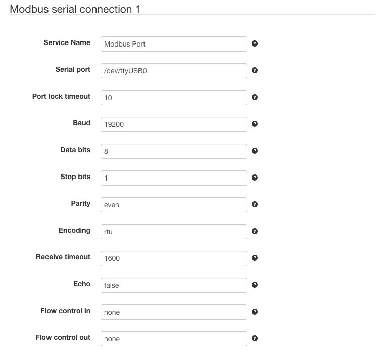
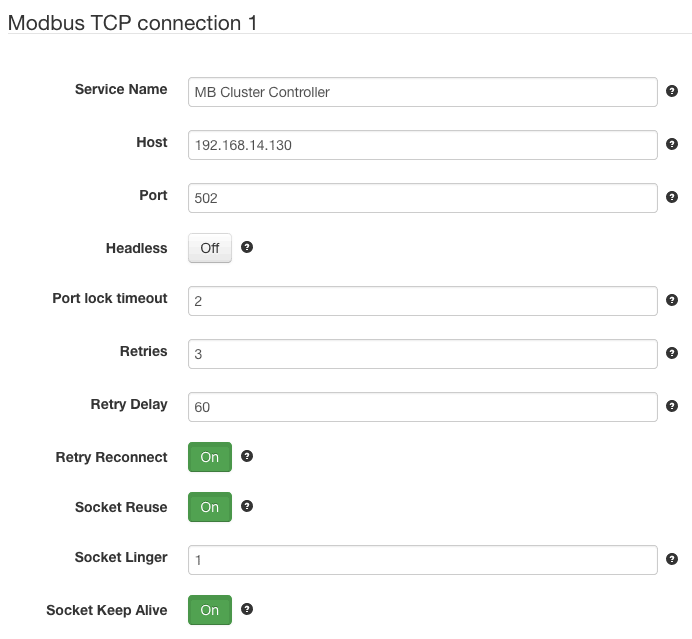
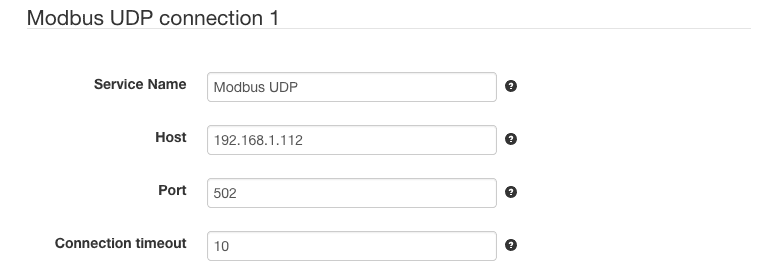

# SolarNode Modbus I/O - Jamod

This plugin provides configurable Modbus network connections for other SolarNode components.
There are three types of networks supported: serial, TCP, and UDP.

## Serial Modbus connection

Serial Modbus connections work via device-specific serial ports made available on the
host operating system. The name of each port is operating-system specific. Some 
common examples are `/dev/ttyS0` (Linux serial port), `/dev/ttyUSB0` (Linux USB serial
port), and `COM1` (Windows serial port).

## TCP Modbus connection

TCP Modbus connections work via TCP socket connections to a remote Modbus device.
You configure this type of connection with a host name (or IP address) and a port
number.

## UDP Modbus connection

UDP Modbus connections work via UDP socket connections to a remote Modbus device.
You configure this type of connection with a host name (or IP address) and a port
number.

