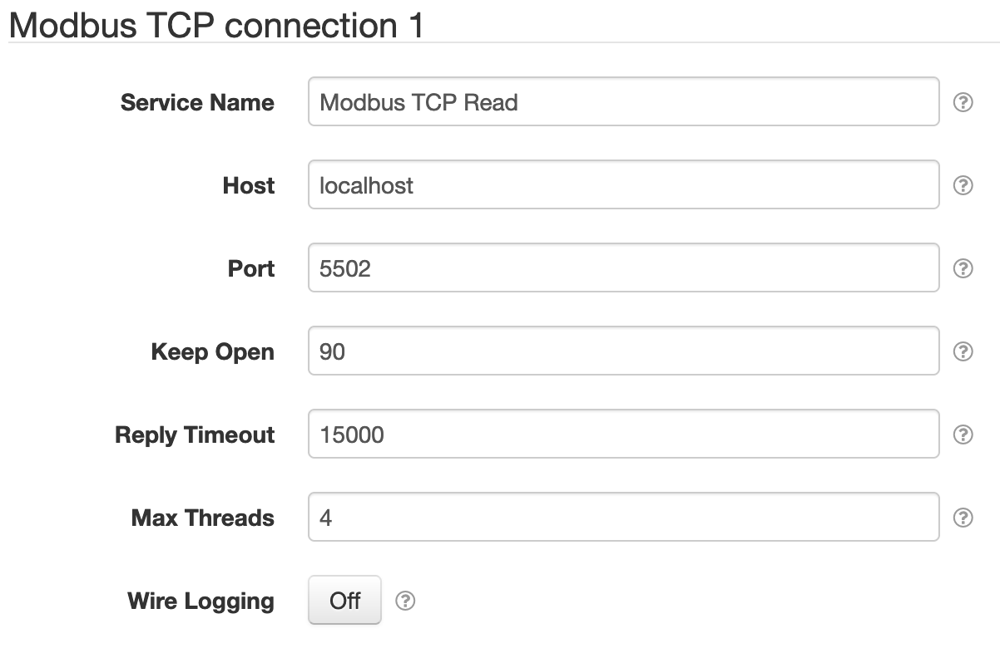

# SolarNode Modbus I/O - Nifty Modbus

This plugin provides configurable Modbus network connections for other SolarNode components.

## TCP Modbus connection

TCP Modbus connections work via TCP socket connections to a remote Modbus device.
You configure this type of connection with a host name (or IP address) and a port
number.

## Serial Modbus connection

Serial Modbus connections for Nifty Modbus are provided by other plugins, such as the
[Nifty Modbus jSerialComm](../net.solarnetwork.node.io.modbus.nifty.jsc/) plugin.
