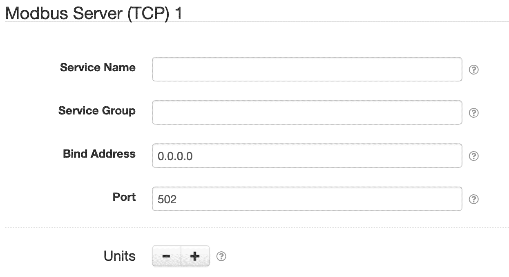
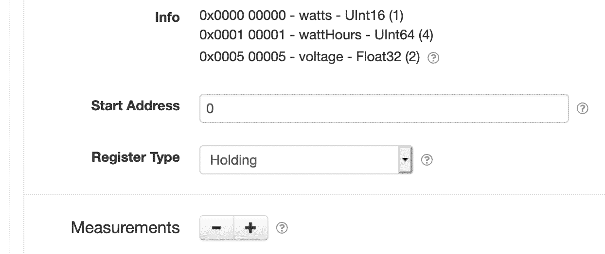
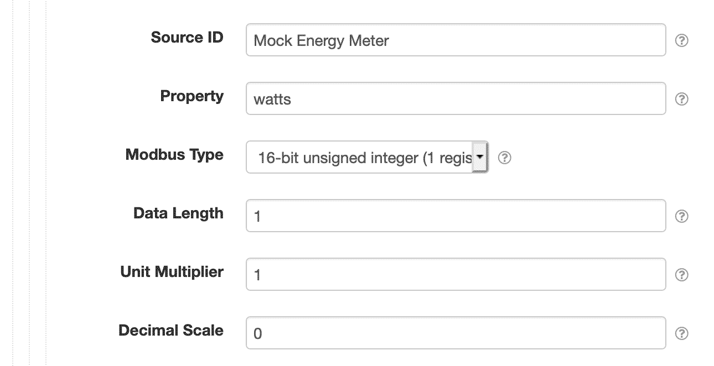

# SolarNode Modbus Server (TCP)

This project provides SolarNode plugin that exposes a Modbus TCP server within SolarNode based on
data collected by other plugins. This is an advanced plugin that requires specific low-level
knowledge of the Modbus services you plan to integrate with.

# Install

The plugin can be installed via the **Plugins** page on your SolarNode. It appears under the **IO**
category as **Modbus Server (TCP)**. Once installed, a new **Modbus Server (TCP)** component will
appear on the **Settings** page on your SolarNode. Click on the **Manage** button to configure
components. You'll need to add one configuration for each port you want to expose a Modbus server
on.

# Use

Each Modbus server configuration is divided into four parts:

 1. Server configuration (e.g. TCP port)
 2. Unit configuration (e.g. Modbus Unit ID)
 3. Register block configuration (e.g. Modbus register starting address)
 4. Measurement configuration (e.g. mapping data into Modbus registers)
 
Each configuration part contains a list of the subsequent configuration part. That is, a server
configuration can have multiple unit configurations, which can contain multiple register block 
configurations, which can have multiple measurement configurations.

## Server configuration

The server configuration defines the port number and address to listen on.



Each server configuration contains the following settings:

| Setting            | Description |
|:-------------------|:------------|
| Service Name       | A unique name to identify this data source with. |
| Service Group      | A group name to associate this data source with. |
| Bind Address       | The IP address or host name to listen on. Set to `0.0.0.0` to listen on all available addresses. |
| Port               | The port number to listen on. The default Modbus port is `502`. |
| Units              | The list of [unit configurations](#unit-configuration). |

### SolarNodeOS port considerations

By default SolarNodeOS has a built-in firewall enabled that will not allow access to arbitrary TCP
ports. Additionally, the SolarNode service runs as an unprivileged user that cannot listen on ports
less than 1024. To work around these issues, you should use a port number 1024 or higher, for
example `5020`. Then you must open that port in the SolarNodeOS firewall, which by default is
`nftables` and configured via the `/etc/nftables.conf` file. You can use a NAT rule in the firewall
to redirect port `502` to your configured port, so Modbus clients use the standard port of `502`. To
open port `502` and redirect to `5020` like in this example, you'd add the following lines, after
the existing ones that open ports 80 and 8080:

```
# Allows Modbus
add rule ip filter INPUT tcp dport 502 counter accept
add rule ip filter INPUT tcp dport 5020 counter accept
```

You'd then add the following NAT lines at the end:

```
# Redirect port 502 to 5020 for SolarNode Modbus server
add rule ip nat prerouting tcp dport 502 redirect to 5020
```

## Unit configuration

Each Modbus server can support up to 256 unit configurations, numbered from `0` - `255`.


Each unit configuration contains the following settings:

| Setting            | Description |
|:-------------------|:------------|
| Unit ID            | The Modbus Unit ID to use for the configured blocks, from `0` - `255`. |
| Register Blocks    | The list of [register block configurations](#register-block-configuration). |

## Register block configuration

Register blocks are sets of contiguous Modbus registers. You configure a starting address and then
each measurement configuration added to the block is mapped to Modbus registers based on the size
required by each measurement.



Each register block configuration contains the following settings:

| Setting            | Description |
|:-------------------|:------------|
| Start Address      | The starting Modbus address for this register block, from `0` - `65,535`. |
| Register Type      | The Modbus register type for this block (e.g. _holding_). |
| Measurements       | The list of [measurement configurations](#measurement-configuration). |

## Measurement configuration

Measurement configurations define what data is made available in Modbus. They work by mapping
properties of datum, collected by other SolarNode plugins, to Modbus registers. Thus you must
configure the datum source ID and property name of each value you want to publish via Modbus.



Each measurement configuration contains the following settings:

| Setting            | Description |
|:-------------------|:------------|
| Source ID          | The datum source ID that contains the **Property** value to publish via Modbus. |
| Property           | The datum property to publish via Modbus. |
| Data Type          | The type of data to expect from the read Modbus register(s).                                            |
| Data Length        | For variable length data types such as strings, the number of Modbus registers to read.                 |
| Unit Multiplier    | For numeric data types, a multiplier to apply to the Modbus value to normalize it into a standard unit. |
| Decimal Scale      | For numeric data types, a maximum number of decimal places to round decimal numbers to.                 |
