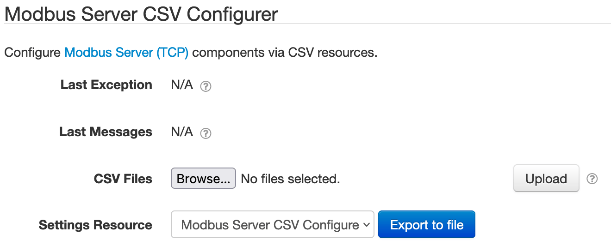

# SolarNode Modbus Server (TCP)

This project provides SolarNode plugin that exposes a Modbus TCP server within SolarNode based on
data collected by other plugins. This is an advanced plugin that requires specific low-level
knowledge of the Modbus services you plan to integrate with.

# Install

The plugin can be installed via the **Plugins** page on your SolarNode. It appears under the **IO**
category as **Modbus Server (TCP)**. Once installed, a new **Modbus Server (TCP)** component will
appear on the **Settings** page on your SolarNode. Click on the **Manage** button to configure
components. You'll need to add one configuration for each port you want to expose a Modbus server
on.

# Use

Each Modbus server configuration is divided into four parts:

 1. Server configuration (e.g. TCP port)
 2. Unit configuration (e.g. Modbus Unit ID)
 3. Register block configuration (e.g. Modbus register starting address)
 4. Measurement configuration (e.g. mapping data into Modbus registers)

Each configuration part contains a list of the subsequent configuration part. That is, a server
configuration can have multiple unit configurations, which can contain multiple register block
configurations, which can have multiple measurement configurations.

# Register word order

All multi-register data (anything more than 16 bits) is stored in **most-to-least significant**
register (word) order, sometimes referred to as _big endian_ or _network_ order. Specifically, the
highest bits if the data are stored first, in smaller numbered registers, followed by lower bits in
larger numbered registers. For example a 32-bit number requires two registers. If the register
address for this number is `0` and the server is updated to hold the value `0x12345678` then
registers `0-1` will look like this:

```
0:  0x1234
1:  0x5678
```

# Register persistence

By default the Modbus Server register blocks are **not** preserved when SolarNode restarts. That
means all registers are effectively cleared to `0` when SolarNode restarts. If you would like to
have the registers preserved instead, a `ModbusRegisterDao` service must be available at
runtime. The [Modbus Server Persistence (JDBC)](../net.solarnetwork.node.io.modbus.server.dao.jdbc)
plugin provides this.

With or without persistence configured, Modbus Server serves all requests from an in-memory
register database. If the `ModbusRegisterDao` service is available, updates to the in-memory
database are then also persisted to that service.

# CSV Configurer

This plugin also provides a **Modbus Server CSV Configurer** component will appear on the main
settings page. This component lets you upload a Modbus Server CSV Configuration file to configure
all Modbus Server components, without having to use the settings form.



## Modbus Server CSV Configuration Format

The Modbus Server CSV Configuration uses the column structure detailed
[below](#csv-column-definition), with each row representing an individual datum property to expose
in Modbus server registers. A header row is required. Comment lines are allowed, just start the line
with a `#` character (i.e. the first cell value). The entire comment line will be ignored.

Here's an example screen shot of a configuration in a spreadsheet application. It is for one server
with one unit with two register blocks:

 1. A **Holding** register block starting at register `0` with 3 datum properties: `watts`, `wattHours`, and `voltage`
 2. An **Input** register block starting at register `100` with 2 datum properties: `frequency` and `current`

Spreadsheet applications generally allows you to export the sheet in the CSV format, which can then
be loaded into SolarNode via the CSV Configurer.


### Instance identifiers

Individual Modbus Device components are defined by the first column (**Instance ID**). You can
assign any identifier you like (such as `Meter`, `Inverter`, and so on) or configure as a single
dash character `-` to have SolarNode assign a simple number identifier. Once an Instance ID has been
assigned on a given row, subsequent rows will use that value if the corresponding cell value is left
empty.

### CSV column definition

The following table defines all the CSV columns used by Modbus Server CSV Configuration. Columns
**A - D** apply to the **entire Modbus Server configuration**, and only the values from the row that
defines a new Instance ID will be used to configure the server. Thus you can omit the values from
these columns when defining more than one register for a given server.

Columns **E - M** define the mapping of datum properties to Modbus registers: each row defines an
individual datum property which occupies one or more Modbus registers.


| Col | Name | Type | Default | Description |
|:----|:-----|:-----|:--------|:------------|
| `A` | **Instance ID** | string |  | The unique identifier for a single Modbus Server component. Can specify `-` to automatically assign a simple number value, which will start at `1`. |
| `B` | **Bind Address** | string | `0.0.0.0` | The IP address or host name to listen on. Set to `0.0.0.0` to listen on all available addresses. |
| `C` | **Port** | integer | `502` | The TCP port to listen on. See [port considerations](#solarnodeos-port-considerations) for more info. |
| `D` | **Throttle** | integer | `100` | A number of **milliseconds** to throttle client requests by. |
| `E` | **Unit ID** | integer | `1` | The Modbus unit ID from `0` - `255`. |
| `F` | **Register Type** | enum |  | The Modbus register type. Must be one of `Coil`, `Discrete Input`, `Holding`, or `Input`. |
| `G` | **Register** | integer |  | The starting register address for the property value (zero-based). For multi-register data types this is the _first_ register the property value will be available at. |
| `H` | **Data Type** | enum | `u16` | The type of data to encode the datum property value into. Must be one of `Boolean` or `bit`, `16-bit float` or `f16`, `32-bit float` or `f32`, `16-bit signed int` or `i16`, `16-bit unsigned int` or `u16`, `32-bit signed int` or `i32`, `32-bit unsigned int` or `u32`, `64-bit signed int` or `i64`, `64-bit unsigned int` or `u16`, `Bytes` or `b`, `String UTF-8` or `s`, `String ASCII` or `a`. |
| `I` | **Data Length** | integer |  | For variable-length data types such as strings, the number of Modbus registers to encode the datum property value into. For fixed-length data types this column is ignored. |
| `J` | **Source ID** | string |  | The datum source ID that holds the property to expose. |
| `K` | **Property** | string |  | The name of the datum property to to encode into Modbus registers. |
| `L` | **Multiplier** | decimal | `1` | For numeric data types, a multiplier to apply to the datum property value to normalize it into a standard unit. |
| `M` | **Decimal Scale** | integer | `0` | For numeric data types, a maximum number of decimal places to round decimal numbers to, or `-1` to not do any rounding. |

## Example CSV

Here is the CSV as shown in the example configuration screen shot above:

```csv
Instance ID,Bind Address,Port,Throttle,Unit ID,Register Type,Register,Data Type,Data Length,Source ID,Property,Multiplier,Decimal Scale
1,0.0.0.0,5020,100,1,Holding,0,UInt16,1,Mock Energy Meter,watts,1,0
,,,,,,,UInt64,4,Mock Energy Meter,wattHours,1,0
,,,,,,,Float32,2,Mock Energy Meter,voltage,1,3
,,,,,Input,100,UInt32,1,Mock Energy Meter,frequency,10,0
,,,,,,,Float32,2,Mock Energy Meter,current,1,-1
```


# Server configuration

The server configuration defines the port number and address to listen on.


Each server configuration contains the following settings:

| Setting            | Description |
|:-------------------|:------------|
| Service Name       | A unique name to identify this data source with. |
| Service Group      | A group name to associate this data source with. |
| Bind Address       | The IP address or host name to listen on. Set to `0.0.0.0` to listen on all available addresses. |
| Port               | The port number to listen on. The default Modbus port is `502`. See [port considerations](#solarnodeos-port-considerations) for more info. |
| Request Throttle   | A number of milliseconds to limit client requests by. |
| Allow Writes       | If enabled, then allow Modbus clients to write to coil and output registers. |
| Units              | The list of [unit configurations](#unit-configuration). |

## SolarNodeOS port considerations

By default SolarNodeOS has a built-in firewall enabled that will not allow access to arbitrary TCP
ports. Additionally, the SolarNode service runs as an unprivileged user that cannot listen on ports
less than 1024. To work around these issues, you should use a port number 1024 or higher, for
example `5020`. Then you must open that port in the SolarNodeOS firewall, which by default is
`nftables` and configured via the `/etc/nftables.conf` file. You can use a NAT rule in the firewall
to redirect port `502` to your configured port, so Modbus clients use the standard port of `502`. To
open port `502` and redirect to `5020` like in this example, you'd add the following lines, after
the existing ones that open ports 80 and 8080:

```
# Allows Modbus
add rule ip filter INPUT tcp dport 502 counter accept
add rule ip filter INPUT tcp dport 5020 counter accept
```

You'd then add the following NAT lines at the end:

```
# Redirect port 502 to 5020 for SolarNode Modbus server
add rule ip nat prerouting tcp dport 502 redirect to 5020
```

## Unit configuration

Each Modbus server can support up to 256 unit configurations, numbered from `0` - `255`.


Each unit configuration contains the following settings:

| Setting            | Description |
|:-------------------|:------------|
| Unit ID            | The Modbus Unit ID to use for the configured blocks, from `0` - `255`. |
| Register Blocks    | The list of [register block configurations](#register-block-configuration). |

## Register block configuration

Register blocks are sets of contiguous Modbus registers. You configure a starting address and then
each measurement configuration added to the block is mapped to Modbus registers based on the size
required by each measurement.


Each register block configuration contains the following settings:

| Setting            | Description |
|:-------------------|:------------|
| Start Address      | The starting Modbus address for this register block, from `0` - `65,535`. |
| Register Type      | The Modbus register type for this block (e.g. _holding_). |
| Measurements       | The list of [measurement configurations](#measurement-configuration). |

## Measurement configuration

Measurement configurations define what data is made available in Modbus. They work by mapping
properties of datum, collected by other SolarNode plugins, to Modbus registers. Thus you must
configure the datum source ID and property name of each value you want to publish via Modbus.


Each measurement configuration contains the following settings:

| Setting            | Description |
|:-------------------|:------------|
| Source ID          | The datum source ID that contains the **Property** value to publish via Modbus. |
| Property           | The datum property to publish via Modbus. |
| Data Type          | The type of data to expect from the read Modbus register(s).                                            |
| Data Length        | For variable length data types such as strings, the number of Modbus registers to read.                 |
| Unit Multiplier    | For numeric data types, a multiplier to apply to the Modbus value to normalize it into a standard unit. |
| Decimal Scale      | For numeric data types, a maximum number of decimal places to round decimal numbers to.                 |
