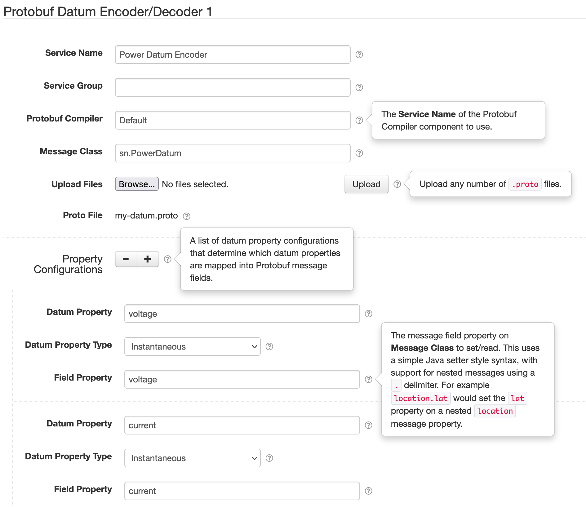
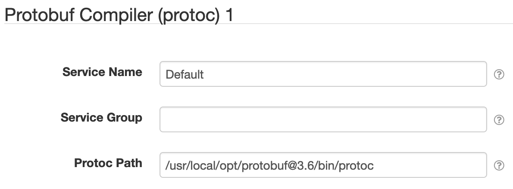

# SolarNode Protobuf I/O

This project contains an OSGi bundle that provides support for working with the [Protobuf][protobuf] 
data serialization framework.

# Protobuf Datum Encoder/Decoder

This component provides a **Datum Encoder** and **Datum Decoder** `net.solarnetwork.io.ObjectCodec`
service that can encode datum into Protobuf messages and vice-versa. Each configured component can
encode/decode to/from a single Protobuf message type, which is configured by uploading `.proto`
files and specifying the name of the Protobuf message type to use.

Other plugins can make use of this service to encode datum as Protobuf messages. For example, the
[SolarFlux Upload][solarflux-upload] plugin supports configuring a Datum Encoder, so you could
configure that service to post Protobuf messages to SolarFlux instead of the default CBOR encoding.

Protobuf messages rely on a schema known in advance, while datum are schema-less and contain
arbitrary properties. Thus this component requires you to configure a mapping between datum
properties and Protobuf message fields.

> :warning: **Note** that some Protobuf features are not supported, such as repeated and map fields.
> This service is designed to support _simple_ message structures.



## Protobuf Datum Encoder/Decoder settings

Each component configuration contains the following overall settings:

| Setting            | Description |
|:-------------------|:------------|
| Service Name       | A unique name to identify this service with. |
| Service Group      | A group name to associate this data source with. |
| Protobuf Compiler  | The <b>Service Name</b> of the <b>Protobuf Compiler</b> component to use. For example, a [protoc](#protoc-protobuf-compiler) one. |
| Message Class      | The full Java class name of the Protobuf message type to use. |
| Upload Files       | Allows you to upload any number of `.proto` Protobuf definition files. |
| Proto File         | Shows the previously-uploaded `.proto` files. |
| Property Configurations | A list of datum property configurations; see below. |

### Property Configuration

Each datum property configuration contains the following settings:

| Setting             | Description |
|:--------------------|:------------|
| Datum Property      | The name of the datum property to read/set. |
| Datum Property Type | The type of the datum property to use. |
| Field Property      | The Protobuf message field name to set/read. |

> **Note** that the **Field Property** supports nested messages by using a `.` delimiter.
> For example, a value like `location.lat` would set the `lat` field on the nested `location`
> message.

# Protoc Protobuf Compiler

This component provides a **Protobuf Compiler**
`net.solarnetwork.common.protobuf.ProtobufCompilerService` service based on the `protoc` tool. This
service can compile `.proto` files into Java Protobuf message classes. Typically only one of these
components need be configured, but you can configure multiple services that use different versions
of `protoc` as needed.

> :warning: **Note** that the `protoc` version used must be compatible with the Protobuf bundle
> deployed in the SolarNode runtime, otherwise compilation errors can occur. 



## Protoc Compiler settings

Each component configuration contains the following overall settings:

| Setting            | Description |
|:-------------------|:------------|
| Service Name       | A unique name to identify this service with. |
| Service Group      | A group name to associate this data source with. |
| Protoc Path        | The operating system path to the `protoc` tool to use. |

# Tips

Here's an example shell command to decode a hex-encoded Protobuf message with `protoc`:

```sh
echo -n 090000004036486c4011dac69fa86c5a4040189fb5eb02 \
  |xxd -r -p \
  |protoc --proto_path=$PWD --decode=sn.PowerDatum my-datum.proto
```

[protobuf]: https://developers.google.com/protocol-buffers
[solarflux-upload]: ../net.solarnetwork.node.upload.flux/
