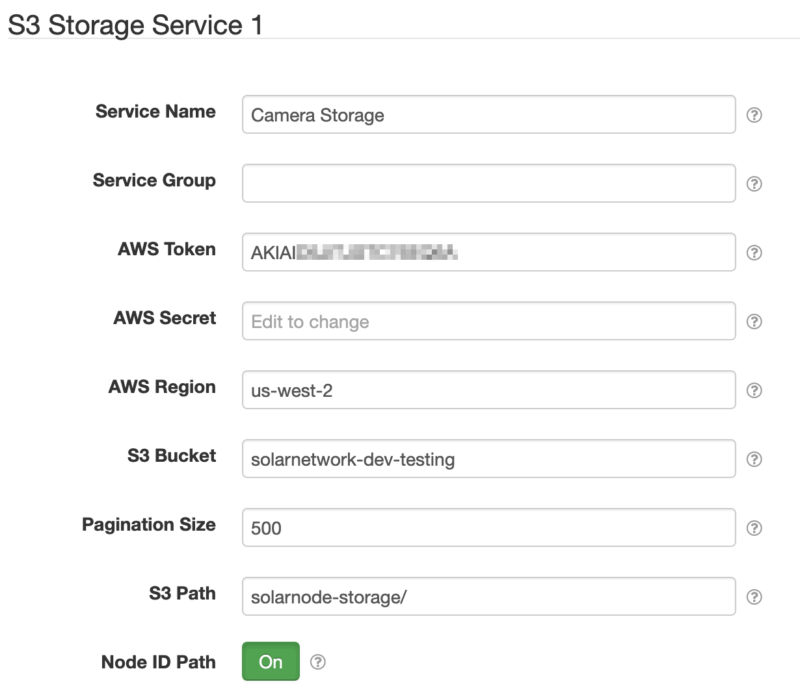

# SolarNode S3 Storage Service

This project provides SolarNode plugin that provides a SolarNode Storage Service using AWS S3 for
cloud-based storage. This plugin is designed to be used by other plugins that use the SolarNode
Storage Service API, so they can manage resources that are saved on S3.

# Install

The plugin can be installed via the **Plugins** page on your SolarNode. It
appears under the **IO** category as **S3 Storage Support**. Once installed,
the components outlined next in this document will become available.

# Configuration

Each service configuration contains the following settings:

| Setting         | Description  |
|-----------------|--------------|
| Service Name    | A unique name to identify this component with. |
| Service Group   | A group name to associate this component with. |
| AWS Token       | AWS access token for authentication. |
| AWS Secret      | AWS access token secret. |
| AWS Region      | AWS service region. |
| S3 Bucket       | S3 bucket name to save backups to. |
| S3 Path         | A prefix to add to all S3 object keys, for example a sub-folder path. |
| Node ID Path    | Automatically add the node ID as a path prefix for all S3 object keys. |

## Settings notes

<dl>
	<dt>S3 Path</dt>
	<dd>Use this value to save all resources with a specific prefix. For example to save
	all resources into a sub-folder named <b>my-folder</b> you would configure 
	<code>my-folder/</code>. Note the trailing slash character to treat the prefix
	as a folder.</dd>
	<dt>Node ID Path</dt>
	<dd>When enabled, the node ID will be automatically added as a folder prefix to 
	all S3 object keys. This prefix is added <b>after</b> and <b>S3 Path</b> prefix.
	Using the example <code>my-folder/</code> S3 Path, a resulting path prefix for
	node <b>123</b> would be <code>my-folder/123/</code>.</dd>
</dl>
