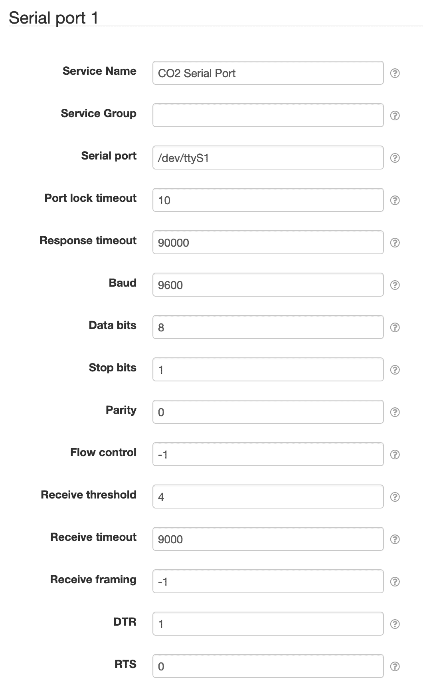

# SolarNode Serial Port (jSerialComm)

This project provides a SolarNode plugin that provides low-level access to serial ports to other
plugins, by way of the [jSerialComm][jsc] library.

# Install

The plugin can be installed via the **Plugins** page on your SolarNode. It appears under the
**IO** category as **Serial Communication Support (PJC)**.

# Use

Once installed, a new **Serial Port** component will appear on the **Settings** page on your
SolarNode. Click on the **Manage** button to configure devices. You'll need to add one configuration
for each serial port you want to communicate over.

## Overall device settings

Each device configuration contains the following overall settings:

| Setting            | Description |
|:-------------------|:------------|
| Service Name       | A unique name to identify this data source with. |
| Service Group      | A group name to associate this data source with. |
| Serial port        | The OS device name. This varies by operating system. Some examples `/dev/ttyUSB0` and `COM1`. |
| Port lock timeout  | The maximum amount of time to wait to acquire exclusive use of the configured port, in seconds. |
| Response timeout   | The maximum amount of time to wait for a response before giving up, in milliseconds. |
| Baud               | The maximum communication speed to use, in bits-per-second. |
| Data bits          | The number of data bits per message. |
| Stop bits          | The number of stop bits per message. |
| Parity             | The serial port parity setting to use. |
| Flow control       | The serial port flow control setting to use. |
| Receive threshold  | The serial port receive threshold setting. |
| Receive timeout    | The maximum amount of time to wait to receive data, in milliseconds. |
| Receive framing    | The serial port receive framing setting to use, or `-1` to disable. |
| DTR                | The DTR scheme to follow at the start of reading from the port. |
| RTS                | The RTS scheme to follow at the start of writing to the port. |

## Overall device settings notes

<dl>
	<dt>Port lock timeout</dt>
	<dd>Multiple components can use the same port, but only one at a time. If one component is using the
	port and another tries to, the second component will wait at most this many seconds for the first
	component to finish using the port before giving up.</dd>
	<dt>Response timeout</dt>
	<dd>This differs from the <em>Receive timeout</em> setting in that this is not a timeout
	controlled by the serial port, rather the application enforces it. If set to <code>0</code>
	the timeout is disabled and the application will wait indefinitely for responses.</dd>
	<dt>Receive threshold</dt>
	<dd>If set to <code>-1</code> then the receive threshold will be disabled.</dd>
	<dt>DTR</dt>
	<dd>When set to <code>0</code> DTR will be set to <em>false</em>. When set to <code>1</code>
	DTR will be set to <em>true</em>. When set to <code>-1</code> the DTR setting will not be changed.</dd>
	<dt>RTS</dt>
	<dd>When set to <code>0</code> RTS will be set to <em>false</em>. When set to <code>1</code>
	RTS will be set to <em>true</em>. When set to <code>-1</code> the RTS setting will not be changed.</dd>
</dl>

## Stop bits

The **Stop bits** setting accepts the following values:

| Setting value | Used value |
|:--------------|:-----------|
| 1             | 1          |
| 2             | 2          |
| 3             | 1.5        |

## Parity

The **Parity** setting accepts the following values:

| Setting value | Used value |
|:--------------|:-----------|
| 0             | None       |
| 1             | Odd        |
| 2             | Even       |
| 3             | Mark       |
| 4             | Space      |

## Flow control

The **Flow control** setting accepts the following values:

| Setting value | Used value   |
|:--------------|:-------------|
| 0             | None         |
| 1             | RTS CTS in   |
| 2             | RTS CTS out  |
| 4             | XON XOFF in  |
| 8             | XON XOFF out |

[jsc]: https://github.com/Fazecast/jSerialComm
