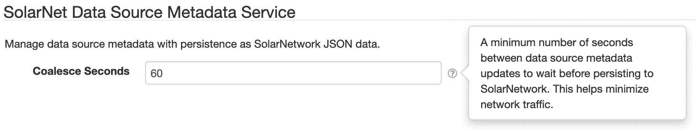

# Metadata Service (SolarNetwork)

This project provides SolarNode plugin that allows SolarNode to save node- or data source-specific
metadata collected by other plugins to SolarNetwork. It uses the SolarIn `/datum/meta/{nodeId}/{sourceId}`
API to [get][datum-meta-view] and [add][datum-meta-post] the metadata as JSON documents.

# Install

This is a core SolarNode plugin and must be deployed manually or as part of the base platform.

# Use

Once installed, a new **Metadata Service (SolarNetwork)** group will appear on the **Settings**
page on your SolarNode.

## Settings

| Setting             | Description |
|:--------------------|:---------------------------------------------------------------------------------------------|
| Persist Seconds    | A minimum number of seconds between data source metadata updates to wait before persisting locally. This helps minimize disk writes. |
| Sync Seconds    | A minimum number of seconds between data source metadata updates to wait before persisting to SolarNetwork. This helps minimize network traffic. |

## Setting notes

The **Persist Seconds** setting affects how quickly SolarNode will persist metadata updates
to the local filesystem. SolarNode will wait _at least_ this number of seconds after a metadata
update before saving the data to disk. If another update occurs for the same metadata, SolarNode
will reset the timer and wait this number of seconds again. **Note** that it is possible for
the metadata to _never_ persist to disk if metadata updates continually reset this timer. You
can configure the **Sync Seconds** to a value larger than this value to ensure the changes 
eventually do get saved to disk.

The **Sync Seconds** setting affects how frequently SolarNode will persist and synchronize a
given data source's metadata to SolarNetwork. Posting the metadata takes time, and if a data
source collects datum at a high frequency SolarNode might not be able to keep up and will consume
a lot of network traffic. **Note** this sync time _also_ persists any unsaved changes to the
local disk, in case the **Persist Seconds** setting is active any repeated updates prevent
that timeout from occurring.

# Metadata Service component

The node-specific metadata service provided by this plugin also implements the generic 
`net.solarnetwork.node.service.MetadataService` API, using the Service ID `Node Metadata Service`.
That means other plugins that use that API can access node metadata by configuring that Service ID
value in its settings.

[datum-meta-view]: https://github.com/SolarNetwork/solarnetwork/wiki/SolarIn-API#node-datum-metadata-view
[datum-meta-post]: https://github.com/SolarNetwork/solarnetwork/wiki/SolarIn-API#node-datum-metadata-add
