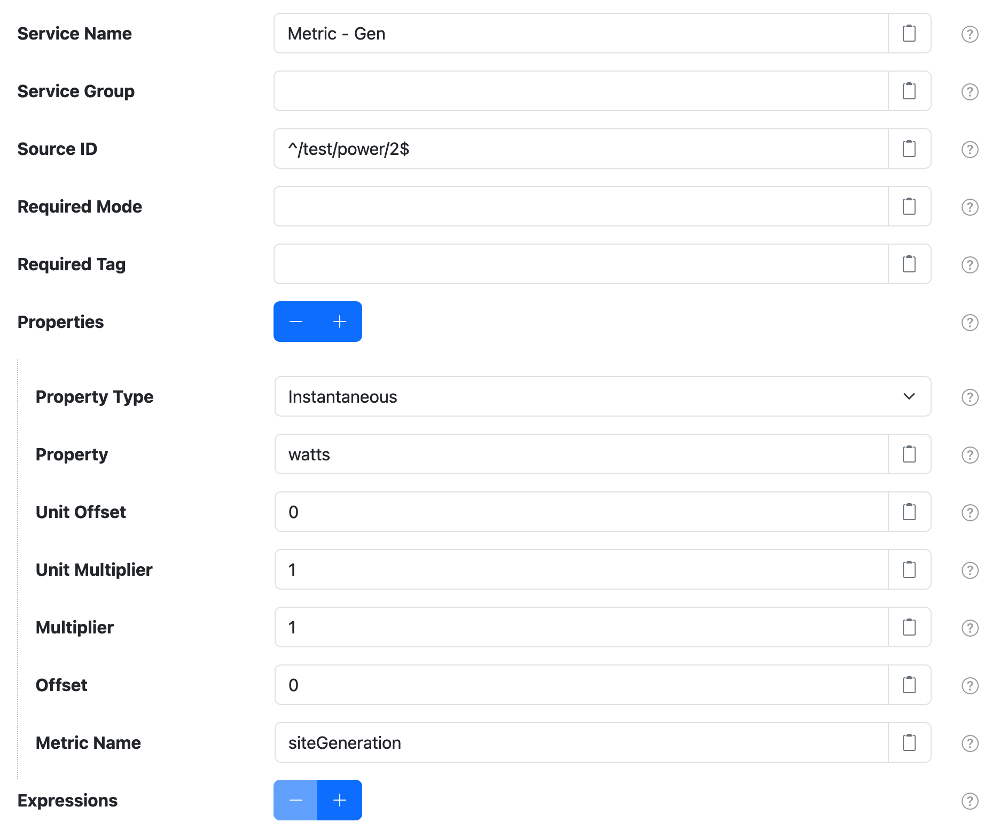
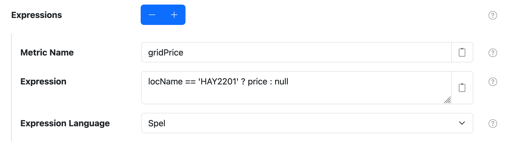

# SolarNode Metric Harvester

This plugin provides a way to capture properties from datum generated by data sources as metrics.

# Use

Once installed, a new **Metric Harvester** component will appear on the
**Settings > Datum Filter** page on your SolarNode. Click on the **Manage** button to configure
filters.



# Settings

Each filter configuration contains the following overall settings:

| Setting            | Description                                                       |
|:-------------------|:------------------------------------------------------------------|
| Service Name       | A unique ID for the filter, to be referenced by other components. |
| Service Group      | An optional service group name to assign. |
| Source ID          | The source ID(s) to filter. |
| Required Mode      | If configured, an [operational mode](https://github.com/SolarNetwork/solarnetwork/wiki/SolarNode-Operational-Modes) that must be active for this filter to be applied. |
| Required Tag       | Only apply the filter on datum with the given tag. A tag may be prefixed with <code>!</code> to invert the logic so that the filter only applies to datum **without** the given tag. Multiple tags can be defined using a `,` delimiter, in which case **at least one** of the configured tags must match to apply the filter. |
| Properties         | A list of datum property configurations. See [Property settings](#property-settings) for more information. |
| Expressions        | A list of expression configurations. See [Expression settings](#property-settings) for more information. |

## Settings notes

 * **Source ID** -- a case-insensitive regular expression pattern to match against datum source ID
   values. **Only** datum with matching source ID values will be filtered.

## Property settings

Use the **Properties** <kbd>+</kbd> and <kbd>-</kbd> buttons to add/remove property configurations.
Each property configuration contains the following settings:

| Setting            | Description                                                       |
|:-------------------|:------------------------------------------------------------------|
| Property Type      | The type of the datum property to extract. |
| Property           | The name of the datum property to extract. Only **numeric** properties are supported. |
| Unit Offset        | An offset to add to the value. This is the first transform applied. Set to `0` for no offset. |
| Unit Multiplier    | A multiplication factor to normalize the value into some other unit. This is the second transform applied, **after** the **Unit Offset**. Set to `1` to leave the input unchanged. |
| Multiplier         | A multiplication factor to normalize the value into some other unit. This is the third transform applied, **after** the **Unit Multiplier**. Set to `1` to leave the input unchanged. |
| Offset             | An offset to add to the value. This is the forth transform applied, **after** the **Multiplier**. Set to `0` for no offset. |
| Metric Name        | The metric name to assign to the value. |

### Value transform

The various **Multiplier** and **Offset** settings allow you to apply two linear equations to the
datum property values to transform a raw data value _x_ into a corresponding metric value _y_.

First the **Unit Offset** _B_ and **Unit Multiplier** _M_ are applied using the equation

```
y = (x + B) × M
```

Then the **Multiplier** _m_ and **Offset** _b_ are applied using the equation

```
y = (m × x) + b
```

Taken together, the overal equation applied is thus:

```
y = (m × ((x + B) × M)) + b
```

## Expression settings

Use the **Expressions** <kbd>+</kbd> and <kbd>-</kbd> buttons to add/remove property configurations.
Each expression configuration contains the following settings:

| Setting            | Description                                                       |
|:-------------------|:------------------------------------------------------------------|
| Metric Name        | The metric name to assign to the value. |
| Expression          | The expression to evaluate. See [Expressions](#expressions) for more info. |
| Expression Language | The [expression language][expr] to write **Expression** in. |



# Expressions

See the [SolarNode Expressions][node-expr] guide for general expressions reference. The root object
is a [`DatumExpressionRoot`][DatumExpressionRoot] that lets you treat all datum properties, and
filter parameters, as expression variables directly.


[expr]: https://github.com/SolarNetwork/solarnetwork/wiki/Expression-Languages
[DatumExpressionRoot]: https://github.com/SolarNetwork/solarnetwork-common/blob/develop/net.solarnetwork.common/src/net/solarnetwork/domain/DatumExpressionRoot.java
[node-expr]: https://github.com/SolarNetwork/solarnetwork/wiki/SolarNode-Expressions
