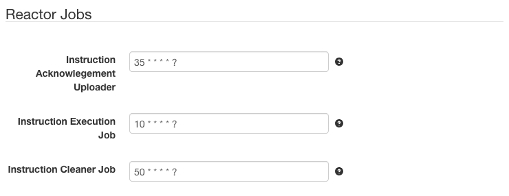

# SolarNode Reactor Service

This project provides SolarNode plugin that allows SolarNode to execute
locally persisted instructions which may have originated from SolarNet
or other plugins.

# Install

This is a core SolarNode plugin and must be deployed manually or as part of
the base platform.

# Use

Once installed, a new **Reactor** group will appear on the **Settings** page
on your SolarNode. These settings allow tweaking how quickly SolarNode can
process instructions.

This plugin manages three scheduled tasks for processing instructions:

 1. **Execution**: looks for _Received_ instructions that have been persisted 
    locally and executes them. Instructions can be received via the 
    [Bulk JSON Web Uploader][bulkjsonwebpost], for example. After execution
    the instruction's state is updated **locally** as either _Completed_ or
    _Declined_.
 2. **Acknowledgement**: posts the status of instructions whose status has
    changed to SolarNet.
 3. **Cleanup**: delete **locally** persisted instruction statuses that have
    reached the _Completed_ or _Declined_ states.
    
Based on these tasks, instructions are executed and their status gets posted
to SolarNet as changes occur.

## Settings

| Setting                              | Description                                                             |
|--------------------------------------|-------------------------------------------------------------------------|
| Instruction Execution Job            | A cron schedule that determines when queued instructions are executed.  |
| Instruction Acknowledgement Uploader | A cron schedule that determines when instruction status is uploaded.    |
| Instruction Cleaner Job              | A cron schedule that determines when completed instructions are purged. |

## Setting notes

By default, each of the above jobs are configured to run once/minute. That means
it can take several minutes for the completed status of an instruction to make
its way up to SolarNet. You can decrease that latency by increasing the frequency
of the **Execution** and **Acknowledgement** jobs.

Also you must consider how instructions are received in the first place.
The [Bulk JSON Web Uploader][bulkjsonwebpost] service can get instructions
in the response from SolarIn each time it posts data. Instructions received
that way are persisted in the _Received_ state. That means SolarNode can
only get instructions as frequently has the Bulk JSON Web Uploader is 
configured to run, and by default that service does not run if there isn't
any data to post (it can be configured to "always upload" to work around
that, however).

Thus when considering how quickly you need SolarNode to handle instructions,
consider the overall time as the sum total of:

 1. time for instruction to get to SolarNode and show up in the _Received_ state
 2. time for the **Execution** job to notice the received instruction and execute
    it, saving the resulting status as _Completed_ or _Declined_
 3. time for the **Acknowledgement** job to notice the _Completed_ and _Declined_
    instructions and post their status to SolarNet

 [bulkjsonwebpost]: https://github.com/SolarNetwork/solarnetwork-node/tree/master/net.solarnetwork.node.upload.bulkjsonwebpost
