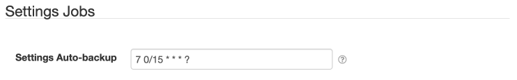
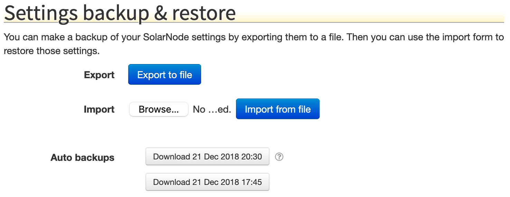

# SolarNode Settings Service (Configuration Admin)

This plugin provides an OSGi Configuration Admin based implementation of the core SolarNode 
_SettingsService_. The _SettingsService_ is used throughout SolarNode to provide a way for plugins
to expose configurable settings to users and to export/import/backup settings in a standardized
CSV format.

Because this service is implemented on top of the OSGi Configuration Admin service, other plugins
can access all the settings managed by _SettingService_ via Configuration Admin, and vice versa.

# Settings Jobs

This plugin provides a job to make automatic backups of all SolarNode settings to a CSV file
stored in the `var/settings-bak` directory of the SolarNode runtime directory.



# Settings backup & restore

This plugin provides support for exporting and importing SolarNode settings as CSV files.



The **Export to file** button allows you to download the current SolarNode settings to a CSV file.
The **Import from file** button allows you to import a CSV file of SolarNode settings and apply 
them. In the **Auto backups** section is a list of the most recent settings CSV backup files that
you can download. Auto backups are created via the job schedule configured in the 
[Settings Jobs](#settings-jobs) section, but only after a change occurs. This means the auto
backups provide a historical snapshot of changes that have been applied to SolarNode.

# Settings CSV format

The SolarNode settings CSV format uses a quite general format and contains the following columns:

| # | Name | Description |
|:--|:-----|:------------|
| 1 | key  | A unique identifier for the service the setting applies to. |
| 2 | type | A unique identifier for the setting with the service specified by `key`. |
| 3 | value | The setting value. |
| 4 | flags | An integer bitmask of flags associated with the setting. See the [flags section](#settings-flags) for more info. |
| 5 | modified | The date the setting was last modified, in `yyyy-MM-dd HH:mm:ss` format. |

To understand the `key` and `type` values required for a given plugin requires consulting the 
documentation of that plugin. You can get a pretty good picture of what the values are by exporting
the settings after configuring a component in SolarNode. Typically the `key` value will mirror
a plugin's Java package name, and `type` follows the Spring Framework property accessor syntax for
a property exposed by the service providing the settings.

## Settings CSV example

Here's an example snippet of settings CSV:

```csv
net.solarnetwork.node.io.modbus.1,serialParams.baudRate,19200,0,2014-03-01 21:01:31
net.solarnetwork.node.io.modbus.1,serialParams.parityString,even,0,2014-03-01 21:01:31
net.solarnetwork.node.io.modbus.1,serialParams.portName,/dev/cuaU0,0,2014-03-01 21:01:31
net.solarnetwork.node.io.modbus.FACTORY,1,1,0,2014-03-01 21:00:31
```

These settings all belong to the `net.solarnetwork.node.io.modbus` settings service.


## Setting property syntax

The `type` setting value usually defines a plugin property via a property accessor syntax with these
rules:

| Expression | Example | Description |
|:----------------|:--------|:------------|
| Property        | `name`         | Indicates a property named `name`. |
| Nested property | `name.subname` | Indicates a nested property `subname` on a parent property `name`. |
| List property   | `name[0]`      | Indicates the first element of an indexed list property named `name`. |
| Map property    | `name['key']`  | Indicates the `key` element of the map property `name`. |

These rules can be combined in complex expressions, such as _the name of the first property 
include list setting_:

```
propIncludes[0].name
```

or _the `UID` property filter of the connection factory of the delegate setting_:

```
delegate.connectionFactory.propertyFilters['UID']
```

## Settings flags

Each setting has a set of flags that can be associated with it. The following table outlines the
bit offset for each flag along with a description:

| # | Name | Description |
|:--|:-----|:------------|
| 0 | Ignore modification date | If this flag is set then changes to the associated setting will not trigger a new auto backup. |
| 1 | Volatile | If this flag is set then changes to the associated setting will not trigger an internal "setting changed" event to be broadcast. |

## Component factories

Many plugins provide _component factories_ which allow you to configure any number of a given 
service provided by the plugin. In the previous [example CSV](#settings-csv-example) the 
**IO Modbus** plugin allows you to configure any number of Modbus connection components, each with
their own specific settings. That is an example of a component factory. The settings CSV will 
include a special row to indicate that such a factory component should be activated, using a unique
number, and then all the settings associated with that factory instance will have that unique 
number appended to their `key` values.

Going back to that example CSV, this is the row that activates the first IO Modbus component:

```csv
net.solarnetwork.node.io.modbus.FACTORY,1,1,0,2014-03-01 21:00:31
```

The synax for `key` column is simply the service identifier followed by `.FACTORY`. Then the `type`
and `value` columns are both set the same unique number. In this example that number is `1`. For all
settings specific to a factory component, the `key` column will be the service identifier followed
by `.NUMBER` where `NUMBER` is the unique instance number.

Here's an example that shows two factory instances configured, each with a different 
`serialParams.portName` setting value:

```csv
net.solarnetwork.node.io.modbus.1,serialParams.portName,/dev/cuaU0,0,2014-03-01 21:01:31
net.solarnetwork.node.io.modbus.2,serialParams.portName,/dev/ttyUSB0,0,2014-03-01 21:01:31
net.solarnetwork.node.io.modbus.FACTORY,1,1,0,2014-03-01 21:00:31
net.solarnetwork.node.io.modbus.FACTORY,2,2,0,2014-03-01 21:00:31
```
