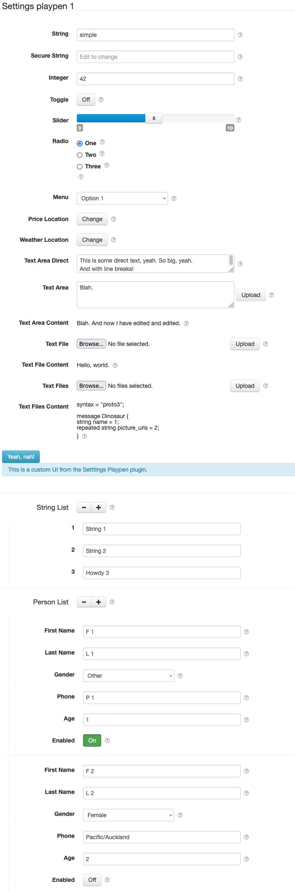
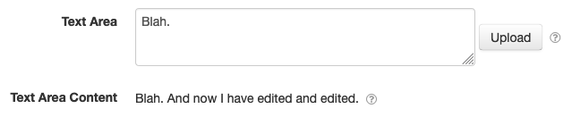
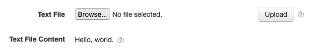
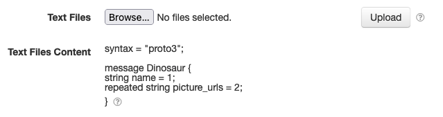
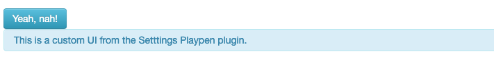
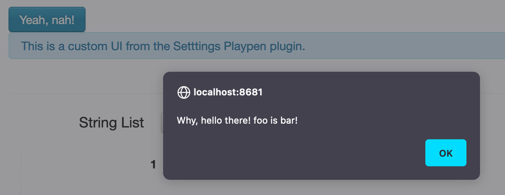
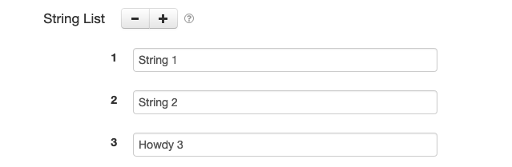
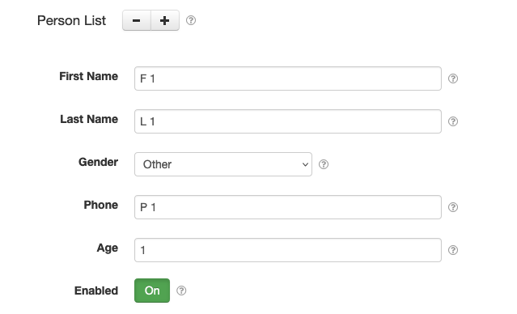

# SolarNode Settings Playpen

This project provides SolarNode plugin to help developers understand how the Settings framework
works. It is a showcase of all the different setting types supported in SolarNode, and how they are
rendered into UI elements in the SolarNode Setup app.



# Install

The plugin is meant for developers only, and must be manually installed.

# Use

Once installed, a new **Settings playpen** component will appear on the **Settings** page on your
SolarNode. Click on the **Manage** button to configure a playpen.

# Settings

Each component provides a long list of settings to play with.

## String


This is a `TextFieldSettingSpecifier` setting, the most common type found in SolarNode. The code
that generates this setting looks like this:

```java
new BasicTextFieldSettingSpecifier("string", "simple");
```

## Secure String (password)


This is a `TextFieldSettingSpecifier` setting, with the `secureTextEntry` property set to `true`.
The code that generates this setting looks like this:

```java
new BasicTextFieldSettingSpecifier("password", null, true);
```

## Integer


This is a `TextFieldSettingSpecifier` setting, but the setting maps to an `integer` property. As all
setting values are inherently strings, this demonstrates how the Settings framework can perform
simple conversion for you, like into `java.lang.Integer` instances like here. The code that
generates this setting looks like this:

```java
new BasicTextFieldSettingSpecifier("integer", String.valueOf(42));
```

## Toggle


This is a `ToggleSettingSpecifier` setting, for on/off switch style settings. The code that
generates this setting looks like this:

```java
new BasicToggleSettingSpecifier("toggle", false);
```

## Slider


This is a `SliderSettingSpecifier` setting, for number-within-a-range style settings. The code that
generates this setting, for a slider between `0` and `10` in `0.5` increments, looks like this:

```java
new BasicSliderSettingSpecifier("slide", 5.0, 0.0, 10.0, 0.5);
```

## Radio


This is a `RadioGroupSettingSpecifier` setting, for single choice listing of options. The code that
generates this setting looks like this:

```java
String[] radioOpts = new String[] { "One", "Two", "Three" };
BasicRadioGroupSettingSpecifier radioSpec = new BasicRadioGroupSettingSpecifier("radio",
		radioOpts[0]);
Map<String, String> radioValues = new LinkedHashMap<>(3);
for ( String s : radioOpts ) {
	radioValues.put(s, s);
}
radioSpec.setValueTitles(radioValues);
```

## Menu


This is a `MultiValueSettingSpecifier` setting, for single choice menu of options. The code that
generates this setting looks like this:

```java
String[] menuOpts = new String[] { "Option 1", "Option 2", "Option 3" };
BasicMultiValueSettingSpecifier menuSpec = new BasicMultiValueSettingSpecifier("menu",
		menuOpts[0]);
Map<String, String> menuValues = new LinkedHashMap<>(3);
for ( String s : menuOpts ) {
	menuValues.put(s, s);
}
menuSpec.setValueTitles(menuValues);
```

## Price/Weather Location


Both of these are `LocationLookupSettingSpecifier` settings, for selecting a location to associate
with price and weather datum streams. The code that generates the price setting looks like this:

```java
String locationId = getPriceLocationId();
String sourceId = getPriceSourceId();
LocationService service = getLocationService();
GeneralLocationSourceMetadata meta = service.getLocationMetadata(locationId, sourceId);
SimpleDatumLocation loc = new SimpleDatumLocation();
loc.setLocationId(locationId);
loc.setSourceId(sourceId);
loc.setSourceMetadata(meta);
new BasicLocationLookupSettingSpecifier("locationKey", DatumLocation.PRICE_TYPE, loc);
```

For weather, just the final line changes like this:

```java
new BasicLocationLookupSettingSpecifier("locationKey", DatumLocation.WEATHER_TYPE, loc);
```

## Text Area Direct


This is a `TextAreaSettingSpecifier` setting, for a larger text setting that preserves white space.
The code that generates this setting looks like this:

```java
new BasicTextAreaSettingSpecifier("textAreaDirect", "", true);
```

## Text Area



This is a `TextAreaSettingSpecifier` setting, for a large text setting whose content is uploaded via
a resource post with content from a text area. The code that generates this setting looks like this,
along with a read-only title setting to show the current text area content:

```java
new BasicTextAreaSettingSpecifier("textArea", "");
new BasicTitleSettingSpecifier("textAreaContent", textAreaContent, true);
```

## Text File



This is a `FileSettingSpecifier` setting, for a large text setting whose content is uploaded via a
file upload. The code that generates this setting looks like this, along with a read-only title
setting to show the current text area content:

```java
new BasicFileSettingSpecifier("file", null,
		new LinkedHashSet<>(Arrays.asList(".txt", "text/*")), false);
new BasicTitleSettingSpecifier("fileContent", fileContent, true);
```

## Text Files



This is also a `FileSettingSpecifier` setting but with the `multiple` property set to `true`, for a
large text setting whose content is uploaded via a file upload. The code that generates this setting
looks like this, along with a read-only title setting to show the current text area content:

```java
new BasicFileSettingSpecifier("textFiles", null,
		new LinkedHashSet<>(Arrays.asList(".txt", "text/*")), true);
new BasicTitleSettingSpecifier("textFilesContent", textFilesContent, true);
```

## Custom Resource



This is a `SetupResourceSettingSpecifier` setting that allows a fully custom UI to be generated for
the setting. This requires implementing the `net.solarnetwork.node.settings.SettingResourceHandler`
API to handle the custom UI resources.

```java
SetupResourceProvider customSettingResourceProvider = getCustomSettingResourceProvider();
new BasicSetupResourceSettingSpecifier(customSettingResourceProvider,
				Collections.singletonMap("foo", "bar")
```

For custom resource settings in the SolarNode Setup web app, the `Map` values are set as HTML data attributes on a container element
surrounding the custom UI HTML. Here a **Yeah, nah!** button is rendered via the `META-INF/settings/playpen-settings.html`
resource (**note** the outer most `<div>` is rendered by the SolarNode Setup web app, and notice
the `data-foo` attribute rendered from the `Map` passed along with the setting):

```html
<div data-foo="bar">
	<button type="button" class="btn btn-info playpen-setting-custom-button">
		Yeah, nah!
	</button>
	<br />
	<div class="alert alert-info">
		This is a custom UI from the Setttings Playpen plugin.
	</div>
</div>
```

A `net/solarnetwork/node/settings/playpen/playpen.js` JavaScript resource is also provided:

```javascript
$(document).ready(function() {
	'use strict';
	
	$('button.playpen-setting-custom-button').on('click', function(event) {
		var btn = $(event.target),
			foo = btn.parent().data('foo');
		alert("Why, hello there! foo is " +foo +"!");
	});

});
```

Thus when the **Yeah, nah!** button is pressed, an alert is shown, like this:



## String List



This is a `GroupSettingSpecifier` group setting of a dynamically-sized list of 
`TextFieldSettingSpecifier` settings. In the SolarNode Setup app, the UI for the setting is rendered
with _add_ and _remove_ buttons that allows the user to add and remove settings from the group.

```java
Collection<String> listStrings = getListString();
BasicGroupSettingSpecifier listStringGroup = SettingUtils.dynamicListSettingSpecifier(
		"listString", listStrings, new SettingUtils.KeyedListCallback<String>() {

			@Override
			public Collection<SettingSpecifier> mapListSettingKey(String value, int index,
					String key) {
				return Collections.<SettingSpecifier> singletonList(
						new BasicTextFieldSettingSpecifier(key, ""));
			}
		});
```

## Complex List (people)



This is a `GroupSettingSpecifier` group setting of a dynamically-sized list of 
`GroupSettingSpecifier` settings of a variety of other settings. In the SolarNode Setup app, the UI for the setting is rendered
with _add_ and _remove_ buttons that allows the user to add and remove settings from the group. In
the playpen, this is used to render a dynamic list of "person forms". Each person has settings for
name, phone, age, etc. Any number of people can be added.

```java
Collection<ComplexListItem> listComplexes = getListComplex();
BasicGroupSettingSpecifier listComplexGroup = SettingUtils.dynamicListSettingSpecifier(
		"listComplex", listComplexes, new SettingUtils.KeyedListCallback<ComplexListItem>() {

			@Override
			public Collection<SettingSpecifier> mapListSettingKey(ComplexListItem value,
					int index, String key) {
				BasicGroupSettingSpecifier personGroup = new BasicGroupSettingSpecifier(
						value.settings(key + "."));
				return Collections.<SettingSpecifier> singletonList(personGroup);
			}
		});
```
