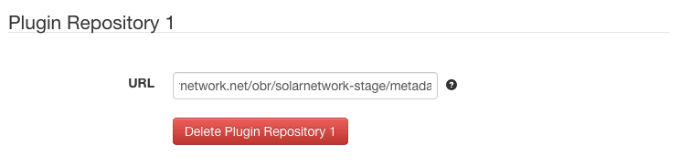
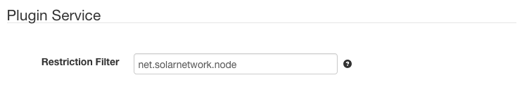

# SolarNode OBR Plugin Repository

This project provides SolarNode plugin repository implemented by the OSGi
Online Bundle Repository (OBR) standard.

# Install

The plugin is typically included in the SolarNode distribution.

# Use

Once installed, a new **Plugin Repository** component will appear on the
**Settings** page on your SolarNode. Click on the **Manage** button to configure
repositories. You can configure as many repositories as you like.

## OBR repository settings

Each device configuration contains the following overall settings:

| Setting       | Description                                            |
|---------------|--------------------------------------------------------|
| URL           | An absolute URL to the `metadata.xml` file of the OBR. |

SolarNetwork Foundation maintains a couple of OBR repositories of the
main SolarNode bundles at:

 * **Staging (Beta)** - https://data.solarnetwork.net/obr/solarnetwork-stage/metadata.xml
 * **Production** - https://data.solarnetwork.net/obr/solarnetwork/metadata.xml

## Plugin restriction filter

There is also a global setting on the main **Settings** page under the
**Plugin Service** section that restricts which plugins will appear on the
**Plugins** page of the SolarNode app.

This filter is a comma-delimited list of plugin ID prefixes to restrict
SolarNode to showing.
