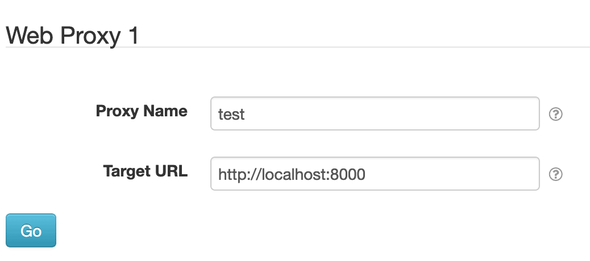
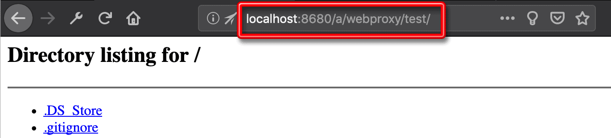

# SolarNode Web Proxy

This project provides a SolarNode plugin for configuring HTTP proxy services to other HTTP servers
accessible to the node. This can be especially useful when combined with SolarSSH, so that you can
easily administer other web-based devices that are on the same local network as a SolarNode.

# Install

The plugin can be installed via the **Plugins** page on your SolarNode. It appears under the
**Setup** category as **Web Proxy Setup**.

# Use

Once installed, a new **Web Proxy** component will appear on the **Settings** page on your
SolarNode. Click on the **Manage** button to configure proxies. You'll need to add one configuration
for each service you want to proxy.

Then use the **Go** button at the bottom of the settings form for a given proxy to go to the proxied
service. Here's an example screen shot of a proxied HTTP server returning a directory listing:

Notice the URL path starts with `/a/webproxy`, which is the prefix for all SolarNode web proxy paths,
followed by `/test`, which is the _Proxy Name_ configured for this proxy service.

## Overall settings

Each configuration contains the following overall settings:

| Setting            | Description |
|:-------------------|:------------|
| Proxy Name         | An optional unique friendly name to use in the URL path. |
| Target URL         | The absolute URL to the service to proxy. |
