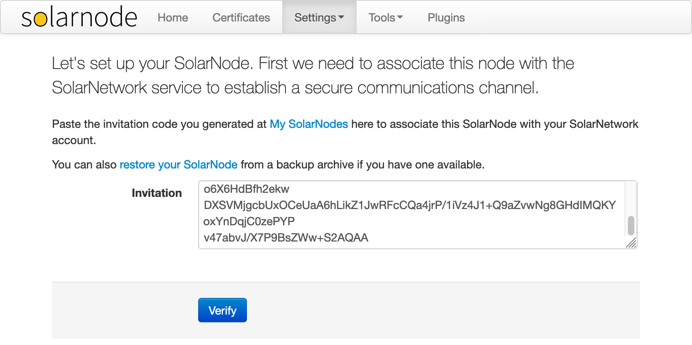
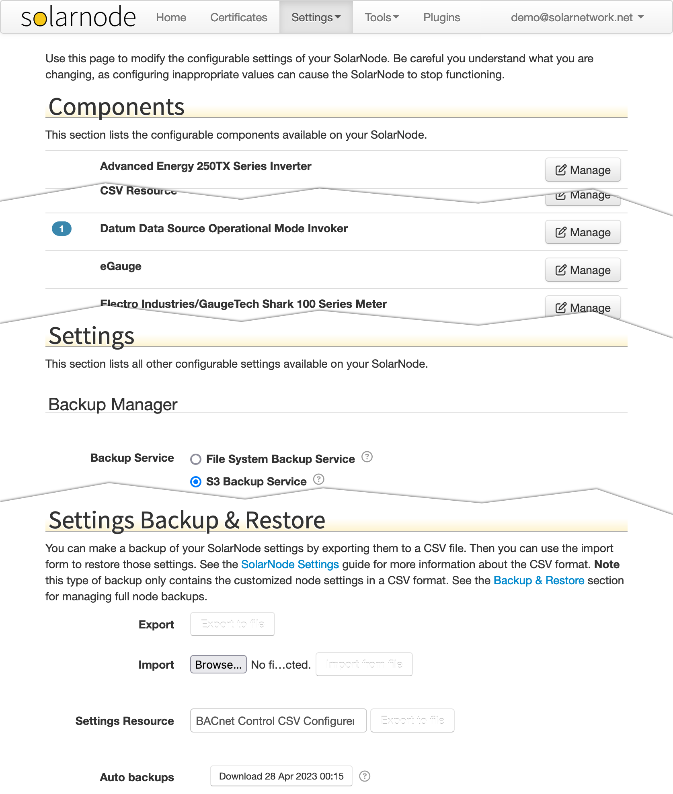
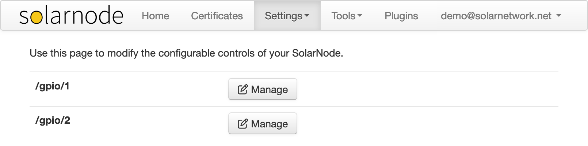

# SolarNode Administration Web App

This project contains an OSGi JEE web application bundle that provides a
web-based UI for administering and configuring the SolarNode application.

See the [SolarNode Handbook][handbook] for detailed information.

## Association

When SolarNode first starts on a new device, the device must be associated with
the SolarNetwork service it will post data to.

An invitation must be generated [on SolarNetwork][solarnetwork-my-nodes] first,
and then pasted on the SolarNode initial screen. The association process will
assign a unique ID and generate a identity certificate for the node. It will
also generate a password that will be required to access this app again in the
future.

## Settings

SolarNode plugins can expose configurable settings that appear on the
**Settings** page. There are global settings, which appear directly on this
page, or _component_ settings, which appear as a list at the top, each with a
**Manage** button. Components are items which can have any number of them
configured individually. For example you might have two different PM3200 power
meters you'd like to collect data from, so you could configure to PM3200
components.

## Controls

SolarNode plugins can expose <i>controls</i> which respond to actions, such as
a switch that can be toggled on and off. All available controls will appear
on the **Controls** page.

[handbook]: https://solarnetwork.github.io/solarnode-handbook/
[solarnetwork-my-nodes]: https://data.solarnetwork.net/solaruser/u/sec/my-nodes
