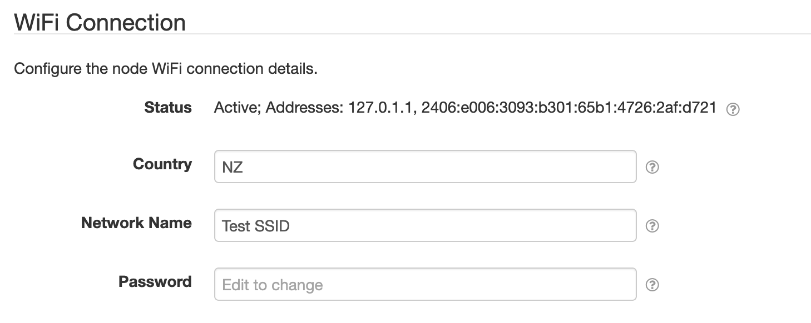

# SolarNode WiFi Setup

This plugin provides a configurable UI within SolarNode for configuring WiFi connection settings.

# Install

This plugin is must be manually installed, along with an associated OS support package, such as 
[`sn-wifi`][sn-wifi] for SolarNodeOS.

# Use

Once installed, a new **WiFi Connection** section will appear on the **Settings** page on your
SolarNode.

## Overall device settings

Each device configuration contains the following overall settings:

| Setting      | Description |
|:-------------|:------------|
| Country      | The 2-character country code of the WiFi network. |
| Network Name | The name of the WiFi network to connect to (also known as the SSID). |
| Password     | The WiFi password to use. |

[sn-wifi]: https://github.com/SolarNetworkFoundation/solarnetwork-ops/tree/master/packages/wifi/debian
