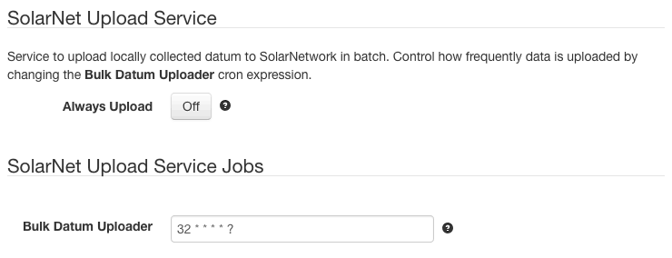

# SolarIn/HTTP Upload Service

This project provides SolarNode plugin that allows SolarNode to upload data
collected by other plugins to SolarIn via HTTP as JSON. It also can parse and persist 
instructions in the response to data uploads, and provides an instruction
acknowledgement service for uploading the status of instructions back
to SolarIn.

# Install

This is a core SolarNode plugin and must be deployed manually or as part of
the base platform.

# Use

Once installed, new **SolarNet Upload Service** and **SolarNet Upload Service Jobs**
groups will appear on the **Settings** page on your SolarNode. These settings
allow tweaking how quickly SolarNode can upload data and respond to instructions.

## Settings

| Setting             | Description                                                                                  |
|---------------------|----------------------------------------------------------------------------------------------|
| Always Upload       | When enabled, SolarNode will call the SolarIn upload URL even if there is no data to upload. |
| Bulk Datum Uploader | A cron schedule that determines when data is uploaded/instructions received.                 |

## Setting notes

The **Always Upload** toggle by default is off. It can be useful to enable this if
you expect to be sending instructions to SolarNode and SolarNode does not collect
data regularly enough for it to connect to SolarIn as frequently as you'd like.
For example, if SolarNode only samples data from a meter once every 5 minutes, but
you'd like to be able to respond to instructions within one minute, you could
configure the **Bulk Datum Uploader** job to run every minute and enable 
**Always Upload**. That will cause SolarNode to contact SolarIn every minute,
and thus able to receive instructions every minute.

If your SolarNode is already collecting data at least as frequently as the 
**Bulk Datum Uploader** job runs at, then enabling the **Always Upload** setting
won't have any real impact because the uploader job will always find data that
needs uploading and thus always contact SolarIn.

See the [Reactor Service][reactor.simple] for more information on how SolarNode
handles instructions.

 [reactor.simple]: https://github.com/SolarNetwork/solarnetwork-node/tree/master/net.solarnetwork.node.reactor.simple
