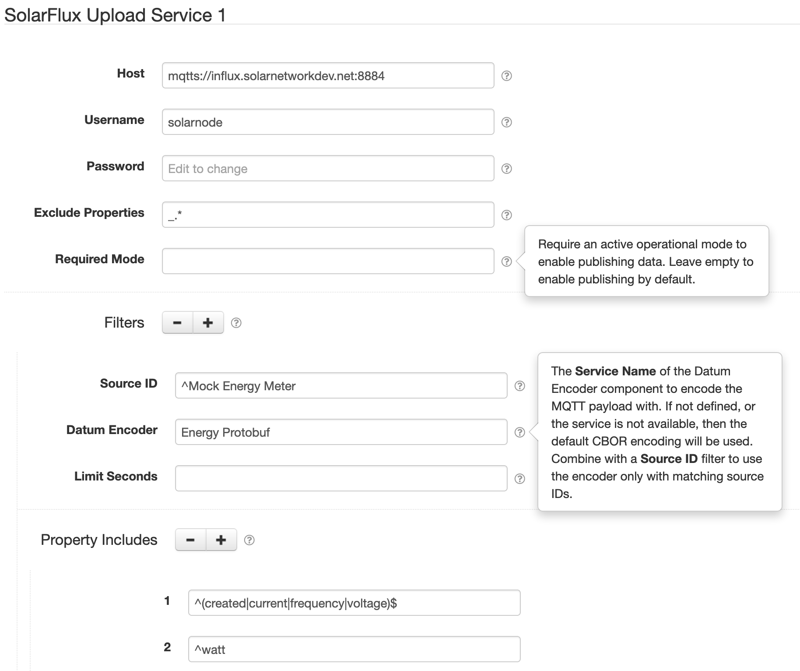
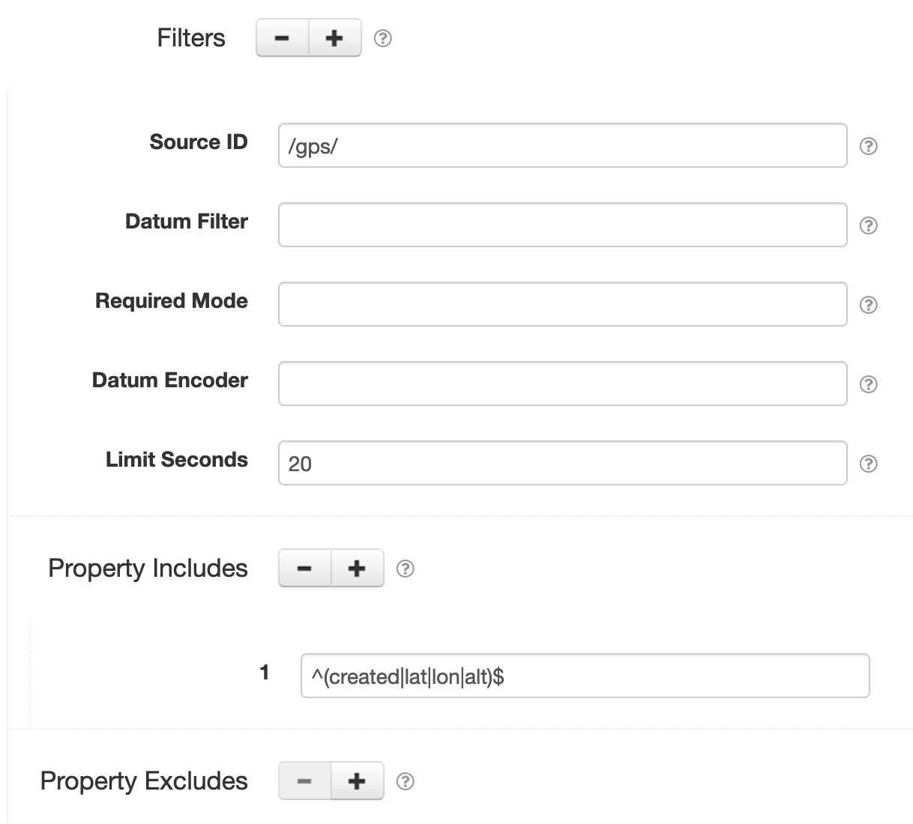

# SolarFlux Upload Service

This project provides SolarNode plugin that posts datum captured by other SolarNode plugins to a
[SolarFlux][solarflux]-compatible MQTT server.



# Install

The plugin is meant for developers and can be manually installed.

# Use

Once installed, a new **SolarFlux Upload Service** component will appear on the **Settings** page on
your SolarNode. Click on the **Manage** button to configure services. You'll need to add one
configuration for each SolarFlux server you want to upload data to.


## MQTT message format

Each datum message is published as a [CBOR][cbor] encoded indefinite-length map by default. This is
essentially a JSON object. The map keys are the datum property names. You can configure a 
**Datum Encoder** to encode datum into a different format, by configuring a [filter](#filter-settings).
 For example, the [Protobuf Datum Encoder][protobuf-io] supports encoding datum into Protobuf messages.

Here's an example datum message, expressed as JSON:

```json
{
  "_DatumType": "net.solarnetwork.node.domain.ACEnergyDatum", 
  "_DatumTypes": [
    "net.solarnetwork.node.domain.ACEnergyDatum", 
    "net.solarnetwork.node.domain.EnergyDatum", 
    "net.solarnetwork.node.domain.Datum", 
    "net.solarnetwork.node.domain.GeneralDatum"
  ], 
  "apparentPower": 2797, 
  "created": 1545167905344, 
  "current": 11.800409317016602, 
  "phase": "PhaseB", 
  "phaseVoltage": 409.89337158203125, 
  "powerFactor": 1.2999000549316406, 
  "reactivePower": -1996, 
  "realPower": 1958, 
  "sourceId": "Ph2", 
  "voltage": 236.9553680419922, 
  "watts": 1958
}
```

## EventAdmin log datum stream

The [`EventAdmin` Appender][eaa] is supported, and log events are turned into a datum stream and 
published to SolarFlux. The log timestamps are used as the datum timestamps.

### Log datum stream source ID mapping

The source ID assigned to log events is `log/` with the log name appended. Period characters (`.`)
in the log name are replaced with slash characters (`/`). For example, a log name
`net.solarnetwork.node.datum.modbus.ModbusDatumDataSource` will be turned into the source ID
`log/net/solarnetwork/node/datum/modbus/ModbusDatumDataSource`.

### Log datum stream properties

The datum stream consists of the following properties:

| Property | Class. | Type | Description |
|:---------|:-------|:-----|:------------|
| `level`    | `s` | String  | The log level name, e.g. `TRACE`, `DEBUG`, `INFO`, `WARN`, `ERROR`, or `FATAL`. |
| `priority` | `i` | Integer | The log level priority (lower values have more priority), e.g. `600`, `500`, `400`, `300`, `200`, or `100`. |
| `name`     | `s` | String  | The log name. |
| `msg`      | `s` | String  | The log message . |
| `exMsg`    | `s` | String  | An exception message, if an exception was included. |
| `exSt`     | `s` | String  | A newline-delimited list of stack trace element values, if an exception was included. |


# Overall settings

Each component configuration contains the following overall settings:

| Setting | Description |
|---------|-------------|
| Host | The URI for the SolarFlux server to connect to. The default for SolarNetwork is `mqtts://influx.solarnetwork.net:8884` |
| Username | The MQTT username to use. The default for `influx.solarnetwork.net:8884` is `solarnode` |
| Password | The MQTT password to use. For `influx.solarnetwork.net:8884` no password is required as the node's certificate will be used. |
| Exclude Properties | A regular expression to match property names on all datum sources to exclude from publishing. |
| Required Mode | If configured, an operational mode that must be active for any data to be published. |
| Maximum Republish | If offline message persistence has been configured, then the maximum number of offline messages to publish in one go. See the [offline persistence](#offline-message-persistence) section for more information. |
| Reliability | The MQTT _quality of service_ level to use. Normally the default of **At most once** is sufficient. |
| Version | The MQTT protocol version to use. Startig with version 5 MQTT [topic aliases][mqtt-topic-aliases] will be used if the server supports it, which can save a significant amount of network bandwidth when long source IDs are in use.  |
| Retained | Toggle the MQTT _retained_ message flag. When enabled the MQTT server will store the most recently published message on each topic so it is immediately available when clients connect.  |
| Wire Logging | Toggle verbose logging on/off to support troubleshooting. The messages are logged to the `net.solarnetwork.mqtt` topic at `DEBUG` level. |
| Filters | Any number of datum [filter configurations](#filter-settings). |

For TLS-encrypted connections, SolarNode will make the node's own X.509 certificate available for
client authentication.

## Overall settings notes

<dl>
	<dt>Host</dt>
	<dd>The URL to the MQTT server to use. Use <code>mqtts</code> for a TLS encrypted connection,
	or <code>mqtt</code> for no encryption. For example: <code>mqtts://influx.solarnetwork.net:8884</code>.</dd>
	<dt>Username</dt>
	<dd>For <code>influx.solarnetwork.net:8884</code> this should be <code>solarnode</code>.</dd>
	<dt>Password</dt>
	<dd>SolarNode will provide its X.509 certificate on TLS connections, so a password
	might not be necessary. For <code>influx.solarnetwork.net:8884</code> this is the case, so no password should be configured.</dd>
	<dt>Exclude Properties</dt>
	<dd>You can exclude all internal datum properties like <code>_DatumType</code> with an expression
	like <code>_.*</code>.</dd>
	<dt>Required Mode</dt>
	<dd>If you would like the ability to control when data is published to SolarFlux you can
	configure an <a href="https://github.com/SolarNetwork/solarnetwork/wiki/SolarNode-Operational-Modes">operational mode</a>,
	and only when that mode is active will data get published to SolarFlux.</dd>
	<dt>Retained</dt>
	<dd>By default this plugin sets the <em>retained</em> flag on each MQTT message. This benefints clients as
	when they connect and subscribe to datum topics they will immediately receive the most recently published
	message instead of having to wait for SolarNode to publish a new message.</dd>
</dl>

# Filter settings

Each component can define any number of filters, which are used to restrict the frequency at which
individual datum sources are posted to SolarFlux, and/or restrict which properties of the datum
are posted. This can be very useful to constrain how much data is sent to SolarFlux, for example
on nodes using mobile internet connections where the cost of posting data is high.

A filter can also configure a **Datum Encoder** to encode the MQTT message with. This can be 
combined with a **Source ID** pattern to encode specific sources with specific encoders. For 
example when using the [Protobuf Datum Encoder][protobuf-io] a single Protobuf message type is
supported per encoder. If you want to encode different datum sources into different Protobuf 
messages, you would configure one encoder per message type, and then one filter per source ID
with the corresponding encoder.

> :warning: **Note** that all filters are applied in the order they are defined, and then the 
> _first_ filter with a **Datum Encoder** configured that matches the filter's **Source ID**
> pattern will be used to encode the datum.



Each filter configuration contains the following settings:

| Setting | Description |
|---------|-------------|
| Source ID | A case-insensitive regular expression to match against datum source IDs. If defined, this filter will only be applied to datum with matching source ID values. If not defined this filter will be applied to all datum. For example `^solar` would match any source ID starting with _solar_. |
| Datum Filter | The Service Name of a **Datum Filter** component to apply to datum before encoding and posting them. Can be a the UID of a specific Datum Filter or a Datum Filter Chain. |
| Required Mode | If configured, an operational mode that must be active for this filter to be applied. |
| Datum Encoder | The <b>Service Name</b> if a <b>Datum Encoder</b> component to encode datum with. The encoder will be passed a `java.util.Map` object with all the datum properties. If not configured then CBOR will be used. |
| Limit Seconds | The minimum number of seconds to limit datum that match the configured **Source ID** pattern. If datum are produced faster than this rate, they will be filtered out. Set to `0` or leave empty for no limit. |
| Property Includes | A list of  case-insensitive regular expressions to match against datum property names. If configured, **only** properties that match one of these expressions will be included in the filtered output. For example `^watt` would match any property starting with _watt_.  |
| Property Excludes | A list of  case-insensitive regular expressions to match against datum property names. If configured, **any** property that match one of these expressions will be excluded from the filtered output. For example `^temp` would match any property starting with _temp_. Exclusions are applied **after** property inclusions.  |

> :warning: **WARNING:** the datum `sourceId` and `created` properties will be affected by the 
  property include/exclude filters! If you define **any** include filters, you might want to
  add an include rule for `^created$`. You might like to have `sourceId` removed to conserve
  bandwidth, however, given that value is part of the MQTT topic the datum is posted on and thus
  redundant.

# Offline message persistence

By default if the connection to the configured SolarFlux MQTT server is down for any reason, all
messages that would normally be published to the server will be discarded. This is suitable for 
most applications that rely on SolarFlux to view real-time status updates only, and SolarNode
uploads datum to SolarIn for long-term persistence. For applications that rely on SolarFlux for
more, it might be desirable to configure SolarNode to locally cache SolarFlux messages when the
connection is down, and then publish those cached messages when the connection is restored. This
can be accomplished by deploying the [MQTT Persistence](../net.solarnetwork.node.dao.mqtt.jdbc)
plugin.

When that plugin is available, all messages processed by this service will be saved locally when the
MQTT connection is down, and then posted once the MQTT connection comes back up. Note the following
points to consider:

 * The cached messages will be posted with the MQTT _retained_ flag set to `false`.
 * The cached messages will be posted in an unspecified order.
 * The cached messages may be posted more than once, regardless of the configured _Reliabiliy_
   setting.

[cbor]: http://cbor.io/
[eaa]: https://github.com/SolarNetwork/solarnetwork-common/tree/develop/net.solarnetwork.common.log4j2#eventadmin-appender
[mqtt-topic-aliases]: https://www.hivemq.com/blog/mqtt5-essentials-part10-topic-alias/
[protobuf-io]: ../net.solarnetwork.node.io.protobuf#protobuf-datum-encoderdecoder
[solarflux]: https://github.com/SolarNetwork/solarnetwork/wiki/SolarFlux-API
