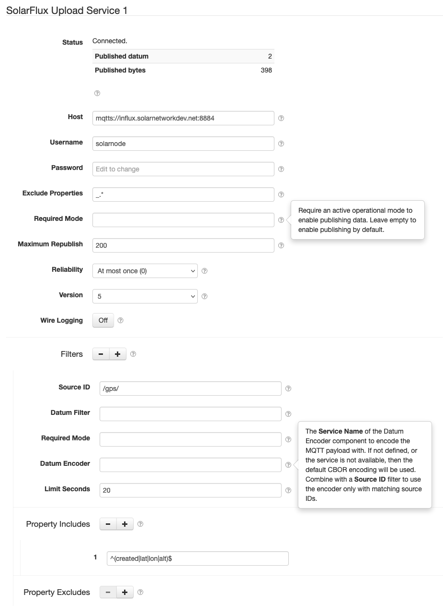

# SolarFlux Upload Service

This project provides SolarNode plugin that posts datum captured by other SolarNode plugins to a
SolarFlux-compatible MQTT server.



# Install

The plugin is meant for developers and can be manually installed.

# Use

Once installed, a new **SolarFlux Upload Service** component will appear on the **Settings** page on
your SolarNode. Click on the **Manage** button to configure services. You'll need to add one
configuration for each SolarFlux server you want to upload data to.


## MQTT message format

Each datum message is published as a [CBOR][cbor] encoded indefinite-length map. This is
essentially a JSON object. The map keys are the datum property names.

Here's an example datum message, expressed as JSON:

```json
{
  "_DatumType": "net.solarnetwork.node.domain.ACEnergyDatum", 
  "_DatumTypes": [
    "net.solarnetwork.node.domain.ACEnergyDatum", 
    "net.solarnetwork.node.domain.EnergyDatum", 
    "net.solarnetwork.node.domain.Datum", 
    "net.solarnetwork.node.domain.GeneralDatum"
  ], 
  "apparentPower": 2797, 
  "created": 1545167905344, 
  "current": 11.800409317016602, 
  "phase": "PhaseB", 
  "phaseVoltage": 409.89337158203125, 
  "powerFactor": 1.2999000549316406, 
  "reactivePower": -1996, 
  "realPower": 1958, 
  "sourceId": "Ph2", 
  "voltage": 236.9553680419922, 
  "watts": 1958
}
```


## Overall device settings

Each device configuration contains the following overall settings:

| Setting | Description |
|---------|-------------|
| Host | The URI for the SolarFlux server to connect to. |
| Username | The MQTT username to use. |
| Password | The MQTT password to use. |
| Exclude Properties | A regular expression to match property names to prevent from being published. |
| Require Mode | If configured, an operational mode that must be active for any data to be published. |

For TLS-encrypted connections, SolarNode will make the node's own X.509 certificate available
for client authentication.

## Overall device settings notes

<dl>
	<dt>Host</dt>
	<dd>The URL to the MQTT server to use. Use <code>mqtts</code> for a TLS encrypted connection,
	or <code>mqtt</code> for no encryption. For example: <code>mqtts://influx.solarnetwork.net:8884</code>.</dd>
	<dt>Password</dt>
	<dd>Note that SolarNode will provide its X.509 certificate on TLS connections, so a password
	might not be necessary.</dd>
	<dt>Exclude Properties</dt>
	<dd>You can exclude all internal datum properties like <code>_DatumType</code> with an expression
	like <code>_.*</code>.</dd>
	<dt>Require Mode</dt>
	<dd>If you would like the ability to control when data is published to SolarFlux you can
	configure an <a href="https://github.com/SolarNetwork/solarnetwork/wiki/SolarNode-Operational-Modes">operational mode</a>,
	and only when that mode is active will data get published to SolarFlux.</dd>
</dl>

[cbor]: http://cbor.io/
