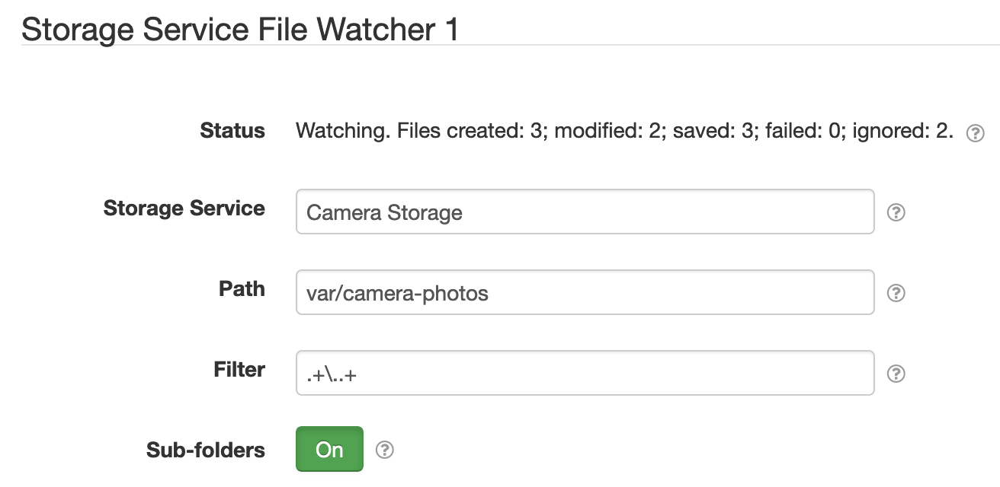

# SolarNode Storage Service Upload

This SolarNode plugin provides a component that can monitor a directory for new or updated files and
copy them to a Storage Service. This provides a way to automatically upload files created by another
plugin or process to be uploaded somewhere, such as S3 by using the [S3 Storage
Service][s3-storage-service].



# Install

The plugin can be installed via the **Plugins** page on your SolarNode. It
appears under the **Upload** category as **Storage Service Upload**. Once installed,
a **Storage Service File Watcher** component will become available.

# Configuration

Each service configuration contains the following settings:

| Setting         | Description  |
|:----------------|:-------------|
| Storage Service | The **Service Name** of the Storage Service component to copy files to. |
| Path            | The OS file system path to monitor. |
| Filter          | A regular expression to filter, so that only files matching the filter are copied. |
| Sub-folders     | Toggle watching for files in sub-folders of <b>Path</b>. |
| Datum Source ID | If configured then datum will be generated each time a file is saved to the configured Storage Service, with this source ID and a `url` property that links to the stored resource. |

# Generated Datum

When a <b>Datum Source ID</b> is configured, then each time a resource is saved to the configured 
Storage Service a datum will be generated. The datum will include the following properties:

| Property | Classification | Description |
|:---------|:---------------|:------------|
| `size`   | `i`            | The size of the file, in bytes. |
| `path`   | `s`            | The path to the file, relative to the <b>Path</b> setting. |
| `url`    | `s`            | The storage URL, as reported by the configured Storage Service. |

For example, a generated datum might look like this:

```json
{
	"created": "2019-10-19 19:20:14.612Z",
	"nodeId": 179,
	"sourceId": "/camera/1/motion",
	"localDate": "2019-10-20",
	"localTime": "08:20",
	"size": 31895,
	"url": "https://example-testing.s3.us-west-2.amazonaws.com/solarnode-s3-storage-settings.png",
	"path": "solarnode-s3-storage-settings.png"
}
```

[s3-storage-service]: ../net.solarnetwork.node.io.s3/
